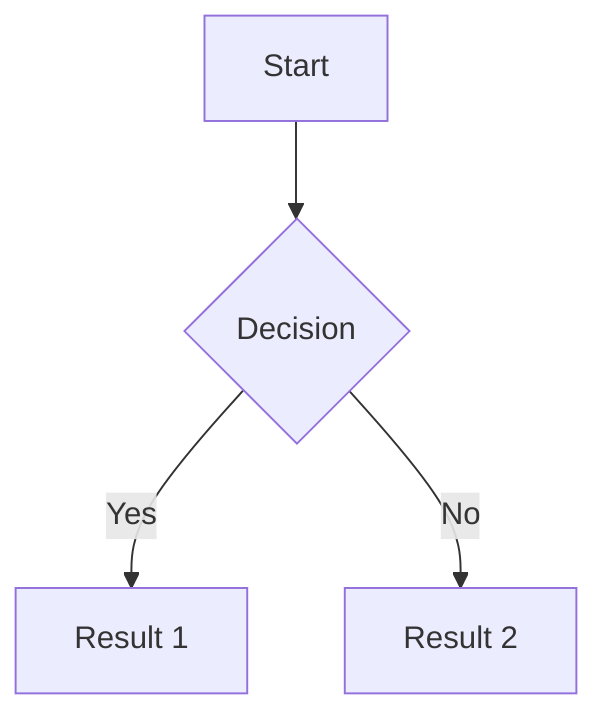

# Write a Go Basics Article

Write an in-depth article about: **$ARGUMENTS**

## File Setup

- Create the file at `docs/<slug>.mdx` where `<slug>` is a lowercase, hyphenated version of the topic
- Use `.mdx` extension (not `.md`) so JSX components work

## Frontmatter

Every article must start with YAML frontmatter:

```yaml
---
sidebar_position: <number>
title: "<Article Title>"
description: "<One-line summary for SEO>"
---
```

- `sidebar_position` controls ordering in the sidebar. Check existing articles and pick the next number.
- Do NOT use `slug: /` — that's reserved for the getting-started page.

## Required Imports

If you use Tabs (you usually should for showing alternatives):

```mdx
import Tabs from '@theme/Tabs';
import TabItem from '@theme/TabItem';
```

No import needed for Mermaid, admonitions, or code blocks.

## Available Features

### 1. Go Code Blocks with Syntax Highlighting

Use triple backticks with `go` language tag. You can highlight specific lines:

````mdx
```go
package main

import "fmt"

// highlight-next-line
func main() {
    fmt.Println("highlighted line")
}
```
````

Other highlight directives:
- `// highlight-next-line` — highlights the line below the comment
- `// highlight-start` / `// highlight-end` — highlights a range

### 2. Interactive Code (Codapi)

Place a `<codapi-snippet>` tag immediately after a Go code block to make it runnable:

````mdx
```go
package main

import "fmt"

func main() {
    fmt.Println("Click Run to execute this!")
}
```

<codapi-snippet sandbox="go" editor="basic">
</codapi-snippet>
````

Rules:
- Every `codapi-snippet` attaches to the **preceding** code block
- The code must be a complete, runnable Go program (`package main` + `func main()`)
- Use `sandbox="go"` always
- Use `editor="basic"` to let readers edit the code before running
- Do NOT make every code block interactive — only ones where running adds value (demonstrating behavior, letting readers experiment)

### 3. Mermaid Diagrams

Use fenced code blocks with `mermaid` language tag:

````mdx

````

Use Mermaid for:
- Data flow (how data moves through channels, goroutines)
- State machines (GC phases, channel states)
- Architecture diagrams (GMP model, memory layout)
- Sequence diagrams (request lifecycle, lock acquisition)

Use Go's brand color for key nodes: `style NodeName fill:#00ADD8,color:#fff`

### 4. Admonitions

```mdx
:::note
Neutral additional info.
:::

:::tip
Helpful advice or best practice.
:::

:::warning
Common mistake or gotcha.
:::

:::danger
Critical issue that causes bugs, crashes, or data loss.
:::

:::info
Background context or reference info.
:::
```

Usage guidelines:
- `:::tip` — best practices, recommended patterns
- `:::warning` — common mistakes, surprising behavior
- `:::danger` — things that crash, corrupt data, or have security implications
- `:::note` — additional context that's good to know
- Don't overuse — max 3-4 per article. They lose impact if everything is an admonition.

### 5. Tabs

Use Tabs for showing alternative approaches, before/after comparisons, or platform differences:

```mdx
<Tabs>
  <TabItem value="approach1" label="Using Mutex" default>

Content for tab 1...

  </TabItem>
  <TabItem value="approach2" label="Using Channel">

Content for tab 2...

  </TabItem>
</Tabs>
```

Important: Leave a blank line after `<TabItem>` and before `</TabItem>` for markdown to render correctly inside tabs.

## Article Structure Guidelines

Follow this structure for each article:

1. **Opening** — One paragraph explaining what the topic is and why it matters. No fluff.

2. **Mental Model / How It Works** — Explain the internals. Use a Mermaid diagram here if the topic involves architecture or state. This is the core of the article.

3. **Code Examples** — Show the concept in action with Go code. Make key examples interactive with Codapi. Show both correct usage and common mistakes.

4. **Gotchas / Common Mistakes** — Use `:::warning` or `:::danger` admonitions. Be specific — show the broken code AND the fix.

5. **When to Use / When Not to Use** — Practical guidance. Use Tabs if comparing alternatives (e.g., mutex vs channel vs atomic).

6. **Key Takeaways** — 3-5 bullet points summarizing the most important things to remember.

## Writing Style

- Write for experienced developers who are learning Go or deepening their Go knowledge
- Be precise and technical — cite Go spec behavior, not folklore
- Show, don't tell — code examples over prose explanations
- Every claim about Go behavior should be demonstrable with code
- Use "you" to address the reader directly
- Keep paragraphs short (2-4 sentences max)
- No filler phrases ("In this article, we will explore...")

## Reference

The full list of topics is in `topics.md` at the project root. Cross-reference related topics by linking to their doc paths when relevant.