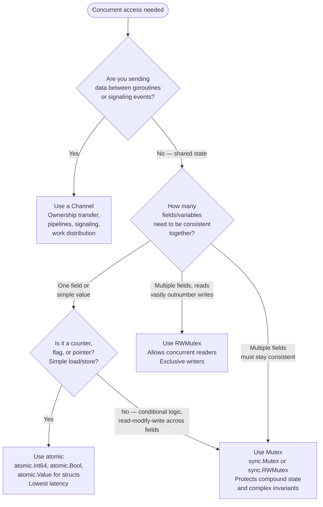

import Tabs from '@theme/Tabs';
import TabItem from '@theme/TabItem';

# atomic.Value vs Mutex vs Channels: When to Use Which

Go gives you three primary tools for coordinating concurrent access to shared state: atomic operations, mutexes, and channels. They are not interchangeable — each is optimized for a different problem shape. Using the wrong one either introduces subtle bugs or leaves performance on the table. This article breaks down what each tool is, when to reach for it, and how to make the choice systematically.

:::tip Go proverb
"Don't communicate by sharing memory; share memory by communicating."

This proverb describes channels — but it does not mean channels are always the right tool. It means: prefer passing ownership of data through channels over protecting shared data with locks. When shared state is genuinely the right model (and it often is), use mutexes or atomics.
:::

## Atomic Operations

The `sync/atomic` package provides operations that execute as a single, indivisible machine instruction. On x86, this uses the `LOCK` prefix to acquire the cache line exclusively before the operation completes. On ARM, it uses `LDREX`/`STREX` exclusive monitors. The critical property: **no other CPU can observe a partial state during an atomic operation**.

Atomic operations require no context switch, no scheduler involvement, and no OS call — they complete in nanoseconds.

The main operations:

- `atomic.LoadInt64(&v)` — read an int64 atomically
- `atomic.StoreInt64(&v, x)` — write an int64 atomically
- `atomic.AddInt64(&v, delta)` — add delta and return new value
- `atomic.CompareAndSwapInt64(&v, old, new)` — if `v == old`, set `v = new`, return whether swap occurred
- `atomic.SwapInt64(&v, new)` — set `v = new`, return old value
- `atomic.Value` — stores and loads any type atomically (but type must be consistent)

```go
package main

import (
	"fmt"
	"sync"
	"sync/atomic"
)

func main() {
	var counter atomic.Int64
	var wg sync.WaitGroup

	for i := 0; i < 1000; i++ {
		wg.Add(1)
		go func() {
			defer wg.Done()
			// highlight-next-line
			counter.Add(1) // atomic: no lock, no race
		}()
	}

	wg.Wait()
	fmt.Println("counter:", counter.Load()) // always 1000
}
```
<codapi-snippet sandbox="go" editor="basic"></codapi-snippet>

### atomic.Value for Arbitrary Types

For non-integer types — structs, slices, maps — use `atomic.Value`. It stores any value as `any` and guarantees that loads always see a complete, consistent value (never a partially written one).

```go
package main

import (
	"fmt"
	"sync/atomic"
)

type Config struct {
	Timeout  int
	MaxRetry int
	Debug    bool
}

func main() {
	var cfg atomic.Value
	// highlight-next-line
	cfg.Store(Config{Timeout: 30, MaxRetry: 3, Debug: false})

	// Simulate a config reload in another goroutine.
	go func() {
		// highlight-next-line
		cfg.Store(Config{Timeout: 60, MaxRetry: 5, Debug: true})
	}()

	// highlight-next-line
	current := cfg.Load().(Config)
	fmt.Printf("timeout=%d retries=%d debug=%v\n",
		current.Timeout, current.MaxRetry, current.Debug)
}
```
<codapi-snippet sandbox="go" editor="basic"></codapi-snippet>

The key constraint: every value stored in an `atomic.Value` must have the same concrete type. Storing an `int` then loading as a `string` panics. Storing a `Config` then a `*Config` also panics. This is enforced at runtime.

**Use atomics when**:
- Updating a single counter, flag, or pointer
- Reading a config that is written infrequently and read very frequently
- You need the absolute lowest latency on the hot path
- You are building lock-free data structures (advanced)

**Do not use atomics when**:
- You need to update multiple fields as a unit (there is no way to atomically update two separate variables together)
- The logic requires read-modify-write across multiple variables
- You need conditional logic based on multiple values

## Mutex

`sync.Mutex` provides mutual exclusion: at most one goroutine holds the lock at a time. Everything done between `Lock()` and `Unlock()` is protected — only the goroutine holding the lock can see intermediate states.

`sync.RWMutex` is a variant that allows multiple concurrent readers or one exclusive writer. Use it when reads vastly outnumber writes, as it lets all readers proceed in parallel.

```go
package main

import (
	"fmt"
	"sync"
)

type SafeCounter struct {
	mu    sync.Mutex
	value int
}

func (c *SafeCounter) Increment() {
	// highlight-next-line
	c.mu.Lock()
	// highlight-next-line
	defer c.mu.Unlock()
	c.value++
}

func (c *SafeCounter) Value() int {
	c.mu.Lock()
	defer c.mu.Unlock()
	return c.value
}

func main() {
	c := &SafeCounter{}
	var wg sync.WaitGroup

	for i := 0; i < 1000; i++ {
		wg.Add(1)
		go func() {
			defer wg.Done()
			c.Increment()
		}()
	}

	wg.Wait()
	fmt.Println("counter:", c.Value()) // always 1000
}
```
<codapi-snippet sandbox="go" editor="basic"></codapi-snippet>

Mutexes shine when protecting **compound state** — multiple fields that must remain consistent relative to each other. Consider a bank account with `balance` and `transactionCount`: you cannot atomically update two separate variables, but you can protect both under a single mutex. Any invariant that spans more than one variable requires a mutex.

### RWMutex for Read-Heavy Data

```go
package main

import (
	"fmt"
	"sync"
)

type RateTable struct {
	mu    sync.RWMutex
	rates map[string]float64
}

func (r *RateTable) Get(currency string) (float64, bool) {
	// highlight-next-line
	r.mu.RLock() // multiple goroutines can hold RLock simultaneously
	// highlight-next-line
	defer r.mu.RUnlock()
	v, ok := r.rates[currency]
	return v, ok
}

func (r *RateTable) Set(currency string, rate float64) {
	// highlight-next-line
	r.mu.Lock() // exclusive: blocks all readers and writers
	// highlight-next-line
	defer r.mu.Unlock()
	r.rates[currency] = rate
}

func main() {
	table := &RateTable{rates: map[string]float64{"USD": 1.0, "EUR": 0.92}}
	table.Set("GBP", 0.79)

	if rate, ok := table.Get("EUR"); ok {
		fmt.Printf("EUR: %.2f\n", rate)
	}
}
```
<codapi-snippet sandbox="go" editor="basic"></codapi-snippet>

**Use a mutex when**:
- Protecting a struct with multiple fields that must be consistent together
- Implementing any read-modify-write operation that involves logic (not just math)
- Protecting data structures like maps (Go's built-in map is not safe for concurrent use)
- You need to hold a lock across multiple operations that must appear atomic to other goroutines

**Watch out for**:
- Holding a lock across I/O — this blocks all other goroutines that need the lock during the I/O wait. Minimize the critical section.
- Forgetting to unlock — always use `defer mu.Unlock()` immediately after `mu.Lock()`.
- Lock ordering — if you acquire multiple mutexes, always acquire them in the same order everywhere to avoid deadlocks.
- Copying a `sync.Mutex` — a `Mutex` must not be copied after first use. Embed it in a struct and pass the struct by pointer.

## Channels

Channels are Go's mechanism for **communication between goroutines**. The mental model: when you send a value through a channel, you are transferring ownership of that data to the receiver. The sender no longer touches the value; the receiver owns it.

This ownership-transfer model is what the Go proverb is about. Rather than having two goroutines share a pointer and negotiate access with locks, one goroutine creates the data, sends it through a channel, and stops accessing it. The receiver then has exclusive access with no locking required.

```go
package main

import (
	"fmt"
	"sync"
)

func producer(jobs <-chan int, results chan<- int, wg *sync.WaitGroup) {
	defer wg.Done()
	for j := range jobs {
		// highlight-next-line
		results <- j * j // send result; caller now owns it
	}
}

func main() {
	jobs := make(chan int, 10)
	results := make(chan int, 10)

	var wg sync.WaitGroup
	for w := 0; w < 3; w++ {
		wg.Add(1)
		go producer(jobs, results, &wg)
	}

	for i := 1; i <= 9; i++ {
		jobs <- i
	}
	close(jobs)

	go func() {
		wg.Wait()
		close(results)
	}()

	sum := 0
	for r := range results {
		sum += r
	}
	fmt.Println("sum of squares:", sum)
}
```
<codapi-snippet sandbox="go" editor="basic"></codapi-snippet>

Channels also excel at **signaling**: done channels, cancellation, timeouts, and pipeline stages. The `context.Context` pattern is built on channels under the hood.

**Use channels when**:
- Sending data from one goroutine to another (ownership transfer)
- Signaling events: "done", "cancelled", "ready"
- Distributing work across a pool of worker goroutines
- Building pipeline stages where each stage processes and forwards data
- Implementing timeouts and cancellation

:::warning
Do not use channels to protect shared state just because channels feel more idiomatic. If two goroutines need to read and update the same map, and neither "owns" the map, use a mutex. Routing every access through a channel (the "monitor goroutine" pattern) adds goroutine scheduling overhead and complexity without a correctness benefit over a well-placed `sync.RWMutex`.
:::

**Channels are the most expensive** of the three primitives: sending or receiving involves goroutine park/unpark operations and scheduler intervention. Each channel operation is roughly an order of magnitude slower than a mutex lock/unlock, which is itself slower than an atomic operation.

## All Three Approaches Side by Side

<Tabs>
<TabItem value="mutex" label="Mutex counter">

```go
package main

import (
	"fmt"
	"sync"
)

type Counter struct {
	mu  sync.Mutex
	val int
}

func (c *Counter) Inc() {
	c.mu.Lock()
	defer c.mu.Unlock()
	c.val++
}

func (c *Counter) Get() int {
	c.mu.Lock()
	defer c.mu.Unlock()
	return c.val
}

func main() {
	c := &Counter{}
	var wg sync.WaitGroup
	for i := 0; i < 1000; i++ {
		wg.Add(1)
		go func() { defer wg.Done(); c.Inc() }()
	}
	wg.Wait()
	fmt.Println(c.Get())
}
```
<codapi-snippet sandbox="go" editor="basic"></codapi-snippet>

</TabItem>
<TabItem value="atomic" label="Atomic counter">

```go
package main

import (
	"fmt"
	"sync"
	"sync/atomic"
)

func main() {
	// highlight-next-line
	var counter atomic.Int64
	var wg sync.WaitGroup

	for i := 0; i < 1000; i++ {
		wg.Add(1)
		go func() {
			defer wg.Done()
			// highlight-next-line
			counter.Add(1)
		}()
	}

	wg.Wait()
	fmt.Println(counter.Load())
}
```
<codapi-snippet sandbox="go" editor="basic"></codapi-snippet>

</TabItem>
<TabItem value="channel" label="Channel counter">

```go
package main

import (
	"fmt"
)

func main() {
	// highlight-next-line
	inc := make(chan struct{})
	get := make(chan chan int)
	done := make(chan struct{})

	// counter goroutine owns the value exclusively
	go func() {
		val := 0
		for {
			select {
			case <-inc:
				val++
			case reply := <-get:
				reply <- val
			case <-done:
				return
			}
		}
	}()

	// Fire 1000 increments
	for i := 0; i < 1000; i++ {
		inc <- struct{}{}
	}

	reply := make(chan int)
	get <- reply
	fmt.Println(<-reply)
	close(done)
}
```
<codapi-snippet sandbox="go" editor="basic"></codapi-snippet>

</TabItem>
</Tabs>

The channel version eliminates shared memory entirely — the `val` variable is owned exclusively by the counter goroutine and never accessed from outside. This is the "monitor goroutine" pattern. It is correct, but it is also the slowest: every increment requires a goroutine context switch through the scheduler. For a simple counter, this is the wrong tool. For a stateful object with complex behavior or I/O, it can be the right architecture.

## The Decision Flowchart



When in doubt, start with a mutex. It is harder to misuse than channels for protecting shared state, and its performance is adequate for the vast majority of use cases. Atomics are an optimization you reach for after profiling shows mutex contention is a bottleneck. Channels are what you reach for when the problem is fundamentally about data flow and ownership transfer rather than shared state protection.

## Performance Characteristics

The following are approximate relative costs. Exact numbers vary by hardware and contention level:

| Primitive | Uncontended latency | Contended latency | Use case |
|---|---|---|---|
| `atomic.Add` / `atomic.Load` | ~1–3 ns | ~10–50 ns (cache line bouncing) | Simple counters, flags |
| `sync.Mutex` Lock/Unlock | ~10–20 ns | ~100–500 ns (OS park/unpark) | Compound state |
| `sync.RWMutex` RLock/RUnlock | ~15–30 ns | Better than Mutex for read-heavy | Read-heavy data |
| Channel send/receive | ~50–200 ns | ~500 ns+ | Communication, pipelines |

These numbers are illustrative. Under high contention, all primitives degrade and the relative ordering can shift. Benchmark your actual workload with `go test -bench -benchmem` and profile with `go tool pprof` before optimizing.

## Key Takeaways

- **Atomics** are the fastest synchronization primitive — hardware instructions, no OS involvement. Use them for single-variable updates: counters, flags, and infrequently-changing config values via `atomic.Value`. They cannot atomically coordinate multiple variables.
- **Mutexes** are the right default for protecting shared state, especially compound state spanning multiple fields. `RWMutex` is worth the complexity only when reads heavily dominate writes.
- **Channels** are for communication and ownership transfer between goroutines — pipelines, work queues, signaling, and cancellation. They are not the idiomatic way to protect shared state.
- When the problem is "two goroutines need safe access to the same data," think mutex first. When the problem is "goroutine A produces data that goroutine B needs to process," think channel.
- Avoid the monitor goroutine pattern (channel-based counter) for simple counters — it is correct but adds scheduler overhead with no correctness benefit over an atomic or mutex.
- Profile before optimizing. Mutex contention often is not the bottleneck. Premature migration to atomics adds complexity and risk of subtle bugs.
