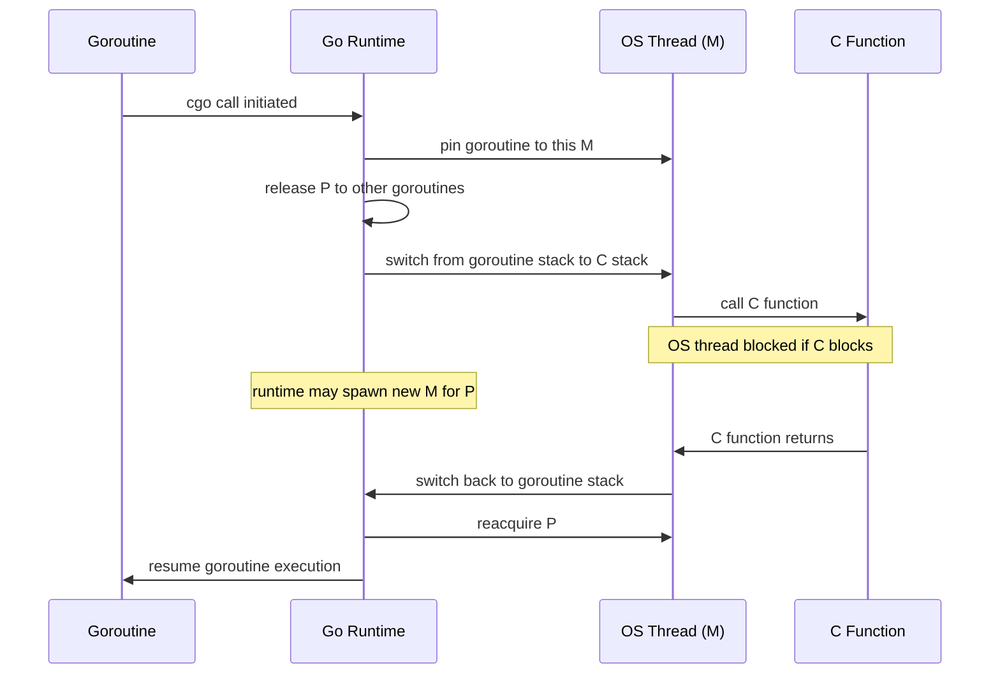

# cgo Overhead: Why Crossing the C Boundary Is Expensive

Go is a language designed for scale: lightweight goroutines, a cooperative scheduler, and a garbage collector that runs concurrently with your code. C is a language built on different assumptions: one thread, one stack, no scheduler. When you call C from Go using cgo, you are bridging two fundamentally different runtime models, and the bridge has a toll. Understanding what that toll is — and when it is worth paying — is essential before reaching for cgo in any performance-sensitive context.

## What cgo Is

cgo is the mechanism that allows Go code to call C functions and, conversely, allows C code to call Go functions. You enable it by importing the special `"C"` pseudo-package and embedding C code in comments directly above the import.

```go
package main

/*
#include <stdlib.h>

int c_abs(int x) {
    return x < 0 ? -x : x;
}
*/
import "C"
import "fmt"

func main() {
	result := C.c_abs(-42)
	fmt.Println(int(result)) // 42
}
```

This is the simplest possible cgo program: define a C function in the comment block, call it from Go. The output is correct. What you do not see is the machinery the runtime executes to make that call happen — machinery that costs roughly 50–200 nanoseconds per crossing, compared to approximately 1 nanosecond for an ordinary Go function call.

## The Four Costs of a cgo Call

### 1. Goroutine-to-OS-Thread Pinning

Go's scheduler multiplexes goroutines (G) onto OS threads (M) using a pool of logical processors (P). A goroutine can move between threads between scheduling points. C code, however, is completely unaware of this: it assumes it owns its thread and its stack. Before calling a C function, the runtime must **pin** the goroutine to its current OS thread. That goroutine cannot be rescheduled to a different M for the duration of the C call. The M is unavailable for running other goroutines during this time.

### 2. Stack Switching

Go goroutines start with a small stack — around 2 KB in recent versions — that grows dynamically using stack copying (or segmented stacks in older versions). C code expects a large, contiguous, fixed stack, typically 8 MB per thread on Linux. Before transferring control to the C function, the Go runtime switches from the goroutine's small stack to the OS thread's larger C stack. This involves saving the goroutine's stack pointer, setting up the C stack frame, and restoring state on return. That switch is not free: it touches multiple cache lines and involves runtime coordination.

### 3. Scheduler Interaction

With the goroutine pinned to an M, the Go scheduler must account for the fact that this M is "in C" and unavailable for scheduling Go goroutines. The P associated with the M is released so other goroutines can run on it, but the M itself is stuck waiting for the C call to return. The scheduler bookkeeping around this state change adds latency.

### 4. GC and Write Barrier Handling

The garbage collector must know that a goroutine is in a C call so it can handle GC correctly. The goroutine's stack and registers are in a different state when in C. The runtime marks the goroutine appropriately and ensures write barriers — the mechanism that tells the GC about pointer writes — are handled correctly across the boundary.

## Blocking in C: Thread Proliferation

The pinning problem becomes acute when the C function **blocks** — for example, if it performs blocking I/O, sleeps, or waits on a mutex. While the goroutine is blocked in C, the OS thread is also blocked. Go's scheduler detects this condition and creates a new OS thread (a new M) to take over that goroutine's P and keep other goroutines running. This preserves the `GOMAXPROCS` guarantee of always having active Ps, but at the cost of creating OS threads.

If 1000 goroutines each make a blocking cgo call simultaneously, the runtime may create up to 1000 OS threads. Each OS thread carries an 8 MB stack and significant kernel overhead. This is the opposite of Go's lightweight concurrency model, where 1000 goroutines share a handful of threads.



## Measuring the Overhead

The overhead is not theoretical. You can measure it directly. The following benchmark compares an ordinary Go function call to the equivalent cgo call:

```go
package main

/*
#include <stdlib.h>
*/
import "C"
import (
	"fmt"
	"time"
)

func goAbs(x int) int {
	if x < 0 {
		return -x
	}
	return x
}

func benchmarkGoCall(n int) time.Duration {
	start := time.Now()
	for i := 0; i < n; i++ {
		_ = goAbs(-i)
	}
	return time.Since(start)
}

func benchmarkCgoCall(n int) time.Duration {
	start := time.Now()
	for i := 0; i < n; i++ {
		// highlight-next-line
		_ = C.abs(C.int(-i)) // cgo call: ~100-200ns each
	}
	return time.Since(start)
}

func main() {
	const n = 100_000
	goDur := benchmarkGoCall(n)
	cgoDur := benchmarkCgoCall(n)

	fmt.Printf("Go  calls: %d iterations in %v (%.1f ns/op)\n",
		n, goDur, float64(goDur.Nanoseconds())/float64(n))
	fmt.Printf("cgo calls: %d iterations in %v (%.1f ns/op)\n",
		n, cgoDur, float64(cgoDur.Nanoseconds())/float64(n))
}
```

On a typical amd64 machine, the Go call runs in under 1 ns/op while the cgo call runs at 50–200 ns/op. The cgo call is **50 to 200 times slower**. For a function like `abs()` that executes in a single CPU instruction, the crossing cost dwarfs the work being done.

:::warning
Never use cgo to call simple C functions — integer arithmetic, string operations, basic math — when an equivalent Go implementation exists. The 50–200 ns overhead per cgo call vastly exceeds the cost of the computation itself. `C.abs(-42)` is orders of magnitude slower than `if x < 0 { return -x }`.
:::

## Thread Affinity: LockOSThread

Some C libraries require that all calls originate from the same OS thread. The most common examples are OpenGL (which maintains per-thread state), GUI toolkits (AppKit on macOS is single-threaded), and some database drivers that use thread-local transaction state.

For these cases, use `runtime.LockOSThread()` at the start of a dedicated goroutine. This permanently binds the goroutine to its current OS thread for the goroutine's lifetime. No other goroutine will ever run on that thread.

```go
package main

/*
#include <stdio.h>

void thread_sensitive_init() {
    // Imagine this initializes a library requiring thread affinity.
    printf("initialized on this thread\n");
}

void thread_sensitive_work(int x) {
    printf("work: %d\n", x);
}
*/
import "C"
import (
	"fmt"
	"runtime"
)

func runThreadSensitive(work <-chan int) {
	// highlight-next-line
	runtime.LockOSThread() // this goroutine is now permanently bound to one OS thread
	defer runtime.UnlockOSThread()

	C.thread_sensitive_init()

	for x := range work {
		C.thread_sensitive_work(C.int(x))
	}
}

func main() {
	work := make(chan int, 5)
	go runThreadSensitive(work)

	for i := 1; i <= 3; i++ {
		work <- i
	}
	close(work)

	// Give the goroutine time to finish.
	var input string
	fmt.Scanln(&input)
}
```

The `runtime/cgo` package handles the mechanics of this. One important implication: the locked goroutine consumes one OS thread for its entire lifetime, so use this pattern sparingly and only for dedicated worker goroutines that are genuinely bound to thread-local C state.

## When cgo Is Worth It

The 50–200 ns overhead per call is fixed. Whether it matters depends entirely on amortization: how much work does the C function do relative to the crossing cost?

**Large, infrequently-called C libraries.** If you are using libssl for TLS termination, libsqlite3 for a local database, or a GPU driver for machine learning inference, the C call does hundreds of microseconds to milliseconds of work. The 100 ns crossing cost is a rounding error.

**Batch processing.** If you can arrange for a single cgo call to process an entire array or buffer of data — rather than calling C once per element — the crossing cost is amortized over the entire batch. One cgo call that processes 10,000 elements costs the same crossing overhead as one that processes 1. Design your C API to accept arrays rather than scalars.

**No Go alternative exists.** Some capabilities simply have no pure-Go equivalent: hardware-specific cryptography acceleration, vendor SDKs, proprietary databases, or operating system APIs not exposed in the standard library. Here the choice is not "cgo vs. Go" — it is "cgo or nothing."

:::tip
Batch your C calls to amortize the fixed per-call crossing cost. Instead of calling `C.process(item)` in a loop, design the C function to accept `C.process_batch(items, count)`. One crossing for 10,000 items costs the same as one crossing for one item, but does 10,000x more useful work.
:::

## When to Avoid cgo

**Tight inner loops.** If your hot path calls a C function millions of times per second, the crossing cost will dominate. A loop that calls `C.abs()` one million times spends 50–200 ms on crossing overhead alone — regardless of how fast `abs()` itself is. Rewrite the C in Go.

**High-frequency calls from many goroutines.** Concurrent cgo callers each pin their goroutine to an OS thread. With 100 goroutines calling cgo simultaneously, you have 100 pinned OS threads. With 1000, you have up to 1000 OS threads — which defeats Go's entire lightweight concurrency model.

**When a pure-Go alternative exists.** The Go standard library and ecosystem cover a remarkable range: `crypto/tls`, `database/sql`, `encoding/json`, `image/*`, `net/*`. If the functionality you need has a Go implementation, use it. Pure Go is easier to cross-compile, profile, and debug, and has no CGO_ENABLED constraints.

## Build Implications

cgo has significant implications for your build pipeline:

```go
package main

import "fmt"

func main() {
	// Build with: CGO_ENABLED=0 go build
	// This produces a fully static binary with no C runtime dependency.
	// Cross-compilation works: GOOS=linux GOARCH=arm64 CGO_ENABLED=0 go build
	//
	// With CGO_ENABLED=1 (the default), you need a C compiler (gcc or clang)
	// present on the build machine. Cross-compilation requires a cross-compiler.
	// The resulting binary links against libc and is no longer fully static.
	fmt.Println("CGO_ENABLED=0 produces a fully static, portable binary")
	fmt.Println("CGO_ENABLED=1 requires a C compiler and produces a dynamically linked binary")
}
```
<codapi-snippet sandbox="go" editor="basic"></codapi-snippet>

`CGO_ENABLED=0` disables cgo entirely — even for packages in the standard library that use cgo (like `net` on some platforms, which falls back to pure-Go DNS resolution). The resulting binary is fully self-contained and can be `COPY`'d into a `FROM scratch` Docker image. This is often a significant operational advantage.

With `CGO_ENABLED=1`, the build requires a C compiler. For cross-compilation — say, building a Linux ARM64 binary on a macOS x86_64 host — you need a cross-compiler targeting the foreign architecture. This substantially complicates CI pipelines.

## Key Takeaways

- A cgo call costs 50–200 ns, versus less than 1 ns for a Go function call. The overhead comes from goroutine-to-OS-thread pinning, stack switching, and scheduler coordination.
- Blocking in C holds an OS thread. Go spawns new threads to compensate, potentially creating as many OS threads as there are concurrent cgo callers. This destroys Go's lightweight concurrency model.
- cgo is worth it when the C call does significant work (large libraries, GPU drivers, proprietary APIs) or when calls are infrequent. Batch operations amortize the fixed crossing cost effectively.
- Avoid cgo in tight inner loops, in functions called millions of times per second, or when a pure-Go alternative exists.
- `CGO_ENABLED=0` eliminates cgo, enables full static linking, and simplifies cross-compilation. Use it whenever you do not require C interop.
- `runtime.LockOSThread()` is required for C libraries with thread-affinity requirements (OpenGL, GUI toolkits). One locked goroutine consumes one dedicated OS thread for its lifetime.
