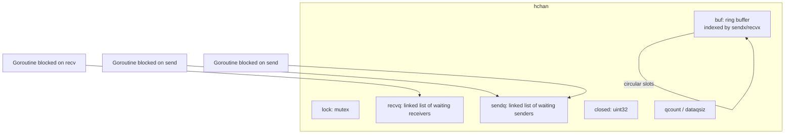
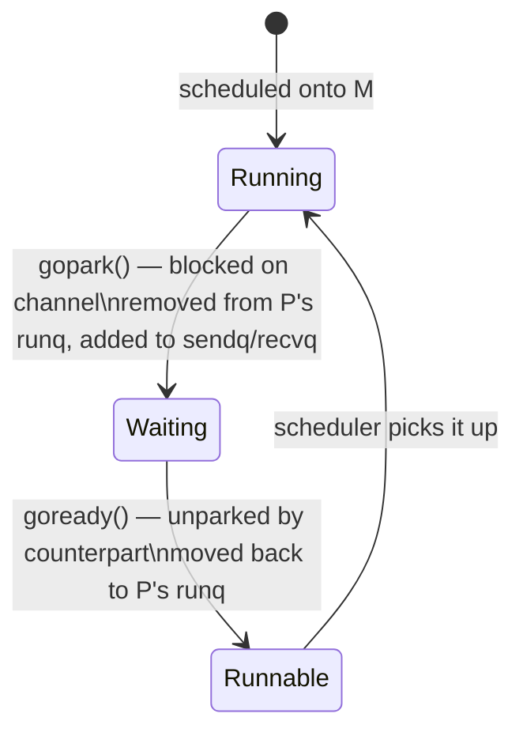

# Channel Internals: Buffered vs Unbuffered

Go channels are more than a convenient syntax — they are a carefully engineered runtime data structure that coordinates goroutine scheduling. Understanding the implementation helps you make better decisions about buffer sizes, concurrency patterns, and performance.

## The `hchan` Struct

Every channel is represented at runtime by an `hchan` struct (defined in `runtime/chan.go`). The key fields are:

```
type hchan struct {
    qcount   uint           // number of elements currently in the buffer
    dataqsiz uint           // capacity of the circular buffer (0 for unbuffered)
    buf      unsafe.Pointer // pointer to the ring buffer array
    elemsize uint16         // size in bytes of one element
    closed   uint32         // 0 = open, 1 = closed
    sendx    uint           // send index into the ring buffer
    recvx    uint           // receive index into the ring buffer
    recvq    waitq          // queue of goroutines blocked on receive
    sendq    waitq          // queue of goroutines blocked on send
    lock     mutex          // protects all fields
}
```

`waitq` is a linked list of `sudog` structs — each `sudog` wraps a goroutine (`*g`) together with the element it is waiting to send or receive.



## Unbuffered Channels: Synchronous Hand-Off

An unbuffered channel has `dataqsiz == 0` and `buf` is never used. Every send must pair with a concurrent receive — they rendezvous in time.

When goroutine A sends on an unbuffered channel:

1. The runtime acquires `hchan.lock`.
2. If `recvq` is non-empty, a waiting receiver exists. The runtime copies the value **directly from A's stack to the receiver's stack**, unparks the receiver goroutine (moves it from `waiting` to `runnable`), and A continues without blocking. This is the **synchronous hand-off** — the buffer is never involved.
3. If `recvq` is empty, A wraps itself in a `sudog`, appends it to `sendq`, releases the lock, and calls `gopark` — removing itself from its P's run queue and transitioning to `waiting`.

The direct-copy optimization is significant: it avoids a memory allocation and a round-trip through shared memory. The Go scheduler documentation calls this the "fast path" for unbuffered channels.

```go
package main

import (
	"fmt"
	"sync"
)

func main() {
	ch := make(chan int) // unbuffered — dataqsiz == 0
	var wg sync.WaitGroup

	wg.Add(1)
	go func() {
		defer wg.Done()
		// highlight-next-line
		val := <-ch // blocks until sender is ready
		fmt.Println("received:", val)
	}()

	// highlight-next-line
	ch <- 42 // blocks until receiver is ready — then direct hand-off
	wg.Wait()
}
```
<codapi-snippet sandbox="go" editor="basic"></codapi-snippet>

:::note
The unbuffered channel enforces a happens-before relationship: the send completes before (or simultaneously with) the receive. This makes it a synchronization primitive, not just a data conduit.
:::

## Buffered Channels: The Ring Buffer

A buffered channel with capacity N allocates a contiguous array of N elements at creation time. `sendx` and `recvx` are indices that advance modulo N, forming a circular queue.

When goroutine A sends on a buffered channel:

1. Lock `hchan`.
2. If `recvq` is non-empty (a receiver is already waiting), skip the buffer entirely and do a direct hand-off — same as the unbuffered fast path.
3. If `qcount < dataqsiz` (buffer has space), copy the value into `buf[sendx]`, advance `sendx`, increment `qcount`, unlock, and return. A does **not** block.
4. If the buffer is full (`qcount == dataqsiz`), A parks itself in `sendq` exactly as described above.

Receiving mirrors this: drain `buf[recvx]` first, advance `recvx`, decrement `qcount`. If the buffer is empty and `sendq` is non-empty, dequeue a sender and copy its value directly.

## Goroutine Lifecycle During Blocking

When a goroutine blocks on a channel operation, the transition is:



`gopark` yields the current OS thread (M) back to the scheduler so it can run other goroutines. This is why thousands of goroutines can be blocked on channels with no OS thread overhead — blocked goroutines are simply nodes in a linked list, not sleeping OS threads.

## Buffered Channel as a Semaphore

A classic use of a buffered channel is as a counting semaphore to limit the number of concurrent goroutines doing expensive work.

```go
package main

import (
	"fmt"
	"sync"
	"time"
)

func main() {
	const maxConcurrent = 3
	// highlight-next-line
	sem := make(chan struct{}, maxConcurrent) // semaphore with capacity 3

	var wg sync.WaitGroup
	for i := range 9 {
		wg.Add(1)
		go func(id int) {
			defer wg.Done()
			// highlight-next-line
			sem <- struct{}{} // acquire: blocks when 3 goroutines already hold a slot
			defer func() {
				// highlight-next-line
				<-sem // release: frees a slot for another goroutine
			}()

			// simulate work
			time.Sleep(50 * time.Millisecond)
			fmt.Printf("worker %d done\n", id)
		}(i)
	}

	wg.Wait()
	fmt.Println("all done")
}
```
<codapi-snippet sandbox="go" editor="basic"></codapi-snippet>

The semaphore pattern works because:
- Sending to a full channel blocks the goroutine in `sendq` until a slot opens.
- Receiving from the channel (release) unparks one waiting sender.
- The buffer capacity directly controls the maximum concurrency level.

## Unbuffered vs Buffered: When to Use Which

| Property | Unbuffered | Buffered |
|---|---|---|
| Synchronization | Guaranteed rendezvous | Sender can run ahead of receiver |
| Memory | No buffer allocation | Allocates N elements upfront |
| Throughput | Lower (always blocks) | Higher (fewer blocks) |
| Backpressure | Immediate | Delayed until buffer full |
| Debugging | Easier (timing is deterministic) | Harder (races less obvious) |

Prefer unbuffered channels when the goal is **synchronization** — you want to know that the receiver got the value before the sender proceeds. Prefer buffered channels when the goal is **decoupling** — producer and consumer can run at different rates, and the buffer absorbs the difference.

## Key Takeaways

- Every channel is an `hchan` struct containing a ring buffer, two goroutine wait queues (`sendq`/`recvq`), and a mutex.
- Unbuffered channels have `dataqsiz == 0`; every send must meet a concurrent receive.
- When a receiver is already waiting, a sender copies data directly to the receiver's stack ("synchronous hand-off"), bypassing any buffer.
- Blocked goroutines are parked with `gopark` — they are removed from the P's run queue and stored as `sudog` nodes in `sendq`/`recvq`. No OS thread is held.
- A buffered channel with capacity N is a counting semaphore; the buffer allows sends to proceed without blocking until N unread items accumulate.
- Buffered channels decouple producer and consumer timing at the cost of making backpressure less immediate.
