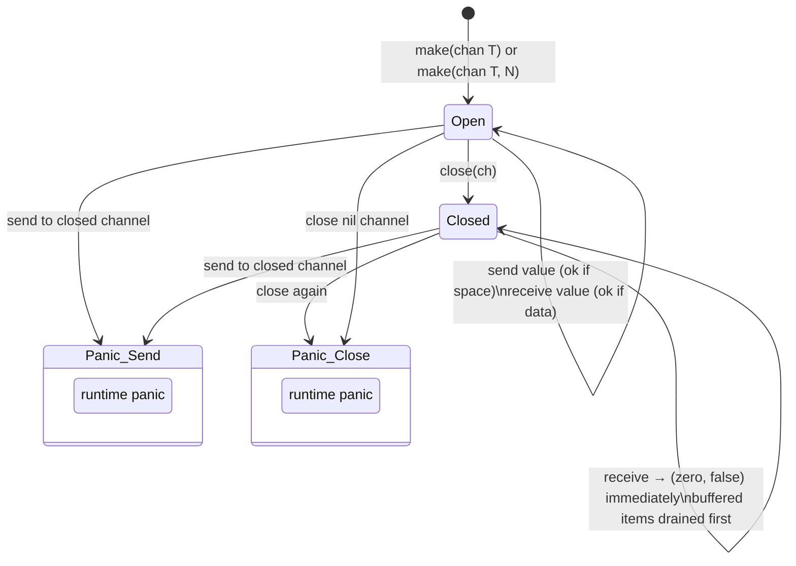

# Closing Channels: Who Closes and What Receivers Observe

Closing a channel is a broadcast signal: one sender tells zero or more receivers that no more values will be sent. Misusing `close` is one of the more common sources of runtime panics in Go programs, so understanding the precise mechanics and conventions is essential.

## What `close()` Does

Calling `close(ch)` on a channel does three things atomically (under `hchan.lock`):

1. Sets `hchan.closed = 1`.
2. Dequeues every goroutine blocked in `recvq` (waiting receivers), gives each a zero value for the channel's element type, and unparks them all.
3. Dequeues every goroutine blocked in `sendq` (waiting senders) and causes their send to panic.

After `close`, the channel is in a permanently drained state for new sends. The buffer, if any, remains accessible for existing buffered values.

## What Receivers Observe

The two-value receive form reveals whether a channel is closed:

```go
package main

import "fmt"

func main() {
	ch := make(chan int, 3)
	ch <- 10
	ch <- 20
	close(ch)

	// Drain buffered values first
	// highlight-next-line
	v1, ok1 := <-ch
	fmt.Printf("v=%d ok=%v\n", v1, ok1) // v=10 ok=true

	v2, ok2 := <-ch
	fmt.Printf("v=%d ok=%v\n", v2, ok2) // v=20 ok=true

	// highlight-next-line
	v3, ok3 := <-ch
	fmt.Printf("v=%d ok=%v\n", v3, ok3) // v=0 ok=false — channel closed and empty
}
```
<codapi-snippet sandbox="go" editor="basic"></codapi-snippet>

The critical observation: a buffered channel delivers all buffered items before signalling closure. Once the buffer is empty and the channel is closed, every subsequent receive returns the zero value and `ok=false` — immediately, without blocking.

An unbuffered closed channel returns zero value and `ok=false` immediately on every receive.

## The `for range` Loop Over a Channel

The idiomatic way to consume all values from a channel is a range loop. It automatically stops when the channel is closed and the buffer (if any) is fully drained:

```go
package main

import "fmt"

func produce(ch chan<- int) {
	for i := range 5 {
		ch <- i * i
	}
	// highlight-next-line
	close(ch) // signals consumers: no more values
}

func main() {
	ch := make(chan int, 5)
	go produce(ch)

	// highlight-next-line
	for v := range ch { // exits when ch is closed and drained
		fmt.Println(v)
	}
	fmt.Println("done")
}
```
<codapi-snippet sandbox="go" editor="basic"></codapi-snippet>

Under the hood, `for v := range ch` desugars to:

```go
for {
    v, ok := <-ch
    if !ok {
        break
    }
    // body
}
```

## Channel State Machine



:::danger Sending to a closed channel panics
```go
ch := make(chan int, 1)
close(ch)
ch <- 1 // panic: send on closed channel
```
There is no recover-free way to test if a channel is closed before sending. The only safe approach is to ensure only the sender closes the channel.
:::

:::danger Closing a channel twice panics
```go
ch := make(chan int)
close(ch)
close(ch) // panic: close of closed channel
```
Once a channel is closed, it is permanently closed. Use a `sync.Once` if there is any risk of double close.
:::

## Who Closes the Channel: The Core Convention

The Go memory model and channel semantics imply one strong rule: **only the sender should close a channel**. Closing from a receiver is almost always wrong, because the sender may attempt to send after the close, causing a panic.

Think of a channel like a write end of a Unix pipe: only the writer closes it. Readers simply drain until EOF (`ok=false`).

### One Producer, One Consumer

The simplest case: the single producer closes when done, the consumer uses `range`.

```go
package main

import "fmt"

func main() {
	jobs := make(chan string, 5)

	// producer
	go func() {
		for _, j := range []string{"a", "b", "c"} {
			jobs <- j
		}
		// highlight-next-line
		close(jobs) // safe: only one sender
	}()

	// consumer
	for job := range jobs {
		fmt.Println("processing:", job)
	}
}
```
<codapi-snippet sandbox="go" editor="basic"></codapi-snippet>

### Multiple Producers: Coordinator Pattern

When multiple goroutines send on the same channel, none of them can safely close it (another sender might still be running). The solution is a coordinator goroutine that waits for all producers to finish, then closes:

```go
package main

import (
	"fmt"
	"sync"
)

func main() {
	const numProducers = 4
	ch := make(chan int, numProducers*3)
	var wg sync.WaitGroup

	for i := range numProducers {
		wg.Add(1)
		go func(id int) {
			defer wg.Done()
			for j := range 3 {
				ch <- id*10 + j
			}
			// highlight-next-line
			// DO NOT close(ch) here — other producers still running
		}(i)
	}

	// Coordinator: close the channel once all producers are done
	// highlight-next-line
	go func() {
		wg.Wait()
		close(ch) // safe: all senders have finished
	}()

	for v := range ch {
		fmt.Println(v)
	}
}
```
<codapi-snippet sandbox="go" editor="basic"></codapi-snippet>

### One Producer, Multiple Consumers

When one goroutine closes a channel, all consumers blocking on receive are unparked simultaneously. This is the broadcast property of `close`:

```go
package main

import (
	"fmt"
	"sync"
)

func main() {
	ch := make(chan int, 10)
	for i := range 10 {
		ch <- i
	}
	close(ch)

	var wg sync.WaitGroup
	for id := range 3 {
		wg.Add(1)
		go func(workerID int) {
			defer wg.Done()
			for v := range ch {
				fmt.Printf("worker %d: %d\n", workerID, v)
			}
		}(id)
	}
	wg.Wait()
}
```
<codapi-snippet sandbox="go" editor="basic"></codapi-snippet>

Each value is delivered to exactly one consumer (channels are not pub/sub). The `close` itself is broadcast — all consumers eventually see the channel drain and their `range` loop exits.

## Key Takeaways

- `close(ch)` marks the channel closed, unparks all blocked receivers with zero values, and makes future sends panic.
- A closed buffered channel drains its remaining buffered values before receivers observe `ok=false`.
- The two-value receive `v, ok := <-ch` distinguishes "zero value from closed channel" from "zero value sent intentionally."
- `for v := range ch` is the idiomatic drain loop; it exits automatically when the channel is closed and empty.
- Only the sender (or a coordinator that knows all senders are done) should call `close`. Closing from a receiver is a design smell.
- Use `sync.WaitGroup` plus a coordinator goroutine to safely close a channel fed by multiple producers.
- Closing a nil channel or a closed channel panics; sending to a closed channel panics.
