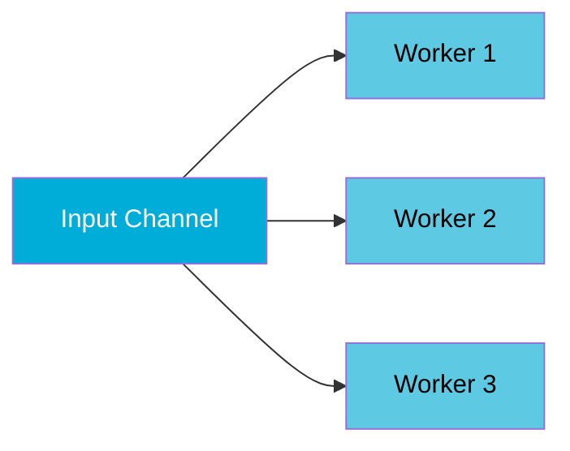
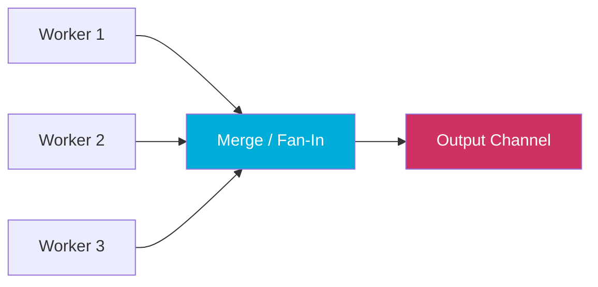

# Concurrency Patterns: Pipeline, Fan-Out, Fan-In, Done

Go's channel and goroutine primitives are low-level. Real concurrent programs need higher-level structure. A small set of recurring patterns — **pipeline**, **fan-out**, **fan-in**, and the **done channel** — cover the vast majority of concurrent coordination problems in Go. These patterns are composable: you can layer them together to build complex data processing pipelines.

## Pipeline

A pipeline is a chain of stages connected by channels. Each stage receives values from an upstream channel, transforms them, and sends results to a downstream channel.


```go
package main

import "fmt"

// generator converts a slice into a channel — the source stage
func generate(nums ...int) <-chan int {
	out := make(chan int)
	go func() {
		for _, n := range nums {
			out <- n
		}
		// highlight-next-line
		close(out) // signal: no more values
	}()
	return out
}

// square reads from in, sends squares to out — a middle stage
func square(in <-chan int) <-chan int {
	out := make(chan int)
	go func() {
		for n := range in {
			out <- n * n
		}
		close(out)
	}()
	return out
}

func main() {
	// Set up pipeline: generate → square → print
	c := generate(2, 3, 4, 5)
	out := square(c)

	for v := range out {
		fmt.Println(v) // 4, 9, 16, 25
	}
}
```

<codapi-snippet sandbox="go" editor="basic">
</codapi-snippet>

Each stage is a goroutine that reads from one channel and writes to another. Stages are decoupled — `square` doesn't know about `generate`. You can insert new stages without changing existing ones.

## Fan-Out

Fan-out distributes work from one channel to multiple goroutines, enabling parallel processing of independent items.



```go
package main

import (
	"fmt"
	"sync"
)

func fanOut(in <-chan int, workers int) []<-chan int {
	outs := make([]<-chan int, workers)
	for i := 0; i < workers; i++ {
		out := make(chan int)
		outs[i] = out
		go func(out chan<- int) {
			for v := range in {
				// highlight-next-line
				out <- v * v // each worker processes items from shared input
			}
			close(out)
		}(out)
	}
	return outs
}

func main() {
	in := make(chan int)
	go func() {
		for i := 1; i <= 9; i++ {
			in <- i
		}
		close(in)
	}()

	outs := fanOut(in, 3) // 3 workers reading from same channel

	var wg sync.WaitGroup
	for i, ch := range outs {
		wg.Add(1)
		i, ch := i, ch
		go func() {
			defer wg.Done()
			for v := range ch {
				fmt.Printf("worker %d: %d\n", i, v)
			}
		}()
	}
	wg.Wait()
}
```

<codapi-snippet sandbox="go" editor="basic">
</codapi-snippet>

All workers read from the same input channel. Go channels are safe for concurrent reads — items are distributed between workers, not broadcast to all. Each item is processed by exactly one worker.

## Fan-In (Merge)

Fan-in merges multiple channels into a single channel. This is the complement of fan-out: collect results from multiple workers into one stream.



```go
package main

import (
	"fmt"
	"sync"
)

func merge(channels ...<-chan int) <-chan int {
	out := make(chan int)
	var wg sync.WaitGroup

	// highlight-start
	forward := func(ch <-chan int) {
		defer wg.Done()
		for v := range ch {
			out <- v
		}
	}
	// highlight-end

	wg.Add(len(channels))
	for _, ch := range channels {
		go forward(ch)
	}

	// Close out once all forwarders are done
	go func() {
		wg.Wait()
		close(out)
	}()

	return out
}

func producer(vals ...int) <-chan int {
	ch := make(chan int)
	go func() {
		for _, v := range vals {
			ch <- v
		}
		close(ch)
	}()
	return ch
}

func main() {
	merged := merge(
		producer(1, 2, 3),
		producer(10, 20, 30),
		producer(100, 200, 300),
	)

	for v := range merged {
		fmt.Println(v) // order not guaranteed
	}
}
```

<codapi-snippet sandbox="go" editor="basic">
</codapi-snippet>

`merge` launches a goroutine per channel, each forwarding values to a single output channel. `WaitGroup` ensures the output channel is closed only after all input channels are drained.

## Fan-Out + Fan-In Together

The typical pattern is: generate work → fan-out to N workers → fan-in results:

```go
package main

import (
	"fmt"
	"sync"
)

func sq(in <-chan int) <-chan int {
	out := make(chan int)
	go func() {
		for v := range in {
			out <- v * v
		}
		close(out)
	}()
	return out
}

func merge(cs ...<-chan int) <-chan int {
	out := make(chan int)
	var wg sync.WaitGroup
	wg.Add(len(cs))
	for _, c := range cs {
		go func(c <-chan int) {
			defer wg.Done()
			for v := range c {
				out <- v
			}
		}(c)
	}
	go func() { wg.Wait(); close(out) }()
	return out
}

func gen(nums ...int) <-chan int {
	out := make(chan int)
	go func() {
		for _, n := range nums {
			out <- n
		}
		close(out)
	}()
	return out
}

func main() {
	in := gen(2, 3, 4, 5, 6, 7, 8, 9)

	// Fan-out: 3 workers
	// highlight-next-line
	results := merge(sq(in), sq(in), sq(in))

	for v := range results {
		fmt.Println(v)
	}
}
```

<codapi-snippet sandbox="go" editor="basic">
</codapi-snippet>

## The Done Channel (Cancellation)

Pipelines need a way to stop early — when the consumer no longer needs more values or when the whole operation is cancelled. The done channel pattern propagates cancellation from consumer to producer without requiring producers to know about consumers.

```go
package main

import "fmt"

func generate(done <-chan struct{}, nums ...int) <-chan int {
	out := make(chan int)
	go func() {
		defer close(out)
		for _, n := range nums {
			select {
			case out <- n:
			// highlight-next-line
			case <-done: // stop if downstream cancelled
				return
			}
		}
	}()
	return out
}

func square(done <-chan struct{}, in <-chan int) <-chan int {
	out := make(chan int)
	go func() {
		defer close(out)
		for n := range in {
			select {
			case out <- n * n:
			case <-done:
				return
			}
		}
	}()
	return out
}

func main() {
	done := make(chan struct{})
	defer close(done) // cancel all stages when main returns

	in := generate(done, 2, 3, 4, 5, 6, 7, 8, 9)
	out := square(done, in)

	// consume only the first two results, then stop
	fmt.Println(<-out)
	fmt.Println(<-out)
	// done is closed by defer — all goroutines exit cleanly
}
```

<codapi-snippet sandbox="go" editor="basic">
</codapi-snippet>

Closing `done` unblocks all `select` statements waiting on `case <-done:`. Every stage exits its goroutine without leaking. For more complex cancellation needs, use `context.Context` instead of a raw `done` channel — it carries deadlines, timeouts, and values too.

:::tip
In production code, prefer `context.Context` over a bare `done` channel. `ctx.Done()` returns a channel that behaves identically to the done pattern but integrates with the standard library (`net/http`, `database/sql`, etc.).
:::

## When to Use Each Pattern

| Pattern | Use when |
|---|---|
| **Pipeline** | Processing data through sequential transformation stages |
| **Fan-out** | Independent items need parallel processing (CPU or I/O bound) |
| **Fan-in** | Collecting results from multiple concurrent producers |
| **Done channel** | The consumer may stop early; you need to signal all producers to exit |

:::warning
Fan-out sends work to N goroutines reading from a **shared channel** — each item goes to exactly one worker. This is different from broadcasting (sending the same item to all workers), which requires separate channels per worker or a pub/sub structure.
:::

## Key Takeaways

- **Pipeline**: chain stages with channels — each stage is a goroutine reading from one channel and writing to another.
- **Fan-out**: multiple goroutines reading from one channel distributes work; each item is consumed by exactly one goroutine.
- **Fan-in**: merge multiple channels into one using a goroutine per input channel and a `WaitGroup` to close the output.
- **Done channel**: close a channel to broadcast cancellation to all goroutines blocked on `select`; use `context.Context` in production code.
- Stages should close their output channel when done, and check the done channel in `select` to exit early — this prevents goroutine leaks.
