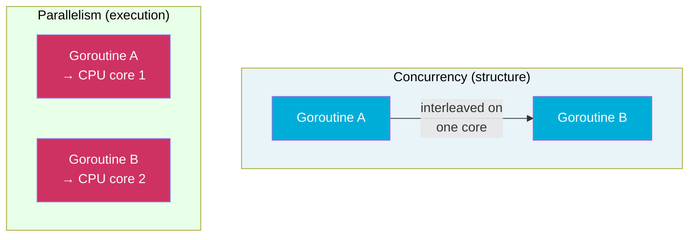

# Concurrency vs. Parallelism in Go

Go is often called a language designed for concurrency. But concurrency is not the same as parallelism — and conflating the two leads to incorrect mental models about what goroutines actually do. Rob Pike's formulation is precise: **concurrency is about dealing with many things at once; parallelism is about doing many things at once**.

## The Core Distinction

**Concurrency** is a program structure. A concurrent program is one composed of independently executing pieces that communicate and coordinate. Those pieces may or may not run at the same physical moment.

**Parallelism** is an execution property. A program executes in parallel when multiple computations proceed simultaneously on multiple CPU cores.



You can have concurrency without parallelism (many goroutines, `GOMAXPROCS=1`). You can have parallelism without meaningful concurrency structure (e.g., a parallel array sum with no coordination). Go gives you both — but only if you have multiple cores and `GOMAXPROCS > 1`.

## Concurrency Without Parallelism

With `GOMAXPROCS=1`, only one goroutine runs at a time. The Go scheduler interleaves them on a single OS thread — switching at blocking points (channel operations, syscalls, function calls in older versions, or explicit preemption in Go 1.14+).

```go
package main

import (
	"fmt"
	"runtime"
	"sync"
)

func main() {
	// highlight-next-line
	runtime.GOMAXPROCS(1) // single OS thread — no parallelism

	var wg sync.WaitGroup
	for i := 0; i < 4; i++ {
		wg.Add(1)
		go func(id int) {
			defer wg.Done()
			fmt.Printf("goroutine %d running\n", id)
		}(i)
	}
	wg.Wait()
}
```

<codapi-snippet sandbox="go" editor="basic">
</codapi-snippet>

All four goroutines run concurrently (the program structure is concurrent) but sequentially on one core (no parallelism). The scheduler decides the order. The program is still correct — channels and mutexes work identically with `GOMAXPROCS=1`.

## Enabling Parallelism

`GOMAXPROCS` controls the number of logical processors (Ps) that execute goroutines simultaneously. The default is `runtime.NumCPU()` since Go 1.5.

```go
package main

import (
	"fmt"
	"runtime"
	"sync"
	"sync/atomic"
	"time"
)

func main() {
	cores := runtime.NumCPU()
	fmt.Printf("NumCPU=%d, GOMAXPROCS=%d\n", cores, runtime.GOMAXPROCS(0))

	var count int64
	var wg sync.WaitGroup
	start := time.Now()

	for i := 0; i < 4; i++ {
		wg.Add(1)
		go func() {
			defer wg.Done()
			for j := 0; j < 10_000_000; j++ {
				// highlight-next-line
				atomic.AddInt64(&count, 1) // safe across goroutines
			}
		}()
	}

	wg.Wait()
	fmt.Printf("count=%d elapsed=%v\n", count, time.Since(start))
}
```

<codapi-snippet sandbox="go" editor="basic">
</codapi-snippet>

With `GOMAXPROCS=4` (on a 4-core machine), all four goroutines execute simultaneously — that's parallelism. The total CPU time consumed is roughly 4× a single-goroutine run, but wall-clock time is ~1×.

## I/O-Bound vs CPU-Bound Workloads

The concurrency/parallelism distinction matters most depending on your workload:

import Tabs from '@theme/Tabs';
import TabItem from '@theme/TabItem';

<Tabs>
  <TabItem value="io" label="I/O-bound" default>

For workloads that spend most of their time waiting — HTTP requests, database queries, file reads — **concurrency is the primary win**, even on a single core.

A goroutine blocked on I/O releases its P so other goroutines can run. You can serve thousands of concurrent HTTP connections on `GOMAXPROCS=1` because most goroutines are sleeping at any given moment.

```go
// Each goroutine blocks waiting for network I/O
// GOMAXPROCS doesn't need to be high for throughput
go func() {
    resp, _ := http.Get("https://example.com") // blocks here
    // P is free while waiting
    defer resp.Body.Close()
}()
```

Increasing `GOMAXPROCS` beyond 1 helps little for pure I/O workloads because the bottleneck is network/disk latency, not CPU.

  </TabItem>
  <TabItem value="cpu" label="CPU-bound">

For workloads that spend most time computing — image processing, cryptography, data transformation — **parallelism matters**. Each goroutine needs a core to make progress.

```go
// Each goroutine does CPU work — needs its own core
go func(chunk []float64) {
    for i := range chunk {
        chunk[i] = math.Sqrt(chunk[i]) // pure CPU
    }
}(data[start:end])
```

For CPU-bound work, `GOMAXPROCS` should equal the number of cores. Going higher adds scheduler overhead without benefit — there's no I/O to overlap.

  </TabItem>
</Tabs>

## The Classic Analogy: Coffee Shop

Rob Pike's gopher analogies capture this well. Consider a coffee shop:

- **Concurrency**: one barista handles multiple orders by switching between tasks — grinding, brewing, steaming — while each step waits. One person, many in-flight tasks.
- **Parallelism**: multiple baristas each making a drink simultaneously. Multiple people, simultaneous work.

Go's goroutines give you both. One goroutine per customer request (concurrent structure), spread across `GOMAXPROCS` baristas (parallel execution).

:::note
Concurrency is a design tool — it decomposes a problem into independently runnable pieces. Whether those pieces run in parallel depends on hardware and `GOMAXPROCS`. A well-structured concurrent program automatically benefits from more cores without code changes.
:::

## Common Misconceptions

:::warning
**"More goroutines = more speed"** — False for CPU-bound work. If you have 1,000 goroutines all doing CPU computation with `GOMAXPROCS=4`, only 4 run simultaneously. The rest wait. Adding more goroutines past `GOMAXPROCS` adds scheduler overhead. For CPU-bound parallelism, spawn approximately `runtime.NumCPU()` goroutines.
:::

:::warning
**"Goroutines are threads"** — Goroutines are multiplexed onto OS threads by the Go runtime scheduler. A goroutine is not an OS thread. See [Goroutine Scheduling](/docs/concurrency/goroutine-scheduling) for the G/M/P model.
:::

## Key Takeaways

- **Concurrency** is a program structure: independently executing components that may interleave. **Parallelism** is simultaneous execution on multiple cores.
- You can have concurrency without parallelism (`GOMAXPROCS=1`). Concurrent Go programs are correct regardless of `GOMAXPROCS`.
- Parallelism requires multiple cores **and** `GOMAXPROCS > 1` (the default since Go 1.5).
- For **I/O-bound** work, concurrency (many goroutines, few cores) is the win — goroutines block on I/O and yield the CPU.
- For **CPU-bound** work, parallelism matters — set `GOMAXPROCS` to `runtime.NumCPU()` and limit goroutines to avoid scheduler overhead.
- A well-structured concurrent program automatically scales to more cores: the design doesn't need to change.
