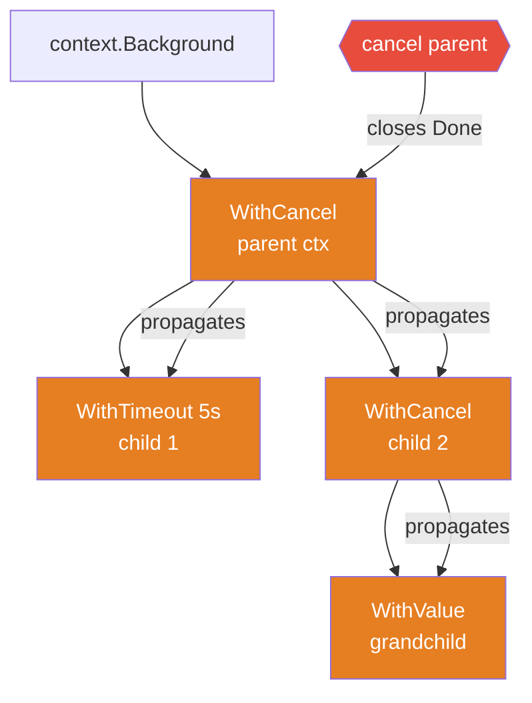

# Context Cancellation: Deadlines, Propagation, and Cleanup

`context.Context` is Go's standard mechanism for carrying cancellation signals, deadlines, and request-scoped values across API boundaries and goroutine trees. It is the correct answer to "how do I stop a goroutine from the outside?" and "how do I enforce a deadline across multiple layers of my program?"

## The context.Context Interface

```go
type Context interface {
    Deadline() (deadline time.Time, ok bool)
    Done() <-chan struct{}
    Err() error
    Value(key any) any
}
```

- `Done()` returns a channel that is closed when the context is cancelled or its deadline expires. This is the channel you watch in `select` to detect cancellation.
- `Err()` returns `nil` while the context is active; `context.Canceled` if it was cancelled by calling the cancel function; `context.DeadlineExceeded` if the deadline passed.
- `Deadline()` returns the absolute time at which the context will be cancelled automatically, and whether a deadline is set.
- `Value()` retrieves a value stored by a parent context under a specific key.

## The Four Constructors

```go
// Root contexts — no parent, never cancelled automatically
ctx := context.Background() // use at the top of the call chain
ctx := context.TODO()       // placeholder when you haven't decided yet

// Derived contexts — wrap a parent and add behavior
ctx, cancel := context.WithCancel(parent)
ctx, cancel := context.WithTimeout(parent, 5*time.Second)
ctx, cancel := context.WithDeadline(parent, time.Now().Add(5*time.Second))
val := context.WithValue(parent, key, value)
```

`WithTimeout` is sugar for `WithDeadline(parent, time.Now().Add(timeout))`. Both return a `cancel` function.

:::warning Always call cancel()
`WithCancel` and `WithTimeout` start an internal goroutine that monitors the deadline and closes `Done()` at the right moment. If you never call `cancel()`, that goroutine leaks until the parent context is itself cancelled. Always `defer cancel()` immediately after creating a derived context.
:::

## Cancellation Propagation: Parent to Child

Cancellation flows strictly **downward** through the context tree. When a parent context is cancelled, all of its children (and their children, recursively) are cancelled simultaneously. Children cannot cancel parents.



When the parent is cancelled:
- All children have their `Done()` channel closed concurrently.
- Each child's `Err()` returns `context.Canceled` (or `context.DeadlineExceeded` if their own deadline expired first).

A child's `WithTimeout` can also cancel before the parent does — the earlier deadline wins. But a child cancellation never travels up.

## Pattern 1: Goroutine That Respects Cancellation

The core pattern: check `ctx.Done()` in every iteration of a long-running loop.

```go
package main

import (
	"context"
	"fmt"
	"time"
)

func worker(ctx context.Context, id int, results chan<- string) {
	for i := 0; ; i++ {
		// highlight-next-line
		select {
		case <-ctx.Done():
			// highlight-next-line
			fmt.Printf("worker %d stopping: %v\n", id, ctx.Err())
			return
		default:
		}

		// Simulate a unit of work
		time.Sleep(40 * time.Millisecond)
		results <- fmt.Sprintf("worker-%d item-%d", id, i)
	}
}

func main() {
	ctx, cancel := context.WithTimeout(context.Background(), 150*time.Millisecond)
	// highlight-next-line
	defer cancel() // always defer immediately

	results := make(chan string, 20)
	for id := range 3 {
		go worker(ctx, id, results)
	}

	// Collect results until context expires
	for {
		select {
		case <-ctx.Done():
			fmt.Println("main: context done:", ctx.Err())
			return
		case r := <-results:
			fmt.Println(r)
		}
	}
}
```
<codapi-snippet sandbox="go" editor="basic"></codapi-snippet>

The non-blocking `select`/`default` check at the top of the loop is a common idiom for checking cancellation without blocking. If the goroutine is doing truly interruptible work (blocking I/O, another channel receive), put the `<-ctx.Done()` in the same `select` as the blocking operation instead.

## Pattern 2: Goroutine Tree with Shared Cancellation

Multiple goroutines sharing one context are cancelled together when the context is cancelled:

```go
package main

import (
	"context"
	"fmt"
	"sync"
	"time"
)

func subtask(ctx context.Context, wg *sync.WaitGroup, name string) {
	defer wg.Done()
	select {
	case <-time.After(500 * time.Millisecond):
		fmt.Println(name, "completed normally")
	// highlight-next-line
	case <-ctx.Done():
		fmt.Println(name, "cancelled:", ctx.Err())
	}
}

func main() {
	ctx, cancel := context.WithCancel(context.Background())
	defer cancel()

	var wg sync.WaitGroup
	for _, name := range []string{"alpha", "beta", "gamma"} {
		wg.Add(1)
		go subtask(ctx, &wg, name)
	}

	time.Sleep(100 * time.Millisecond)
	// highlight-next-line
	cancel() // cancels all three goroutines simultaneously

	wg.Wait()
	fmt.Println("all goroutines cleaned up")
}
```
<codapi-snippet sandbox="go" editor="basic"></codapi-snippet>

## Cleanup on Cancellation

When `ctx.Done()` fires, the goroutine has an obligation to clean up before returning. Cleanup may include:

- Flushing an in-progress write buffer
- Closing an open network connection
- Sending a "cancelled" response to a downstream caller
- Releasing a lock or semaphore

```go
package main

import (
	"context"
	"fmt"
	"time"
)

type Connection struct{ id int }

func (c *Connection) Close() { fmt.Printf("connection %d closed\n", c.id) }

func processWithCleanup(ctx context.Context, conn *Connection) error {
	defer conn.Close() // always close, regardless of why we return

	for i := 0; ; i++ {
		select {
		case <-ctx.Done():
			// highlight-next-line
			// Flush any buffered state before returning
			fmt.Printf("flushing partial work at item %d\n", i)
			return ctx.Err()
		case <-time.After(30 * time.Millisecond):
			fmt.Printf("processed item %d\n", i)
		}
	}
}

func main() {
	ctx, cancel := context.WithTimeout(context.Background(), 120*time.Millisecond)
	defer cancel()

	conn := &Connection{id: 42}
	err := processWithCleanup(ctx, conn)
	fmt.Println("finished with:", err)
}
```
<codapi-snippet sandbox="go" editor="basic"></codapi-snippet>

## `ctx.Err()` After Cancellation

`ctx.Err()` lets you distinguish between voluntary cancellation and deadline expiry:

```go
package main

import (
	"context"
	"fmt"
	"time"
)

func classify(ctx context.Context) {
	<-ctx.Done()
	// highlight-next-line
	switch ctx.Err() {
	case context.Canceled:
		fmt.Println("context was explicitly cancelled")
	case context.DeadlineExceeded:
		fmt.Println("context deadline exceeded")
	}
}

func main() {
	ctx1, cancel1 := context.WithCancel(context.Background())
	go classify(ctx1)
	cancel1() // explicit cancel
	time.Sleep(10 * time.Millisecond)

	ctx2, cancel2 := context.WithTimeout(context.Background(), 50*time.Millisecond)
	defer cancel2()
	go classify(ctx2)
	time.Sleep(100 * time.Millisecond)
}
```
<codapi-snippet sandbox="go" editor="basic"></codapi-snippet>

:::warning Context values are not function parameters
`context.WithValue` is for request-scoped metadata — trace IDs, authenticated user identities, locale settings. It is not a way to smuggle optional configuration into functions. Functions should declare their parameters explicitly. Accessing a value through `ctx.Value(key)` bypasses type checking and makes dependencies invisible.
:::

:::danger Never store context in a struct
Context should be passed as the first argument to every function that needs it, conventionally named `ctx`. Storing it in a struct means the context's lifetime is tied to the struct's lifetime, not the request's lifetime, which breaks the deadline and cancellation model.

```go
// Wrong
type Server struct {
    ctx context.Context
}

// Correct
func (s *Server) HandleRequest(ctx context.Context, req Request) {}
```
:::

## Key Takeaways

- `context.Context` carries cancellation signals, deadlines, and key-value pairs. Its `Done()` channel is closed when cancelled or expired.
- Cancellation propagates parent-to-child automatically. A cancelled parent cancels all descendants. Children cannot cancel parents.
- Always `defer cancel()` immediately after `WithCancel` or `WithTimeout` to prevent goroutine leaks.
- Check `<-ctx.Done()` in select statements inside long-running loops; use a non-blocking `select`/`default` check if you cannot block.
- Use `ctx.Err()` to distinguish `context.Canceled` from `context.DeadlineExceeded` and to determine the appropriate cleanup action.
- Pass context as the first argument to functions; never store it in a struct or use it to pass optional function parameters.
