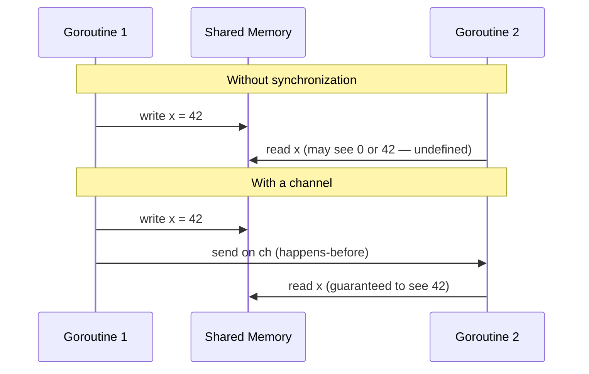

# Go Memory Model

The Go memory model is a specification that defines **when a write to a variable by one goroutine is guaranteed to be observable by a read of the same variable by another goroutine**. If you have never read it, the short version is: far fewer guarantees than you probably assume.

Understanding the memory model is not academic. It is the foundation for every correct concurrent program in Go. Without it, you are writing code that happens to work on your laptop today but silently corrupts data in production under different hardware, a different Go version, or different load patterns.

## Why Reordering Happens

Modern hardware and compilers do not execute your program in the order you wrote it. There are three layers where reordering occurs:

- **Compiler reordering**: The Go compiler may reorder stores and loads if the reordering is unobservable within a single goroutine. From the compiler's point of view, a write that no other goroutine will see can be deferred or eliminated.
- **CPU out-of-order execution**: Modern CPUs execute instructions out of order to maximize pipeline utilization. A write issued early may not be committed to cache before a later read.
- **CPU cache coherency**: Each core has its own L1 and L2 caches. A write by core 0 may sit in that core's write buffer and not be flushed to shared L3 for an unpredictable amount of time. Core 1 may read a stale value from its own cache.

On x86, the memory model is relatively strong (total store order), so races are harder to observe. On ARM (including Apple Silicon) and POWER, the memory model is weaker and reordering is far more aggressive. Code that appears correct on x86 can exhibit blatant corruption on ARM. This is the precise reason "it works on my machine" is not good enough.

## The Happens-Before Relationship

The Go memory model is defined in terms of a partial order called **happens-before**. If event A happens-before event B, then:

- All memory writes visible at A are guaranteed to be visible at B.
- The runtime, compiler, and CPU must not reorder operations in a way that violates this order.

If there is no happens-before relationship between two events, neither can assume anything about what the other has written. The specification explicitly says: if a read and a write of the same variable are not ordered by happens-before, the read may observe any value — including garbage.

:::note
Happens-before is a **partial** order. Events that are not related in either direction are called **concurrent**, and no ordering guarantee applies to them.
:::

## No Synchronization: No Guarantee

Within a single goroutine, the happens-before order matches program order. Everything that appears earlier in the code happens-before everything that appears later, as observed by that goroutine.

Across goroutines, there is **no happens-before relationship unless you establish one explicitly** using a synchronization operation. This means:

```go
package main

import "fmt"

var x int

func main() {
	// highlight-next-line
	go func() { x = 42 }() // Write to x in goroutine
	// highlight-next-line
	fmt.Println(x)          // Read x in main — may see 0, 42, or crash
}
```

This program has a data race. The goroutine write and the main goroutine read are not ordered. The Go memory model says the read may observe any value the system pleases.

## Synchronization Operations That Establish Happens-Before

The following operations create happens-before edges between goroutines:

### Goroutine Creation

The `go` statement that starts a goroutine happens-before the goroutine's execution begins. Writes made before the `go` statement are visible to the new goroutine.

```go
package main

import (
	"fmt"
	"sync"
)

var config = "default"

func main() {
	// highlight-next-line
	config = "production"   // This write happens-before the goroutine starts
	var wg sync.WaitGroup
	wg.Add(1)
	go func() {
		defer wg.Done()
		fmt.Println(config) // Guaranteed to see "production"
	}()
	wg.Wait()
}
```

### Channel Operations

A send on a channel happens-before the corresponding receive from that channel completes. For unbuffered channels, the receive synchronizes directly with the send. For buffered channels, the kth receive happens-before the (k+C)th send completes, where C is the capacity.

### The `sync` Package

`sync.Mutex` Unlock happens-before any subsequent Lock. `sync.WaitGroup` Done happens-before Wait returns. These are covered in depth in the [Happens-Before article](./happens-before).

### Atomic Operations (Go 1.19+)

Since the Go 1.19 memory model revision, `atomic.Store` is guaranteed to happen-before an `atomic.Load` that observes the stored value. Atomics are now explicitly sequentially consistent in the memory model.

## A Broken Program

:::warning This is a data race
The program below has undefined behavior under the Go memory model. The race detector will flag it. Do not use this pattern.
:::

```go
package main

import (
	"fmt"
	"sync"
)

func main() {
	var counter int
	var wg sync.WaitGroup

	for i := 0; i < 1000; i++ {
		wg.Add(1)
		go func() {
			defer wg.Done()
			// highlight-next-line
			counter++ // DATA RACE: read-modify-write is not atomic
		}()
	}

	wg.Wait()
	fmt.Println("counter:", counter) // Might print anything less than 1000
}
```
<codapi-snippet sandbox="go" editor="basic"></codapi-snippet>

Run this a few times. You will often see a value less than 1000 because increments from different goroutines interleave and overwrite each other. On some runs you may get 1000 by luck — that is the insidious part. The race detector (`go run -race`) will always catch it.

## The Fixed Version: Mutex

```go
package main

import (
	"fmt"
	"sync"
)

func main() {
	var counter int
	var mu sync.Mutex
	var wg sync.WaitGroup

	for i := 0; i < 1000; i++ {
		wg.Add(1)
		go func() {
			defer wg.Done()
			// highlight-next-line
			mu.Lock()
			counter++
			// highlight-next-line
			mu.Unlock()
		}()
	}

	wg.Wait()
	fmt.Println("counter:", counter) // Always 1000
}
```
<codapi-snippet sandbox="go" editor="basic"></codapi-snippet>

The `mu.Unlock()` in one goroutine happens-before the `mu.Lock()` in the next. This chains the happens-before relationships so each increment is fully visible to the next.

## Visualizing Two Goroutines: Unsync vs Channel



The channel send creates the happens-before edge. Without it, the memory model makes no guarantee about what G2 sees.

## The Core Rule

The Go memory model can be summarized in one practical rule:

> If two goroutines access the same variable and at least one of the accesses is a write, then all accesses must be synchronized — otherwise the program has a data race and its behavior is undefined.

"Undefined behavior" in Go means: the race detector will report it, the results are unpredictable, and future Go versions or different hardware are permitted to make things worse, not better.

## Key Takeaways

- The Go memory model defines visibility guarantees for writes across goroutines using the **happens-before** partial order.
- Within a single goroutine, happens-before matches program order. Across goroutines, there are no guarantees without explicit synchronization.
- Hardware (CPU caches, out-of-order execution) and the compiler both reorder operations. The memory model is the contract that constrains this reordering.
- Operations that establish happens-before: goroutine creation, channel sends/receives, `sync.Mutex` lock/unlock, `sync.WaitGroup` Done/Wait, and atomic operations.
- Any concurrent access where at least one goroutine writes and there is no synchronization is a **data race** — undefined behavior in Go.
- Always run your test suite with `-race`. Make it part of CI.
