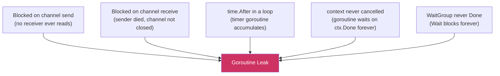

# Goroutine Leaks: Goroutine Leaks: Causes, Detection, and Prevention

A goroutine leak happens when a goroutine is started but never terminates. Leaked goroutines accumulate over time — each holds a stack (starting at 2–8 KB, growing as needed), any memory it references, and any network or file handles. In a long-running server, a small per-request leak becomes a memory growth that eventually causes OOM crashes or catastrophic GC pressure. Unlike thread leaks in other languages, Go goroutine leaks are silent: the runtime keeps them alive, and they show up only in heap profiles or goroutine counts.

## How Goroutines Leak

A goroutine leaks when it is permanently blocked with no way to unblock, or when it loops forever waiting on a condition that is never met.



## Pattern 1: Abandoned Channel Send

The goroutine sends on a channel that nobody reads anymore:

```go
package main

import (
	"fmt"
	"runtime"
	"time"
)

func leak() {
	ch := make(chan int) // unbuffered
	go func() {
		result := compute()
		// highlight-next-line
		ch <- result // BLOCKS FOREVER if nobody reads ch
	}()
	// caller returns without reading ch — goroutine is stuck
}

func compute() int { return 42 }

func main() {
	for i := 0; i < 10; i++ {
		leak()
	}
	time.Sleep(100 * time.Millisecond)
	fmt.Println("goroutines:", runtime.NumGoroutine()) // 11 — 10 leaked + main
}
```

<codapi-snippet sandbox="go" editor="basic">
</codapi-snippet>

**Fix**: use a buffered channel of size 1, so the send completes even if nobody reads immediately:

```go
func noLeak() {
	// highlight-next-line
	ch := make(chan int, 1) // buffered: send completes without a receiver
	go func() {
		ch <- compute()
	}()
	// goroutine exits even if caller never reads ch
}
```

Or use a `select` with a `done` channel / context so the goroutine can exit:

```go
func noLeakWithCtx(ctx context.Context) {
	ch := make(chan int, 1)
	go func() {
		select {
		case ch <- compute():
		case <-ctx.Done(): // exits if context is cancelled
		}
	}()
}
```

## Pattern 2: Abandoned Channel Receive

The goroutine waits to receive, but the sender exits without closing the channel:

```go
func leakyWorker(jobs <-chan string) {
	go func() {
		for job := range jobs { // BLOCKS FOREVER if jobs is never closed
			process(job)
		}
	}()
}

func process(s string) {}
```

If `jobs` is never closed, `range jobs` blocks forever after all items are consumed.

**Fix**: always close the channel when the sender is done, or use a done/context signal:

```go
func main() {
	jobs := make(chan string, 10)

	go func() {
		for job := range jobs {
			process(job)
		}
	}()

	jobs <- "task1"
	jobs <- "task2"
	// highlight-next-line
	close(jobs) // signals the worker to exit after draining
}
```

## Pattern 3: time.After in a Loop

`time.After(d)` creates a new `time.Timer` and returns its channel. The timer (and its goroutine) is only garbage collected after it fires — not when you stop using the channel. Inside a loop, this creates a new unreleased timer every iteration:

```go
func leakyPoller(ctx context.Context) {
	for {
		select {
		case <-ctx.Done():
			return
		// highlight-next-line
		case <-time.After(1 * time.Second): // new timer every iteration — leaks until it fires
			poll()
		}
	}
}

func poll() {}
```

**Fix**: use `time.NewTicker` for periodic work, or reuse a single `time.Timer`:

```go
package main

import (
	"context"
	"fmt"
	"time"
)

func correctPoller(ctx context.Context) {
	// highlight-next-line
	ticker := time.NewTicker(1 * time.Second)
	defer ticker.Stop() // releases the ticker when done

	for {
		select {
		case <-ctx.Done():
			return
		case <-ticker.C:
			fmt.Println("tick")
		}
	}
}

func main() {
	ctx, cancel := context.WithTimeout(context.Background(), 3*time.Second)
	defer cancel()
	correctPoller(ctx)
}
```

<codapi-snippet sandbox="go" editor="basic">
</codapi-snippet>

## Pattern 4: Missing Context Propagation

Goroutines that wait on a context that is never passed down or cancelled:

```go
func handler(w http.ResponseWriter, r *http.Request) {
	go func() {
		// highlight-next-line
		result, err := db.QueryContext(context.Background(), query) // ignores r.Context()!
		// If the HTTP request is cancelled, this goroutine keeps running
		_ = result
		_ = err
	}()
}
```

**Fix**: pass the request context so the goroutine exits when the request is cancelled:

```go
func handler(w http.ResponseWriter, r *http.Request) {
	go func() {
		// highlight-next-line
		result, err := db.QueryContext(r.Context(), query) // exits if request is cancelled
		_ = result
		_ = err
	}()
}
```

:::danger
Launching goroutines in HTTP handlers without tying them to `r.Context()` is one of the most common leak patterns in Go servers. Each cancelled or timed-out request leaves a goroutine running to completion (or forever). Under load, this accumulates into hundreds of leaked goroutines.
:::

## Detecting Leaks

### runtime.NumGoroutine

The simplest check: print goroutine count before and after an operation:

```go
package main

import (
	"fmt"
	"runtime"
	"time"
)

func main() {
	before := runtime.NumGoroutine()

	for i := 0; i < 5; i++ {
		go func() {
			time.Sleep(50 * time.Millisecond)
		}()
	}

	time.Sleep(200 * time.Millisecond) // wait for goroutines to finish
	after := runtime.NumGoroutine()

	fmt.Printf("before: %d, after: %d, leaked: %d\n", before, after, after-before)
}
```

<codapi-snippet sandbox="go" editor="basic">
</codapi-snippet>

### pprof Goroutine Profile

In a running server, the goroutine profile shows every live goroutine and its stack:

```bash
# if net/http/pprof is imported:
curl http://localhost:6060/debug/pprof/goroutine?debug=2
```

Look for stacks that repeat — hundreds of goroutines stuck at the same `chan receive` or `select` line is the signature of a leak.

### goleak in Tests

`go.uber.org/goleak` integrates goroutine leak detection into tests:

```go
import "go.uber.org/goleak"

func TestMain(m *testing.M) {
	// highlight-next-line
	goleak.VerifyTestMain(m) // fails if any goroutines are still running after tests
}

// Or per-test:
func TestHandler(t *testing.T) {
	defer goleak.VerifyNone(t)
	// ... test code
}
```

`goleak` captures the goroutine count before the test, runs it, and asserts that no extra goroutines remain afterwards. It's the most reliable way to catch leaks in unit and integration tests.

## Prevention Checklist

import Tabs from '@theme/Tabs';
import TabItem from '@theme/TabItem';

<Tabs>
<TabItem value="channels" label="Channels" default>

- The goroutine that creates a channel is usually responsible for closing it.
- A goroutine blocked on receive exits when the channel is closed — always close producer channels when done.
- Use buffered channels (size 1) for fire-and-forget sends where you don't want to wait for a receiver.
- Use `select` with a done/context case on any blocking send or receive.

</TabItem>
<TabItem value="context" label="Context">

- Every goroutine that does I/O or waits should accept a `context.Context` and respect `ctx.Done()`.
- Never use `context.Background()` inside a goroutine launched from a request handler — pass the request context.
- Parent contexts cancel child contexts — structure context trees so cancellation propagates naturally.

</TabItem>
<TabItem value="timers" label="Timers">

- Never use `time.After` inside a loop — use `time.NewTicker` and `defer ticker.Stop()`.
- Always call `timer.Stop()` when done with a `time.NewTimer` and drain the channel if Stop returns false.
- For one-shot delays inside a select, `time.After` is fine — the timer fires once and is then GC'd.

</TabItem>
</Tabs>

## Key Takeaways

- Goroutine leaks are silent at runtime — goroutines accumulate, eating memory and goroutine stacks.
- The four main causes: blocked channel send/receive with no counterpart, `time.After` in a loop, and missing context propagation.
- Always close producer channels when done to unblock `range`-based consumers.
- Use `context.Context` to give all goroutines an exit signal; never use `context.Background()` in a request-scoped goroutine.
- Replace `time.After` in loops with `time.NewTicker` + `defer ticker.Stop()`.
- Detect leaks in tests with `goleak`; in production with pprof goroutine profiles and `runtime.NumGoroutine` monitoring.
