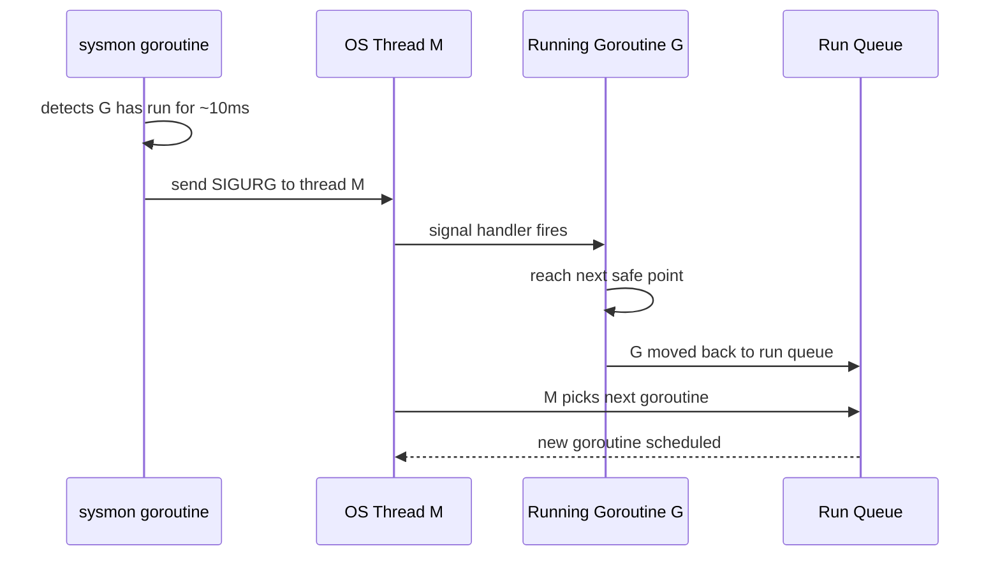

# Preemption: Why Tight CPU Loops Can Starve Other Goroutines

Go's scheduler is cooperative in spirit but increasingly preemptive in implementation. Understanding the history — and the remaining gaps — is essential for writing Go programs that stay responsive under CPU-intensive workloads.

## A Brief History of Go Preemption

### Before Go 1.14: Cooperative Scheduling Only

In early versions of Go, goroutines were **never preempted involuntarily**. The scheduler could only take back a goroutine's P at explicit yield points:

- **Function call boundaries**: the compiler inserted a check at the start of every non-inlined function to see if the goroutine should yield.
- **Channel operations**: sending or receiving blocks the goroutine, freeing the P.
- **Runtime calls**: allocating memory, calling `runtime.Gosched()`, and similar operations were yield points.

This meant a goroutine running a tight loop — no function calls, no allocations — could hold its P indefinitely. No other goroutine on that P could run until the loop finished.

```go
// Historical problem: this loop could never be preempted before Go 1.14
func spinForever() {
	for {
		// No function calls, no allocations.
		// On Go < 1.14 with GOMAXPROCS=1: everything else starves.
	}
}
```

The practical consequence: programs with `GOMAXPROCS=1` and a CPU-bound goroutine in a tight loop would freeze all other goroutines, including the garbage collector. Even with `GOMAXPROCS>1`, a tight loop on every P would crowd out I/O-bound goroutines sharing those Ps.

### Go 1.14+: Asynchronous Preemption

Go 1.14 introduced **asynchronous preemption**. The runtime's monitoring goroutine (`sysmon`) sends a `SIGURG` signal to OS threads running goroutines that have been scheduled too long (approximately 10 ms without yielding). The signal handler suspends the goroutine at the next safe point — a point where the runtime can inspect and modify the goroutine's stack safely — and moves it back to the run queue.

The key word is "safe point." Not every instruction is a safe point. The runtime must be able to identify all live pointers on the goroutine's stack for the garbage collector. In practice, most instructions after Go 1.14 are safe points, but there are still narrow regions (e.g., very early in function prologues) where preemption is deferred.

:::info Why SIGURG?
`SIGURG` (Urgent condition on socket) was chosen because it is not used by most programs and is not blocked by any signals mask in common Go programs. It acts as an out-of-band interrupt to the OS thread, which then suspends the goroutine at the next safe point.
:::

## Why It Still Matters After Go 1.14

Asynchronous preemption does not eliminate all starvation risks:

1. **Latency spikes**: a goroutine can still run for up to ~10 ms before being preempted. In a latency-sensitive service handling requests in microseconds, a 10 ms starvation event is a significant spike.
2. **`GOMAXPROCS=1`**: with a single P, asynchronous preemption works, but you have only one goroutine running at a time. A CPU-bound goroutine still blocks I/O-bound goroutines for up to ~10 ms between preemptions.
3. **CGo**: goroutines executing C code via `cgo` cannot be preempted until they return to Go code. A C function that runs for seconds holds its M without preemption.
4. **`//go:nosplit` functions**: functions marked `//go:nosplit` cannot grow the stack, and the compiler emits no preemption checks for them. These are intentionally used in the runtime but can be a source of scheduling gaps.

## Demonstrating the Old Problem (with a Fix)

The following program shows what happens when a goroutine does heavy CPU work and other goroutines need to share the same P. We use `runtime.Gosched()` to manually yield and observe the difference.

```go
package main

import (
	"fmt"
	"runtime"
	"sync"
	"time"
)

func cpuBound(label string, iterations int, yield bool, wg *sync.WaitGroup) {
	defer wg.Done()
	for i := 0; i < iterations; i++ {
		// A small computation to keep the loop from being optimized away
		_ = i * i
		// highlight-next-line
		if yield && i%100_000 == 0 {
			runtime.Gosched() // Manually yield the processor
		}
	}
	fmt.Printf("%s finished\n", label)
}

func main() {
	// highlight-next-line
	runtime.GOMAXPROCS(1) // Single P: starkly shows scheduling contention

	var wg sync.WaitGroup

	start := time.Now()
	wg.Add(3)

	go cpuBound("worker-A", 5_000_000, true, &wg)
	go cpuBound("worker-B", 5_000_000, true, &wg)
	go cpuBound("worker-C", 5_000_000, true, &wg)

	wg.Wait()
	fmt.Printf("done in %v\n", time.Since(start))
}
```
<codapi-snippet sandbox="go" editor="basic"></codapi-snippet>

With `runtime.Gosched()` at regular intervals, the three workers interleave. Remove the `yield` calls (set `yield: false`) and watch what changes: one goroutine tends to run to completion before the others get a chance, because preemption only fires every ~10 ms — and with `GOMAXPROCS=1`, there is only one P to go around.

## Demonstrating Latency Impact

```go
package main

import (
	"fmt"
	"runtime"
	"sync"
	"time"
)

func main() {
	// highlight-next-line
	runtime.GOMAXPROCS(1)

	var wg sync.WaitGroup
	latencies := make([]time.Duration, 0, 10)
	var mu sync.Mutex

	// CPU-bound goroutine: holds P for long stretches
	wg.Add(1)
	go func() {
		defer wg.Done()
		deadline := time.Now().Add(200 * time.Millisecond)
		for time.Now().Before(deadline) {
			_ = 1 + 1 // tight loop, no yield
		}
	}()

	// Latency-sensitive goroutine: wants to run every 10ms
	wg.Add(1)
	go func() {
		defer wg.Done()
		for i := 0; i < 10; i++ {
			before := time.Now()
			// highlight-next-line
			time.Sleep(10 * time.Millisecond) // wakes up and immediately wants to run
			actual := time.Since(before)
			mu.Lock()
			latencies = append(latencies, actual)
			mu.Unlock()
		}
	}()

	wg.Wait()

	mu.Lock()
	defer mu.Unlock()
	for i, l := range latencies {
		fmt.Printf("wake %d: expected ~10ms, got %v\n", i+1, l.Round(time.Millisecond))
	}
}
```
<codapi-snippet sandbox="go" editor="basic"></codapi-snippet>

The latency-sensitive goroutine wakes from `time.Sleep` ready to run, but must wait for the CPU-bound goroutine to be preempted. With `GOMAXPROCS=1`, actual wake latency can be significantly higher than the requested 10 ms.

## The Asynchronous Preemption Mechanism

When `sysmon` determines a goroutine has been running too long:



The `sysmon` goroutine runs on its own OS thread (not tied to a P) and polls every 20 µs for goroutines that need preemption, retrying threads that are in long-running syscalls or have held a P for too long.

## `runtime.Gosched()`: Manual Cooperation

`runtime.Gosched()` yields the processor voluntarily. The current goroutine is moved to the tail of the **global run queue**, and the P immediately picks a new goroutine from its local queue or steals work.

Use `runtime.Gosched()` when:

- You have a tight loop that must be responsive to other goroutines and you want to guarantee yield points more frequently than preemption fires.
- You are implementing custom scheduling logic or a spin-lock in Go.
- You are targeting environments where preemption latency matters (low-latency services, games, real-time systems).

```go
package main

import (
	"fmt"
	"runtime"
	"sync"
)

func main() {
	runtime.GOMAXPROCS(1)
	var wg sync.WaitGroup

	counter := 0

	wg.Add(1)
	go func() {
		defer wg.Done()
		for i := 0; i < 5; i++ {
			fmt.Println("printer:", i)
			// highlight-next-line
			runtime.Gosched() // yield to let the counter goroutine run
		}
	}()

	wg.Add(1)
	go func() {
		defer wg.Done()
		for i := 0; i < 5; i++ {
			counter++
			// highlight-next-line
			runtime.Gosched() // yield back to the printer
		}
	}()

	wg.Wait()
	fmt.Println("counter:", counter)
}
```
<codapi-snippet sandbox="go" editor="basic"></codapi-snippet>

## `GOMAXPROCS=1` Behavior

With a single P, everything runs sequentially from the scheduler's point of view. Asynchronous preemption still works (SIGURG is still sent), but only one goroutine can run at a time. The practical effects:

- A tight loop without `Gosched()` holds the only P for ~10 ms at a time between preemptions.
- All I/O-bound goroutines (waiting on timers, network) can still make progress when they are unblocked — the Go runtime uses the network poller to inject them into the run queue — but they must wait for the CPU-bound goroutine to be preempted first.
- `GOMAXPROCS=1` is useful for deterministic testing and finding races by exposing scheduling interleavings that parallel execution hides.

## Implications for Mixed CPU/IO Workloads

If you observe high tail latency in a service that handles both CPU-intensive requests and lightweight I/O requests:

1. **Profile with `pprof`**: look for goroutines that spend long continuous intervals on-CPU without blocking.
2. **Check `GOMAXPROCS`**: ensure it is set to the number of available cores, not a smaller value.
3. **Add `runtime.Gosched()`** at natural breakpoints in long computation loops.
4. **Consider splitting work**: move heavy CPU work to a separate pool of goroutines with bounded concurrency, so I/O goroutines always have access to at least one P.

```mermaid
gantt
    title P timeline: CPU-bound goroutine with and without Gosched()
    dateFormat  X
    axisFormat  %L ms

    section Without Gosched
    G1 (CPU)   :active, 0, 10
    G1 (CPU)   :active, 10, 20
    G2 (IO)    :crit, 20, 22

    section With Gosched
    G1 (CPU)   :active, 0, 3
    G2 (IO)    :done, 3, 5
    G1 (CPU)   :active, 5, 8
    G2 (IO)    :done, 8, 10
```



The bottom timeline shows G2 getting regular turns on the P. The top timeline shows G2 blocked until G1 exhausts its preemption window.

## Key Takeaways

- Before Go 1.14, goroutines were only preempted at function call boundaries and explicit yield points. A tight loop with no calls could hold a P forever.
- Go 1.14 introduced asynchronous preemption via `SIGURG`. Goroutines can now be preempted at most safe points, even in tight loops, approximately every 10 ms.
- Async preemption does not eliminate starvation: 10 ms is a long time for latency-sensitive workloads; CGo and `//go:nosplit` functions are still immune.
- `runtime.Gosched()` manually yields the processor. Use it in tight loops where 10 ms preemption latency is unacceptable.
- With `GOMAXPROCS=1`, all goroutines share one P. CPU-bound goroutines delay I/O-bound goroutines for up to ~10 ms between preemptions.
- For mixed CPU/IO workloads with latency requirements, profile first, then add yield points or restructure work into separate goroutine pools.
