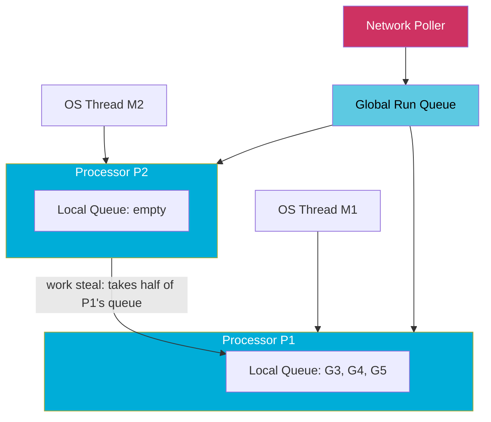
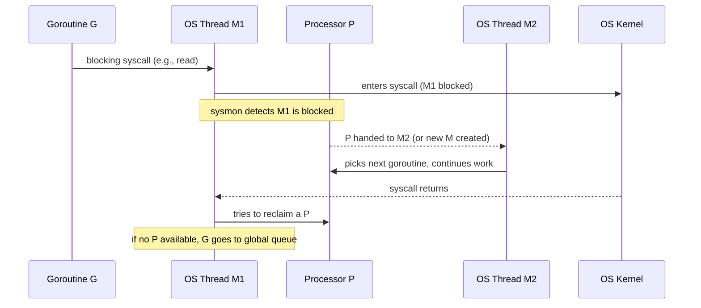

# Goroutine Scheduling: The G, M, P Model

Go lets you start a million goroutines with `go func()`. The reason this is practical — rather than catastrophic — is the Go runtime scheduler. It multiplexes lightweight goroutines onto a small pool of OS threads using a three-entity model: **G**, **M**, and **P**. Understanding this model explains why goroutines are cheap, how work stealing prevents idle cores, and how the runtime keeps running even when goroutines make blocking syscalls.

## The Three Entities

### G — Goroutine

A **G** is the Go runtime's representation of a goroutine. It contains:

- The goroutine's **stack** (starts at 2–8 KB, grows dynamically up to 1 GB by default).
- The goroutine's **program counter** and other register state saved during context switches.
- Scheduling metadata: status (runnable, running, waiting, dead), pointer to the M and P it is currently assigned to.

Because goroutine stacks start small and grow on demand, you can create hundreds of thousands of goroutines without pre-allocating large memory regions. An OS thread typically reserves 1–8 MB of stack, fixed at creation time.

### M — Machine (OS Thread)

An **M** is an OS thread. The Go runtime creates and destroys Ms as needed. An M executes goroutines by running them on its stack via the scheduler loop. Key properties:

- An M must be associated with a P to run user Go code.
- An M without a P can still run certain runtime tasks (e.g., handling a goroutine that just returned from a syscall).
- The number of Ms can exceed `GOMAXPROCS` — extra Ms are created when goroutines make blocking syscalls.

### P — Processor (Scheduling Context)

A **P** is a logical processor. It is the scheduling context that mediates between Gs and Ms. Key properties:

- There are exactly `GOMAXPROCS` Ps (default: number of logical CPU cores, controlled by `runtime.GOMAXPROCS(n)` or the `GOMAXPROCS` environment variable).
- Each P has a **local run queue** of runnable Gs (bounded at 256 entries).
- A P must be held by an M to allow that M to execute Go code.
- Ps hold per-P caches: memory allocator caches (`mcache`), deferred work, and more.

:::note GOMAXPROCS controls parallelism, not concurrency
`GOMAXPROCS` sets the number of Ps, which is the maximum number of goroutines that can execute Go code **simultaneously**. You can have millions of goroutines (concurrency) with `GOMAXPROCS=1` (no parallelism). Increasing `GOMAXPROCS` beyond the number of physical cores rarely helps and can hurt due to increased cache contention.
:::

## The Scheduler Loop

The scheduler runs the following loop on each M:

1. **Pick a G from the P's local run queue** (FIFO order, bounded at 256).
2. If the local queue is empty, **try to steal from another P** (work stealing).
3. If no Gs are available anywhere, **check the global run queue**.
4. If still empty, **check the network poller** for goroutines waiting on I/O that is now ready.
5. If truly nothing to do, the M parks itself (releases P, waits for work).



## Run Queues in Detail

There are three places a runnable G can live:

| Queue | Owner | Capacity | Notes |
|-------|-------|----------|-------|
| Local run queue | One P | 256 Gs | FIFO; fast access without locks |
| Global run queue | Runtime | Unlimited | Protected by a mutex; slower |
| Network poller | Runtime | Unlimited | Goroutines waiting on net I/O, timers |

When a P's local queue is full (256 Gs), the scheduler moves half of them to the global run queue. This prevents any one P from starving others when work is produced faster than it is consumed.

## Work Stealing

Work stealing is the mechanism that keeps all Ps busy even when work is unevenly distributed. When a P finds its local queue empty:

1. It checks the **global run queue** first (periodic check every ~61 scheduling ticks).
2. It randomly picks another **P** and attempts to steal **half** of that P's local queue.
3. If the victim P also has an empty queue, it tries other Ps.

Stealing half (rather than one) amortizes the cost of the steal operation across multiple scheduled goroutines. This is a well-known result from work-stealing scheduler research.

```go
package main

import (
	"fmt"
	"runtime"
	"sync"
	"time"
)

func main() {
	// highlight-next-line
	runtime.GOMAXPROCS(4) // 4 Ps — 4 goroutines can run simultaneously

	var wg sync.WaitGroup
	start := time.Now()

	for i := 0; i < 8; i++ {
		wg.Add(1)
		go func(id int) {
			defer wg.Done()
			// Simulate CPU-bound work
			sum := 0
			for j := 0; j < 10_000_000; j++ {
				sum += j
			}
			fmt.Printf("goroutine %d done (sum=%d)\n", id, sum)
		}(i)
	}

	wg.Wait()
	fmt.Printf("all done in %v with GOMAXPROCS=%d\n", time.Since(start), runtime.GOMAXPROCS(0))
}
```
<codapi-snippet sandbox="go" editor="basic"></codapi-snippet>

With `GOMAXPROCS=4`, four goroutines run truly in parallel. The other four wait in run queues. As a goroutine finishes, a P picks up the next one. Work stealing ensures no P sits idle while another has queued work.

## When Goroutines Are Scheduled Out

A goroutine gives up its M/P slot in several ways:

| Event | What Happens |
|-------|-------------|
| **Blocking syscall** | M detaches from P. P is handed to another M (or a new M is created). M + G block in the kernel. |
| **Channel block** | G is parked (moved to a wait queue), P picks a new G. |
| **`runtime.Gosched()`** | G voluntarily yields; moved to end of global run queue. |
| **Preemption (Go 1.14+)** | SIGURG causes G to be suspended at a safe point; moved to run queue. |
| **Function call (pre-1.14)** | Scheduler may preempt at any function call boundary. |

## Syscall Handling: The Handoff Mechanism

The most important scheduling event for understanding Go's scalability is the syscall handoff. When goroutine G calls a blocking syscall:

1. G and M enter the kernel together. M is now blocked.
2. The Go runtime (via a monitoring thread called `sysmon`) detects that M is blocked.
3. P is **detached** from M and handed to another M (or a new M is created if none is available).
4. Other goroutines continue running on the new M+P pair.
5. When the syscall returns, M attempts to reacquire a P. If none is free, G is placed on the global run queue and M parks itself.



This handoff is why Go programs can make thousands of concurrent blocking syscalls without needing thousands of OS threads — each blocked M releases its P so other goroutines keep making progress.

## Why Goroutines Are Cheaper Than OS Threads

| Property | OS Thread | Goroutine |
|----------|-----------|-----------|
| Initial stack | 1–8 MB (fixed) | 2–8 KB (grows dynamically) |
| Stack growth | Not possible after creation | Segmented or copying stacks, up to 1 GB |
| Context switch | ~1–10 µs (kernel mode) | ~100–300 ns (user space) |
| Creation cost | ~10–100 µs | ~1–2 µs |
| Scheduling | OS kernel | Go runtime (user space) |

A context switch between goroutines only saves and restores the registers the Go ABI uses (a small subset), and happens entirely in user space without a system call. An OS thread context switch requires a kernel mode transition, saving all CPU registers, and updating kernel data structures.

## Key Takeaways

- **G** (goroutine) is a lightweight user-space thread with a small, growable stack. Millions can exist.
- **M** (machine) is an OS thread that executes goroutines. More Ms can be created than `GOMAXPROCS` when blocking syscalls occur.
- **P** (processor) is the scheduling context; there are exactly `GOMAXPROCS` Ps. A P's local run queue holds up to 256 runnable goroutines.
- **Work stealing**: when a P's local queue is empty, it steals half of another P's queue, keeping all cores busy.
- **Syscall handoff**: a blocking syscall causes M to release P so other goroutines continue running on a different M.
- Goroutines are cheap because stacks start small, context switches are in user space, and creation is fast.
- `GOMAXPROCS` controls parallelism (simultaneous execution), not concurrency (total goroutines). Setting it higher than core count rarely helps.
