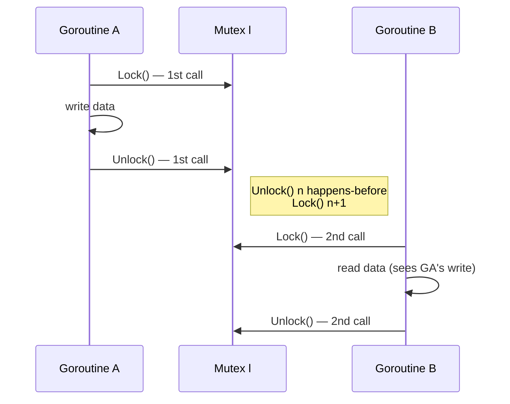
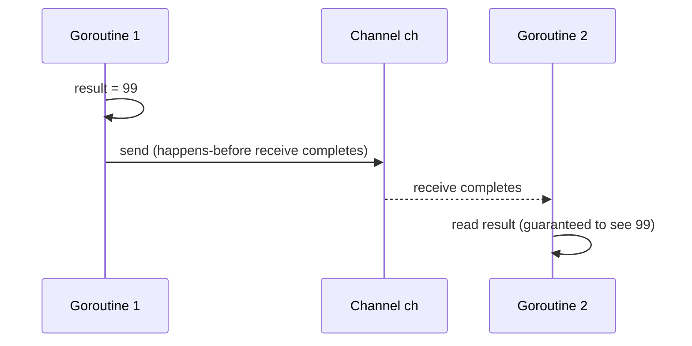
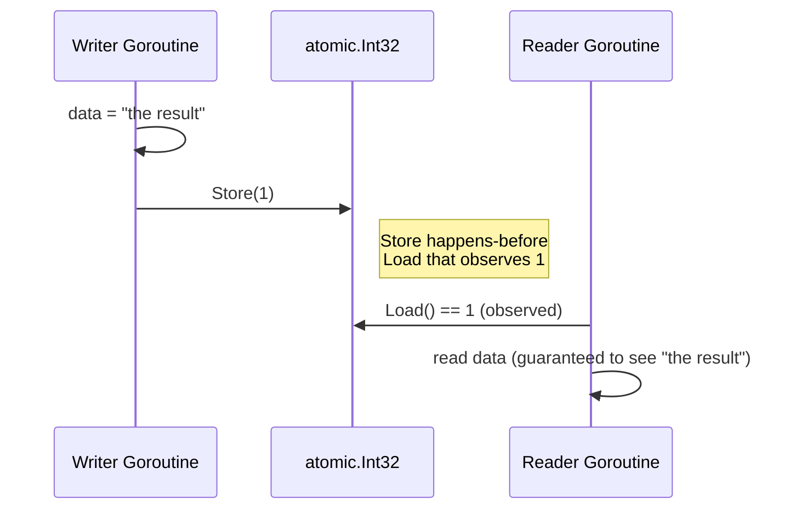
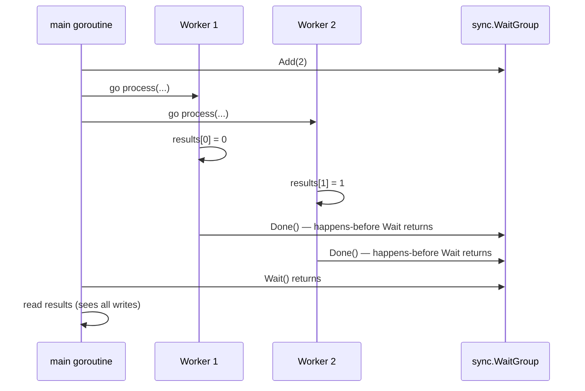

# Happens-Before: Mutex, Channels, Atomic, WaitGroup

The Go memory model is built around a single concept: the **happens-before** relationship. Every correct concurrent program in Go depends on establishing happens-before edges between goroutines at the right points. This article makes those edges precise for each of the four main synchronization mechanisms: mutexes, channels, atomics, and WaitGroups.

## What Happens-Before Means

Happens-before is a **partial order** over events (memory reads and writes, synchronization operations) in a concurrent program. Writing it formally: if event A happens-before event B, we write A → B, and the guarantee is:

- Every memory write that A can observe is also observable at B.
- The program (compiler + CPU + runtime) must not behave in a way that contradicts this ordering.

If neither A → B nor B → A holds, the events are **concurrent** and neither can make any assumption about the other's memory writes. This is not just a theoretical concern — the compiler and CPU actively reorder operations that are not constrained by happens-before.

:::info The key insight
Happens-before is not about wall-clock time. Two events can be "concurrent" even if they happen microseconds apart. What matters is whether a synchronization operation creates a formal ordering between them.
:::

## 1. Mutex

The Go memory model specifies for `sync.Mutex` (and `sync.RWMutex`):

> For any `sync.Mutex` or `sync.RWMutex` variable `l` and n < m, call n of `l.Unlock()` happens-before call m of `l.Lock()` returns.

In plain terms: when goroutine A releases the lock, every write goroutine A made while holding the lock is visible to goroutine B when goroutine B subsequently acquires the same lock.

```go
package main

import (
	"fmt"
	"sync"
)

type SafeBuffer struct {
	mu   sync.Mutex
	data []string
}

func (b *SafeBuffer) Produce(item string) {
	b.mu.Lock()
	// highlight-next-line
	b.data = append(b.data, item) // Write happens-before Unlock
	b.mu.Unlock()
	// highlight-next-line
	// Unlock happens-before the next Lock in any goroutine
}

func (b *SafeBuffer) Drain() []string {
	b.mu.Lock()
	// highlight-next-line
	out := b.data // This Lock happens-after the Unlock above
	b.data = nil
	b.mu.Unlock()
	return out
}

func main() {
	buf := &SafeBuffer{}
	var wg sync.WaitGroup

	for i := 0; i < 5; i++ {
		wg.Add(1)
		go func(n int) {
			defer wg.Done()
			buf.Produce(fmt.Sprintf("item-%d", n))
		}(i)
	}

	wg.Wait()
	fmt.Println("Collected:", buf.Drain())
}
```
<codapi-snippet sandbox="go" editor="basic"></codapi-snippet>

The sequence of Lock/Unlock calls chains the happens-before relationships. Every item produced before an Unlock is visible after the subsequent Lock, so the final Drain sees all five items.



## 2. Channels

Channel operations are the most expressive synchronization tool in Go. The memory model gives two rules:

**Unbuffered channels**: A send on channel `ch` happens-before the corresponding receive from `ch` completes.

**Buffered channels**: The kth receive from a channel of capacity C happens-before the (k+C)th send on that channel completes.

The buffered rule is less intuitive. It means the channel acts as a counting semaphore: a send can only complete once there is capacity, and capacity is freed by receives.

```go
package main

import "fmt"

func main() {
	ch := make(chan int) // unbuffered

	result := 0

	go func() {
		// highlight-next-line
		result = 99        // Write
		ch <- 1            // Send happens-before receive completes
	}()

	// highlight-next-line
	<-ch                   // Receive completes — happens-after the send
	fmt.Println(result)    // Guaranteed to see 99
}
```
<codapi-snippet sandbox="go" editor="basic"></codapi-snippet>



### Buffered Channel as Semaphore

```go
package main

import (
	"fmt"
	"sync"
)

func main() {
	// Allow at most 3 concurrent workers
	// highlight-next-line
	sem := make(chan struct{}, 3)
	var wg sync.WaitGroup

	for i := 0; i < 10; i++ {
		wg.Add(1)
		go func(n int) {
			defer wg.Done()
			// highlight-next-line
			sem <- struct{}{}        // Acquire: blocks when 3 slots full
			fmt.Printf("worker %d running\n", n)
			// highlight-next-line
			<-sem                    // Release: the kth receive happens-before (k+C)th send
		}(i)
	}

	wg.Wait()
}
```

The memory model guarantee for buffered channels ensures that each receive that frees a slot happens-before the next blocked sender unblocks, establishing the ordering needed for safe resource limiting.

## 3. Atomic Operations

Since the Go 1.19 memory model revision, the specification explicitly states:

> If the effect of an atomic operation A is observed by atomic operation B, then A happens-before B.

This formalizes what was previously implementation-defined behavior. `sync/atomic` operations are now sequentially consistent: a Store that is observed by a Load establishes a happens-before edge.

```go
package main

import (
	"fmt"
	"sync"
	"sync/atomic"
)

func main() {
	var ready atomic.Int32
	var data string
	var wg sync.WaitGroup

	wg.Add(1)
	go func() {
		defer wg.Done()
		data = "the result"
		// highlight-next-line
		ready.Store(1)         // Store happens-before the Load that sees 1
	}()

	wg.Add(1)
	go func() {
		defer wg.Done()
		// Spin-wait: not great for performance, but correct for demonstration
		for ready.Load() == 0 {
			// highlight-next-line
		}                      // Load observes 1 — happens-after the Store
		fmt.Println(data)      // Guaranteed to see "the result"
	}()

	wg.Wait()
}
```
<codapi-snippet sandbox="go" editor="basic"></codapi-snippet>

:::warning Spin-wait is a code smell
The spin-wait above is shown for clarity. In production code, prefer channels or a `sync.Mutex` with a condition variable (`sync.Cond`). Spin-waiting burns CPU and can degrade badly under contention.
:::



## 4. WaitGroup

The `sync.WaitGroup` rule is:

> For any `sync.WaitGroup` value `wg`, a call to `wg.Done()` happens-before a call to `wg.Wait()` that it unblocks returns.

This means all memory writes made by a goroutine before calling `wg.Done()` are visible to the goroutine after `wg.Wait()` returns.

```go
package main

import (
	"fmt"
	"sync"
)

func process(id int, results []int, wg *sync.WaitGroup) {
	defer wg.Done()
	// highlight-next-line
	results[id] = id * id    // Write before Done
}

func main() {
	const n = 8
	results := make([]int, n)
	var wg sync.WaitGroup

	for i := 0; i < n; i++ {
		wg.Add(1)
		go process(i, results, &wg)
	}

	// highlight-next-line
	wg.Wait()                // Returns only after all Done() calls
	// All writes to results are visible here
	fmt.Println(results)
}
```
<codapi-snippet sandbox="go" editor="basic"></codapi-snippet>



## Common Misconception: Channels Do Not Make Shared Data Safe

A frequent mistake is believing that if two goroutines communicate via a channel, all their shared memory accesses are automatically safe. This is false. The channel only establishes happens-before between the **send and receive operations themselves**. Any other shared variable accessed outside of that synchronization point is still unprotected.

```go
package main

import (
	"fmt"
	"sync"
)

var sharedLog []string // still needs protection

func main() {
	ch := make(chan int)
	var wg sync.WaitGroup
	var mu sync.Mutex // needed even though ch exists

	for i := 0; i < 5; i++ {
		wg.Add(1)
		go func(n int) {
			defer wg.Done()
			// highlight-next-line
			mu.Lock()
			sharedLog = append(sharedLog, fmt.Sprintf("goroutine %d", n))
			mu.Unlock()
			ch <- n
		}(i)
	}

	go func() {
		wg.Wait()
		close(ch)
	}()

	for range ch {
		// drain
	}

	fmt.Println("log entries:", len(sharedLog))
}
```

The channel coordinates completion signaling. The mutex protects the shared slice. These are two separate concerns requiring separate synchronization.

## Key Takeaways

- Happens-before is a partial order; concurrent events (no ordering in either direction) have no memory visibility guarantees.
- **Mutex**: `Unlock()` call n happens-before `Lock()` call n+1. All writes made under the lock are visible to the next holder.
- **Unbuffered channel**: send happens-before receive completes. **Buffered channel**: kth receive happens-before (k+C)th send completes.
- **Atomic** (Go 1.19+): a Store is sequentially consistent — a Load that observes it happens-after it.
- **WaitGroup**: `Done()` happens-before `Wait()` returns. Writes before `Done()` are visible after `Wait()`.
- Using a channel to signal does not protect unrelated shared memory. Each shared resource needs its own synchronization.
