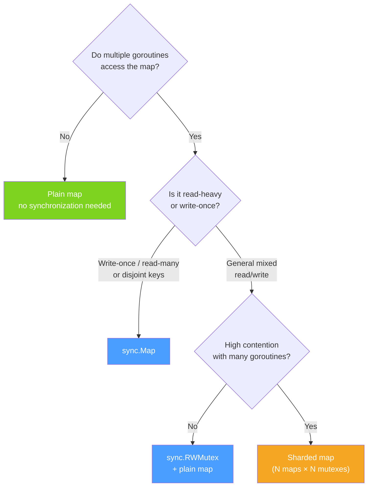

# Map Concurrency: Why Concurrent Writes Crash Go

Go's built-in map is optimized for single-goroutine access. The moment two goroutines touch the same map simultaneously — and at least one is writing — you're in undefined behavior territory. In practice, Go doesn't give you undefined behavior silently: it detects the race and kills the program with a fatal, unrecoverable error. Understanding why this happens and what to use instead is essential for any Go programmer writing concurrent code.

## The Rule

**Concurrent reads of a map are safe.** Multiple goroutines can read from the same map simultaneously without issue, as long as no goroutine is writing.

**Concurrent read + write, or write + write, is not safe.** It triggers a fatal runtime error that cannot be recovered with `recover()`.

## Why the Runtime Kills It

Go 1.6 added a lightweight concurrency detector directly into the map implementation. The `hmap` struct has a `flags` field containing a `hashWriting` bit. The map mutation path (`mapassign`, `mapdelete`) sets this bit at the start of the operation and clears it at the end.

Every map access — including reads — checks this bit. If a goroutine observes `hashWriting` set when it wasn't the one to set it, the runtime immediately calls `throw()`:

```
fatal error: concurrent map read and map write
```

This is a **fatal error, not a panic**. `recover()` cannot catch it. The program prints the error and a goroutine stack trace, then exits. There is no way to keep the program running after this occurs.

The design choice is intentional. The alternative would be to silently corrupt the map's internal structure — mislinked bucket chains, lost keys, or incorrect counts — producing subtle, non-deterministic bugs that are nearly impossible to debug. Go's philosophy here is: crash loudly and early rather than corrupt silently and crash mysteriously later.

## Why Not Just Lock Every Operation?

The natural question is: why didn't Go just build locking into the map? The answer is performance. The common case for maps in Go is single-goroutine access — local maps used within one function, maps in data structures accessed by one goroutine at a time. Adding a mutex to every read and write would impose synchronization overhead on all of those cases, even when there's no concurrency.

Go's design philosophy is to pay for what you use. If you need concurrent map access, you opt in to the overhead by using one of the synchronization strategies below.

## Solution 1: sync.RWMutex Wrapping a Map

The most direct solution is to guard a plain map with a `sync.RWMutex`. Use `RLock`/`RUnlock` for reads and `Lock`/`Unlock` for writes. This allows multiple concurrent readers without blocking each other, while writes get exclusive access.

```go
package main

import (
	"fmt"
	"sync"
)

type SafeMap struct {
	mu sync.RWMutex
	m  map[string]int
}

func NewSafeMap() *SafeMap {
	return &SafeMap{m: make(map[string]int)}
}

func (s *SafeMap) Set(key string, value int) {
// highlight-next-line
	s.mu.Lock()
	defer s.mu.Unlock()
	s.m[key] = value
}

func (s *SafeMap) Get(key string) (int, bool) {
// highlight-next-line
	s.mu.RLock()
	defer s.mu.RUnlock()
	v, ok := s.m[key]
	return v, ok
}

func (s *SafeMap) Delete(key string) {
	s.mu.Lock()
	defer s.mu.Unlock()
	delete(s.m, key)
}

func main() {
	sm := NewSafeMap()
	var wg sync.WaitGroup

	// 10 concurrent writers
	for i := 0; i < 10; i++ {
		wg.Add(1)
		go func(i int) {
			defer wg.Done()
			sm.Set(fmt.Sprintf("key%d", i), i*i)
		}(i)
	}

	wg.Wait()

	// Read results
	for i := 0; i < 10; i++ {
		v, ok := sm.Get(fmt.Sprintf("key%d", i))
		fmt.Printf("key%d = %d (found: %v)\n", i, v, ok)
	}
}
```
<codapi-snippet sandbox="go" editor="basic"></codapi-snippet>

The `RWMutex` approach is general-purpose, easy to reason about, and performs well for mixed read/write workloads. It is often the right choice because the code is straightforward and the locking semantics are explicit.

## Solution 2: sync.Map

`sync.Map` is a built-in concurrent map in the `sync` package. It uses two internal maps: a read-only atomic snapshot (`read`) and a writable dirty map (`dirty`). Reads that hit the atomic `read` map require no locking at all — they use atomic loads. Writes and reads that miss in `read` fall through to `dirty` with a mutex.

```go
package main

import (
	"fmt"
	"sync"
)

func main() {
	var m sync.Map

	var wg sync.WaitGroup

	// Store values concurrently
	for i := 0; i < 5; i++ {
		wg.Add(1)
		go func(i int) {
			defer wg.Done()
// highlight-next-line
			m.Store(fmt.Sprintf("worker%d", i), i*10)
		}(i)
	}
	wg.Wait()

	// Load a value
	if val, ok := m.Load("worker2"); ok {
		fmt.Println("worker2:", val)
	}

	// Delete a value
	m.Delete("worker0")

	// Range over all entries
	fmt.Println("All entries:")
	m.Range(func(key, value any) bool {
		fmt.Printf("  %v = %v\n", key, value)
		return true // return false to stop iteration
	})

	// LoadOrStore: atomic get-or-set
	actual, loaded := m.LoadOrStore("worker2", 999)
	fmt.Printf("LoadOrStore worker2: value=%v, was already loaded=%v\n", actual, loaded)
}
```
<codapi-snippet sandbox="go" editor="basic"></codapi-snippet>

`sync.Map` is optimized for two specific access patterns:
- **Write-once, read-many**: a key is stored once and read frequently by many goroutines.
- **Disjoint key sets**: different goroutines access non-overlapping sets of keys.

`sync.Map` is **not** a general-purpose replacement for `mutex + map`. For workloads with frequent writes to the same keys or many new key insertions, the `dirty` map promotion overhead makes it slower than a plain `RWMutex`-guarded map.

## Solution 3: Sharding

For high-throughput workloads where a single mutex becomes a bottleneck, sharding splits the map into N independent shards, each with its own mutex. A key is routed to a shard by `hash(key) % N`. Goroutines accessing different shards don't contend with each other.

```go
package main

import (
	"fmt"
	"hash/fnv"
	"sync"
)

const numShards = 16

type Shard struct {
	mu sync.RWMutex
	m  map[string]int
}

type ShardedMap [numShards]Shard

func NewShardedMap() *ShardedMap {
	var sm ShardedMap
	for i := range sm {
		sm[i].m = make(map[string]int)
	}
	return &sm
}

func (sm *ShardedMap) shard(key string) *Shard {
	h := fnv.New32a()
	h.Write([]byte(key))
// highlight-next-line
	return &sm[h.Sum32()%numShards]
}

func (sm *ShardedMap) Set(key string, value int) {
	s := sm.shard(key)
	s.mu.Lock()
	defer s.mu.Unlock()
	s.m[key] = value
}

func (sm *ShardedMap) Get(key string) (int, bool) {
	s := sm.shard(key)
	s.mu.RLock()
	defer s.mu.RUnlock()
	v, ok := s.m[key]
	return v, ok
}

func main() {
	sm := NewShardedMap()
	var wg sync.WaitGroup

	for i := 0; i < 20; i++ {
		wg.Add(1)
		go func(i int) {
			defer wg.Done()
			sm.Set(fmt.Sprintf("key%d", i), i)
		}(i)
	}
	wg.Wait()

	v, ok := sm.Get("key7")
	fmt.Println("key7:", v, ok)
}
```
<codapi-snippet sandbox="go" editor="basic"></codapi-snippet>

Sharding reduces contention proportionally to the number of shards. The tradeoff is complexity: operations that need to touch all keys (like computing the total count) must acquire all shard locks, typically in a fixed order to avoid deadlock.

import Tabs from '@theme/Tabs';
import TabItem from '@theme/TabItem';

<Tabs>
  <TabItem value="mutex" label="sync.Mutex + map">

**When to use:**
- General-purpose concurrent map access
- Mixed read/write workloads
- Frequent updates to the same keys
- Many new key insertions
- When you need full map operations (iteration, len, complex transactions)

**Characteristics:**
- `RWMutex` allows concurrent readers
- Simple, explicit locking semantics
- Predictable performance
- `Lock()` for writes, `RLock()` for reads

```go
type SafeCounter struct {
    mu sync.RWMutex
    m  map[string]int
}
```

  </TabItem>
  <TabItem value="syncmap" label="sync.Map">

**When to use:**
- Write-once, read-many patterns (caches, registries)
- Disjoint key sets accessed by different goroutines
- When you need `LoadOrStore` atomicity

**When NOT to use:**
- Frequent updates to the same keys
- Many new key insertions
- When you need `len()` or full iteration semantics

```go
var registry sync.Map
// Store once:
registry.Store("handler", myHandler)
// Read many times with no lock overhead:
val, _ := registry.Load("handler")
```

  </TabItem>
</Tabs>



:::danger
Concurrent map writes cause a `fatal error: concurrent map read and map write` that **cannot be recovered** with `recover()`. The program dies immediately. Use the Go race detector (`go test -race` or `go run -race`) during development to catch concurrent map access before it reaches production.
:::

:::tip
`sync.Map` is not a universal drop-in replacement for `map`. For most concurrent workloads, a `sync.RWMutex` wrapping a plain `map` is simpler, more predictable, and often faster. Reach for `sync.Map` only when your access pattern matches its optimized cases: write-once/read-many or disjoint key access.
:::

## Key Takeaways

- Go maps are **not safe for concurrent use**. Concurrent reads are fine; concurrent read+write or write+write triggers a fatal, unrecoverable crash.
- The runtime detects the race via a `hashWriting` flag in `hmap.flags` and calls `throw()` — not `panic()` — so `recover()` cannot save you.
- Go chose detection-and-crash over silent corruption, and chose no built-in locking to avoid overhead in the common single-goroutine case.
- Use `sync.RWMutex + map` for general-purpose concurrent map access.
- Use `sync.Map` for write-once/read-many or disjoint-key patterns.
- Use sharding for very high-throughput scenarios where a single mutex is a bottleneck.
- Always run `go test -race` during development to catch concurrent map access early.
