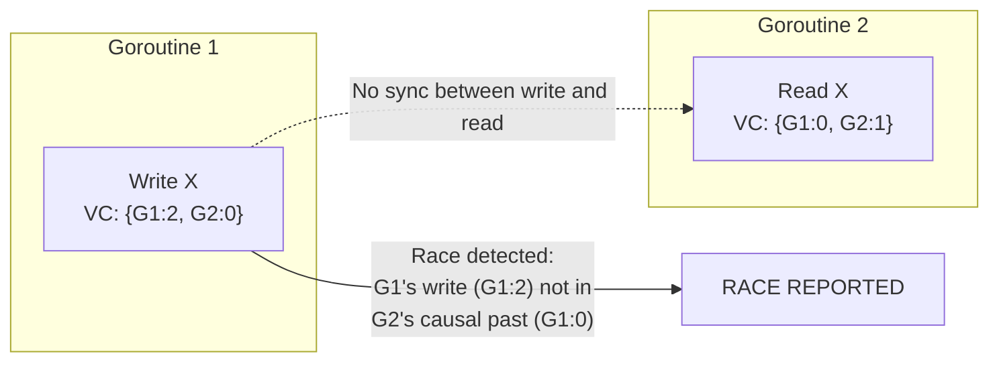

# Race Detector: What It Catches and What It Cannot Prove

Go's race detector is one of the most practical debugging tools in the language ecosystem. Enable it with a single flag, run your tests, and it reports data races with enough information to fix them immediately. But the detector has hard limits — it is dynamic, not static, and can only report races that actually happen during a run. Understanding both capabilities is what makes it useful.

## What the Race Detector Is

The race detector is compile-time and run-time instrumentation activated by the `-race` flag. When you compile with `-race`, the compiler inserts code around every memory access. At runtime, a library (based on ThreadSanitizer) tracks which goroutine accessed which memory location and when.

The tracking uses **vector clocks** — one per goroutine. Synchronization operations advance and synchronize these clocks. When goroutine A performs a write to address X, and goroutine B later reads from X, the detector checks whether A's write is in B's causal past. If it is not — meaning there was no synchronization between the write and the read — that is a data race.

## How to Use It

```
go run -race main.go
go test -race ./...
go build -race ./...
```

The most important invocation is `go test -race ./...`. Run this in CI on every commit. The overhead is significant — 5-10x slower execution, 5-10x more memory — so `-race` binaries are rarely deployed to production. Some teams run production traffic through `-race` builds for a small fraction of requests; this is an option if you have the capacity headroom.

:::tip
`-race` in CI is non-negotiable for concurrent Go code. Add it to your test pipeline now. A single race found by the detector in CI is worth a week of debugging the same race in production under load.
:::

## What a Race Report Looks Like

When the detector finds a race, it prints a detailed report:

```
==================
WARNING: DATA RACE
Write at 0x00c0000b4010 by goroutine 7:
  main.increment()
      /Users/alex/demo/main.go:12 +0x3c

Previous read at 0x00c0000b4010 by goroutine 6:
  main.increment()
      /Users/alex/demo/main.go:11 +0x30

Goroutine 7 (running) created at:
  main.main()
      /Users/alex/demo/main.go:22 +0x6c

Goroutine 6 (running) created at:
  main.main()
      /Users/alex/demo/main.go:22 +0x6c
==================
```

The report tells you:
- Which two goroutines raced
- The memory address
- The stack trace of each conflicting access, with file and line number
- Where each goroutine was created

This is usually enough to pinpoint the race immediately. You do not need to reproduce the race manually — the detector caught it for you, with full context.

## A Racy Program and Its Fix

Here is a classic race: multiple goroutines incrementing a shared counter without synchronization.

```go
package main

import (
    "fmt"
    "sync"
)

func main() {
    var counter int
    var wg sync.WaitGroup

    for i := 0; i < 1000; i++ {
        wg.Add(1)
        go func() {
            defer wg.Done()
// highlight-next-line
            counter++ // DATA RACE: unsynchronized read-modify-write
        }()
    }

    wg.Wait()
    fmt.Println("counter:", counter)
}
```

Running this with `go run -race main.go` triggers a race report pointing to the `counter++` line. The value of `counter` is also unpredictable — it will almost certainly be less than 1000 due to lost updates.

The fix uses a mutex to serialize access:

```go
package main

import (
    "fmt"
    "sync"
)

func main() {
    var counter int
    var mu sync.Mutex
    var wg sync.WaitGroup

    for i := 0; i < 1000; i++ {
        wg.Add(1)
        go func() {
            defer wg.Done()
// highlight-next-line
            mu.Lock()
            counter++
            mu.Unlock()
        }()
    }

    wg.Wait()
    fmt.Println("counter:", counter) // always 1000
}
```
<codapi-snippet sandbox="go" editor="basic"></codapi-snippet>

Alternatively, `sync/atomic` is appropriate for simple integer counters:

```go
package main

import (
    "fmt"
    "sync"
    "sync/atomic"
)

func main() {
    var counter int64
    var wg sync.WaitGroup

    for i := 0; i < 1000; i++ {
        wg.Add(1)
        go func() {
            defer wg.Done()
// highlight-next-line
            atomic.AddInt64(&counter, 1) // atomic — no race
        }()
    }

    wg.Wait()
    fmt.Println("counter:", atomic.LoadInt64(&counter))
}
```

## What the Race Detector Catches

The race detector reliably catches:

- **Unsynchronized reads and writes to shared variables** — the fundamental case shown above.
- **Map concurrent access** — the race detector catches this before the runtime's built-in map concurrent access detector. The runtime will panic on concurrent map access; the race detector reports it as a race, giving you a stack trace instead of a crash.
- **Races through closures** — when a goroutine captures a variable by reference and the outer goroutine also modifies it.
- **Races on struct fields** — each field is tracked independently; a race on one field doesn't mask a race on another.
- **Races on slice headers** — concurrent modification of a slice's length or pointer is a race even if the underlying array elements are different.

A common closure race:

```go
package main

import (
    "fmt"
    "sync"
)

func main() {
    var wg sync.WaitGroup
    for i := 0; i < 5; i++ {
        wg.Add(1)
        go func() {
            defer wg.Done()
// highlight-next-line
            fmt.Println(i) // races with the loop variable i
        }()
    }
    wg.Wait()
}
```

The goroutine captures `i` by reference. The loop continues mutating `i` while goroutines read it — a race. Fix: copy `i` before passing it to the goroutine.

## What the Race Detector Cannot Prove

The race detector is **dynamic**. It reports races that happen during the execution being observed. If a racy code path is never exercised during the run, no race is reported.

:::warning
Passing all tests without `-race` doesn't mean your code is race-free. Passing tests with `-race` doesn't mean your code is race-free either — it means no race was observed during those test runs. The race detector can only report races that actually occur. Racy code under low concurrency may never exhibit the race in tests but will under production load.
:::

Specific limitations:

- **Code paths not executed**: if the race exists in a function that no test calls with concurrent access, it won't be found.
- **C code (cgo)**: instrumentation doesn't cross the Go/C boundary. Races in C code are invisible to the detector.
- **Deadlocks**: a deadlock is not a data race. The race detector does not detect goroutines waiting on each other forever. Use `go tool pprof` or `SIGQUIT` (which dumps goroutine stacks) for deadlock diagnosis.
- **Logic races**: two goroutines cooperating correctly at the memory level but producing logically incorrect results due to ordering assumptions are not data races and won't be detected.
- **Once-in-a-million races**: races that require extremely specific scheduling are unlikely to manifest in short test runs.

## How Vector Clocks Work

Each goroutine maintains a vector clock — a logical timestamp that captures the goroutine's happens-before knowledge. Synchronization operations (mutex lock/unlock, channel send/receive, `sync.WaitGroup` operations) advance and share these clocks.



When the detector compares the two access records: goroutine G1's write happened at G1's logical time 2, but G2's vector clock shows it only knows about G1's time 0 — meaning G2 has no knowledge of G1's write. Without a synchronization event carrying G1:2 into G2's causal knowledge, the read in G2 races with the write in G1.

When a mutex is unlocked by G1 and then locked by G2, G2's vector clock is updated to incorporate G1's current clock — establishing a happens-before relationship. Any write by G1 before the unlock is now in G2's causal past, and the race detector won't flag G2's subsequent read of that data.

## Best Practices for Using the Race Detector

**In CI**: always. Add `-race` to your `go test` command in your Makefile, CI pipeline, or wherever tests run. The overhead is acceptable for CI.

**In integration tests**: integration tests exercise code paths that unit tests don't. Running them with `-race` catches races that only manifest under realistic concurrency.

**In load tests**: races are more likely to manifest when many goroutines run simultaneously. A load test with `-race` is often where latent races surface for the first time.

**In local development**: `go test -race ./...` before committing is a good habit for packages with concurrency.

**Not in production** (usually): 5-10x overhead is too high for most services. Exceptions: staging environments, canary deployments, or dedicated traffic-sampling instances.

## Key Takeaways

- The race detector is activated by the `-race` flag at compile and run time. It instruments every memory access.
- It uses vector clocks to detect when two goroutines access the same memory location without synchronization between them.
- Race reports include both goroutines' stack traces and the memory address — enough context to fix the race immediately.
- Overhead is 5-10x slower and 5-10x more memory — appropriate for testing, not for production.
- The detector catches unsynchronized variable access, map concurrent access, and closure races.
- It cannot detect races in code paths that don't execute during the run, in C code via cgo, or deadlocks.
- Always run `go test -race ./...` in CI. Also run it during integration and load tests for maximum coverage.
- A clean race detector run does not prove the absence of races — it only proves no race was observed during that execution.
