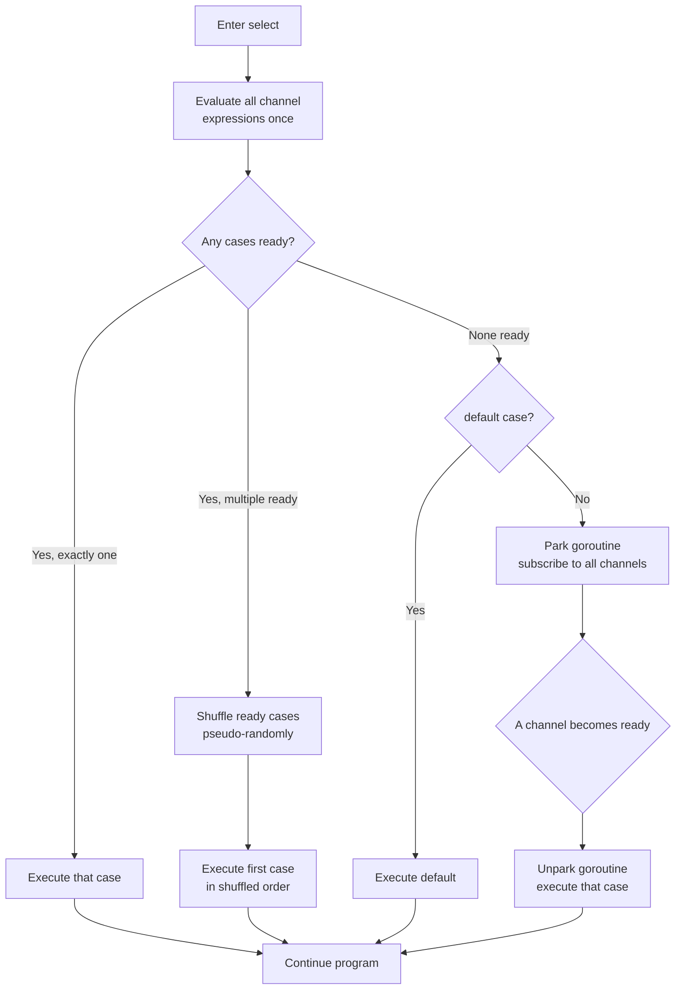

# select: Fairness and Pseudo-Random Case Picking

`select` is Go's multiplexing statement for channels. It watches multiple channel operations simultaneously and proceeds as soon as any one of them is ready. Understanding how it picks a case — and how to exploit that behavior — is essential for writing correct concurrent programs.

## How select Evaluates Cases

The basic semantics: evaluate all channel expressions and element expressions (these are always evaluated, in source order, exactly once), then determine which cases are ready to proceed. A send case is ready if the channel can accept a value; a receive case is ready if the channel has a value or is closed.

```go
package main

import "fmt"

func main() {
	ch1 := make(chan string, 1)
	ch2 := make(chan string, 1)
	ch1 <- "one"
	ch2 <- "two"

	// highlight-next-line
	select {
	case msg := <-ch1:
		fmt.Println("received from ch1:", msg)
	case msg := <-ch2:
		fmt.Println("received from ch2:", msg)
	}
}
```
<codapi-snippet sandbox="go" editor="basic"></codapi-snippet>

Run this several times — you may see either case selected, because both channels are ready at the moment `select` executes.

## Pseudo-Random Case Selection

When multiple cases are simultaneously ready, Go does **not** pick the first one in source order. Instead, it shuffles the ready cases using a pseudo-random permutation and picks the first one in the shuffled order. This is implemented in `runtime/select.go` via a Fisher-Yates shuffle of the `scase` array before the poll loop.

The result: each ready case has an equal probability of being selected on any given evaluation of the `select`. This prevents starvation — a goroutine feeding a fast channel cannot permanently monopolize a `select` that also watches a slower channel.

:::note
"Random" here means the Go runtime uses its internal non-cryptographic random number generator. The distribution is uniform across ready cases, but it is not seeded from external entropy. Do not use this for security-sensitive decisions.
:::

The following program demonstrates the pseudo-random selection by running a select loop 1000 times with both channels pre-loaded, and counting how often each case wins:

```go
package main

import "fmt"

func main() {
	ch1 := make(chan int, 1000)
	ch2 := make(chan int, 1000)
	for i := range 1000 {
		ch1 <- i
		ch2 <- i
	}

	count1, count2 := 0, 0
	for range 1000 {
		// highlight-next-line
		select {
		case <-ch1:
			count1++
		case <-ch2:
			count2++
		}
	}

	fmt.Printf("ch1 selected: %d times\n", count1)
	fmt.Printf("ch2 selected: %d times\n", count2)
	fmt.Printf("ratio: %.2f\n", float64(count1)/float64(count2))
}
```
<codapi-snippet sandbox="go" editor="basic"></codapi-snippet>

You should see a ratio close to 1.0, confirming that neither case is systematically preferred.

## The `default` Case: Non-Blocking Select

Adding a `default` case makes the entire `select` non-blocking. If no channel case is ready, `default` runs immediately — no goroutine parking occurs.

```go
package main

import "fmt"

func main() {
	ch := make(chan int, 1)

	// Non-blocking receive
	// highlight-next-line
	select {
	case v := <-ch:
		fmt.Println("got:", v)
	default:
		fmt.Println("channel empty, continuing")
	}

	ch <- 99

	// Now the channel has a value
	select {
	case v := <-ch:
		fmt.Println("got:", v)
	default:
		fmt.Println("channel empty, continuing")
	}
}
```
<codapi-snippet sandbox="go" editor="basic"></codapi-snippet>

Non-blocking sends follow the same pattern — place the send in a `case` and provide a `default` for "channel full, drop the message" semantics.

## The Evaluation Flowchart



## Common Patterns

### Timeout with `time.After`

```go
package main

import (
	"fmt"
	"time"
)

func doWork(ch chan<- string) {
	time.Sleep(200 * time.Millisecond)
	ch <- "result"
}

func main() {
	result := make(chan string, 1)
	go doWork(result)

	// highlight-next-line
	select {
	case res := <-result:
		fmt.Println("got result:", res)
	// highlight-next-line
	case <-time.After(100 * time.Millisecond):
		fmt.Println("timed out waiting for result")
	}
}
```
<codapi-snippet sandbox="go" editor="basic"></codapi-snippet>

:::warning time.After in loops
Every call to `time.After` allocates a new `time.Timer` internally. In a high-frequency select loop, this creates a timer per iteration that is not garbage collected until it fires. Prefer creating one `time.NewTimer` outside the loop and calling `timer.Reset()` after each iteration.
:::

### Done/Cancel with Context

```go
package main

import (
	"context"
	"fmt"
	"time"
)

func worker(ctx context.Context, results chan<- int) {
	for i := 0; ; i++ {
		select {
		// highlight-next-line
		case <-ctx.Done():
			fmt.Println("worker cancelled:", ctx.Err())
			return
		case results <- i:
			time.Sleep(30 * time.Millisecond)
		}
	}
}

func main() {
	ctx, cancel := context.WithTimeout(context.Background(), 150*time.Millisecond)
	defer cancel()

	results := make(chan int, 10)
	go worker(ctx, results)

	for {
		select {
		case <-ctx.Done():
			fmt.Println("main done, ctx err:", ctx.Err())
			return
		case v := <-results:
			fmt.Println("result:", v)
		}
	}
}
```
<codapi-snippet sandbox="go" editor="basic"></codapi-snippet>

### Priority Select: Draining a Done Channel First

Random selection means you cannot guarantee a particular case fires first. When you need priority — for example, always check a cancel signal before processing more work — use nested selects:

```go
package main

import "fmt"

func priorityReceive(done <-chan struct{}, work <-chan int) (int, bool) {
	// highlight-next-line
	select {
	case <-done:
		return 0, false // priority: check done first
	default:
	}

	// done was not ready; now wait on either
	select {
	case <-done:
		return 0, false
	case v := <-work:
		return v, true
	}
}

func main() {
	done := make(chan struct{})
	work := make(chan int, 5)
	for i := range 5 {
		work <- i
	}

	for {
		v, ok := priorityReceive(done, work)
		if !ok {
			fmt.Println("done")
			return
		}
		fmt.Println("processing:", v)
		if v == 3 {
			close(done) // simulate cancellation mid-stream
		}
	}
}
```
<codapi-snippet sandbox="go" editor="basic"></codapi-snippet>

### Fan-In: Merging Multiple Channels

```go
package main

import (
	"fmt"
	"sync"
)

func fanIn(channels ...<-chan int) <-chan int {
	merged := make(chan int, 10)
	var wg sync.WaitGroup

	for _, ch := range channels {
		wg.Add(1)
		go func(c <-chan int) {
			defer wg.Done()
			for v := range c {
				merged <- v
			}
		}(ch)
	}

	go func() {
		wg.Wait()
		close(merged)
	}()
	return merged
}

func main() {
	a := make(chan int, 3)
	b := make(chan int, 3)
	a <- 1; a <- 3; a <- 5; close(a)
	b <- 2; b <- 4; b <- 6; close(b)

	for v := range fanIn(a, b) {
		fmt.Println(v)
	}
}
```
<codapi-snippet sandbox="go" editor="basic"></codapi-snippet>

## Key Takeaways

- `select` blocks until at least one case can proceed; if multiple are ready, one is chosen by pseudo-random uniform selection.
- Cases are shuffled at the runtime level — source code order has no influence on which ready case wins.
- The random selection prevents starvation but does not guarantee equal throughput across cases over time.
- A `default` case makes `select` non-blocking; the goroutine never parks.
- `time.After` in a select loop allocates a new timer each iteration; use `time.NewTimer` and `Reset` to avoid the leak.
- Nested selects implement priority: do a non-blocking `select` on the high-priority channel first, fall through to a blocking `select` if it is not ready.
