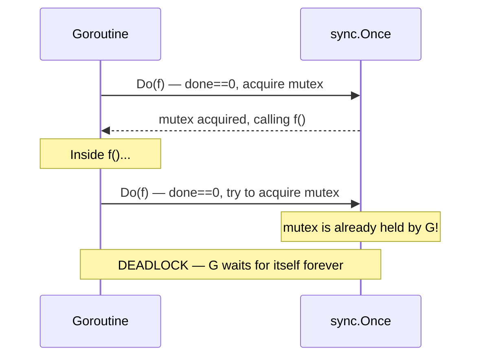

# sync.Once: Internals and Deadlock Patterns

`sync.Once` solves a deceptively simple problem: run a function exactly once, even when called from many goroutines concurrently. It is the standard tool for lazy singleton initialization in Go. Understanding its implementation reveals both why it is safe and why one particular misuse deadlocks silently.

## What sync.Once Guarantees

```go
var once sync.Once
once.Do(f)
```

- `f` is called exactly once, no matter how many goroutines call `Do` simultaneously.
- All calls to `Do` block until `f` has returned.
- After `f` returns, all future calls to `Do` return immediately.
- The completion of `f` **happens-before** any `Do` call returns. This is a formal guarantee in the Go memory model: every goroutine that calls `Do` and observes that `f` has run will see all memory writes made by `f`.

## The Internal Implementation

The `sync.Once` struct is two fields:

```go
type Once struct {
    done atomic.Uint32  // 0 = not done, 1 = done
    m    Mutex
}
```

The `Do` method follows a double-checked locking pattern:

```go
func (o *Once) Do(f func()) {
    // Fast path: atomic load, no lock required
    // highlight-next-line
    if o.done.Load() == 0 {
        o.doSlow(f)
    }
}

func (o *Once) doSlow(f func()) {
    o.m.Lock()
    defer o.m.Unlock()
    // highlight-next-line
    if o.done.Load() == 0 { // re-check under lock
        // highlight-next-line
        defer o.done.Store(1) // set AFTER f returns (defer order: inner first)
        f()
    }
}
```

Two properties of this implementation deserve attention:

**Fast path is lock-free.** After the first call completes, `done` is 1. Every subsequent call reads `done == 1` via an atomic load and returns without acquiring the mutex. This makes the common case (f already ran) extremely cheap.

**`done` is set via `defer`.** The `defer o.done.Store(1)` executes after `f()` returns — including if `f()` panics. This has a critical implication for the panic case discussed below.

## The Happens-Before Guarantee

The `done.Store(1)` write is ordered after `f()` completes because of the `defer`. Any goroutine that subsequently reads `done == 1` (via `done.Load()`) is guaranteed — by the atomics memory model — to observe all writes that `f()` made. This is why it is safe to read a singleton initialized by `sync.Once` without additional synchronization:

```go
package main

import (
	"fmt"
	"sync"
)

type Config struct {
	DSN     string
	Timeout int
}

var (
	cfg     *Config
	cfgOnce sync.Once
)

func getConfig() *Config {
	// highlight-next-line
	cfgOnce.Do(func() {
		// Expensive initialization — runs exactly once
		cfg = &Config{
			DSN:     "postgres://localhost/mydb",
			Timeout: 30,
		}
		fmt.Println("config initialized")
	})
	// highlight-next-line
	return cfg // safe to read without lock — happens-after cfgOnce.Do
}

func main() {
	var wg sync.WaitGroup
	for i := range 5 {
		wg.Add(1)
		go func(id int) {
			defer wg.Done()
			c := getConfig()
			fmt.Printf("goroutine %d: DSN=%s\n", id, c.DSN)
		}(i)
	}
	wg.Wait()
}
```
<codapi-snippet sandbox="go" editor="basic"></codapi-snippet>

The "config initialized" line prints exactly once regardless of how many goroutines call `getConfig()` simultaneously.

## What Happens When f() Panics?

Because `done.Store(1)` is deferred, it runs even if `f()` panics. The panic propagates through `doSlow` and `Do` to the caller of `Do`. Any future call to `Do` finds `done == 1` and returns immediately without calling `f` again.

This means: **a panicking `f` is considered "done."** If your initialization function panics, future callers get back `nil` (or whatever zero value the singleton was), and no error. This is usually the correct behavior — retrying a broken initialization in a concurrent program is often worse — but you should be aware of it:

```go
package main

import (
	"fmt"
	"sync"
)

var once sync.Once

func riskyInit() {
	fmt.Println("riskyInit called")
	panic("initialization failed")
}

func main() {
	// First call — panics, but done is still set to 1
	func() {
		defer func() {
			if r := recover(); r != nil {
				fmt.Println("recovered:", r)
			}
		}()
		// highlight-next-line
		once.Do(riskyInit) // panics here
	}()

	// Second call — does NOT call riskyInit again
	// highlight-next-line
	once.Do(riskyInit) // returns immediately, done == 1
	fmt.Println("second Do returned without calling riskyInit")
}
```
<codapi-snippet sandbox="go" editor="basic"></codapi-snippet>

## The Deadlock Trap: Recursive Do

The most surprising failure mode of `sync.Once` is a goroutine deadlocking against itself. It happens when `f()` — the function passed to `Do` — calls `Do` on the **same** `Once` value:



:::danger The recursive Do deadlock
```go
package main

import "sync"

var once sync.Once

func init_() {
    // This calls Do on the same Once that is currently executing init_
    // highlight-next-line
    once.Do(init_) // deadlock: outer Do holds the mutex; inner Do blocks forever
}

func main() {
    once.Do(init_) // goroutine blocks here, never returns
}
```

Do not run this — it will hang. The outer `Do` holds `o.m` while calling `f`. The inner `Do` finds `done == 0` (not yet set, `f` hasn't returned), enters `doSlow`, and blocks on `o.m.Lock()`. Neither can proceed.
:::

The fix is to never call `Do` on the same `Once` from inside the function passed to `Do`. If you need mutual recursion between initialization steps, use separate `Once` values or restructure the initialization to be linear.

## Once Cannot Be Reset

`sync.Once` has no `Reset` method. Once `done` is 1, it stays 1. This is intentional — resettable once semantics would require additional synchronization and would solve a different problem.

:::warning Once cannot be reused
If you need to run a function once per "round" or once per request, `sync.Once` is the wrong tool. Use a mutex-protected boolean, a channel, or reconstruct the `Once` inside a struct that you recreate per round.
:::

## Lazy Singleton with sync.Once vs init()

`init()` functions run at program startup, before `main`. `sync.Once` defers initialization to first use. The tradeoff:

| | `init()` | `sync.Once` |
|---|---|---|
| When | Program startup | First call to `Do` |
| Error handling | Must panic | Can return error via closure |
| Testing | Hard to control | Easy — create fresh `Once` |
| Unused code | Always runs | Skipped if never called |

For database connections, configuration loading, or any initialization that may fail or that you want to skip in tests, prefer `sync.Once` over `init()`.

```go
package main

import (
	"errors"
	"fmt"
	"sync"
)

type DB struct{ url string }

var (
	db     *DB
	dbErr  error
	dbOnce sync.Once
)

func openDB(url string) (*DB, error) {
	dbOnce.Do(func() {
		if url == "" {
			// highlight-next-line
			dbErr = errors.New("empty database URL")
			return
		}
		db = &DB{url: url}
		fmt.Println("database opened:", url)
	})
	return db, dbErr
}

func main() {
	d1, err := openDB("postgres://localhost/prod")
	fmt.Println(d1, err)

	// Second call — returns cached result, no re-initialization
	d2, err := openDB("postgres://localhost/prod")
	fmt.Println(d1 == d2, err) // true — same pointer
}
```
<codapi-snippet sandbox="go" editor="basic"></codapi-snippet>

## Key Takeaways

- `sync.Once.Do(f)` guarantees `f` runs exactly once across all concurrent callers; all callers block until `f` returns.
- The fast path is a lock-free atomic load of a `uint32` flag — extremely cheap after the first call.
- The slow path uses a mutex with double-checked locking; `done` is set via `defer` so it fires even if `f` panics.
- If `f` panics, `done` is still set to 1. Future `Do` calls return without re-running `f`. The panic propagates to the first caller only.
- Calling `Do` on the same `Once` from inside `f` causes a deadlock — `f` holds the mutex and blocks on itself.
- `sync.Once` cannot be reset; for repeatable initialization, use a different synchronization mechanism or create a new `Once` per lifecycle.
- Prefer `sync.Once` over `init()` for lazy initialization that may fail, that involves I/O, or that you need to control in tests.
