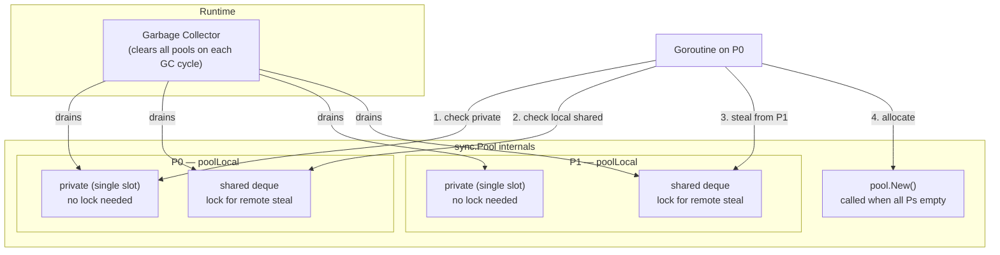

# sync.Pool: What It Is, What It's Not, and GC Interaction

Every heap allocation in Go costs time: the allocator must find memory, the garbage collector must eventually scan and reclaim it, and write barriers must be maintained throughout. For hot code paths — request handlers, serializers, parsers — these per-allocation costs accumulate into measurable latency and GC pressure. `sync.Pool` exists to amortize that cost by recycling temporary objects between uses.

But `sync.Pool` is routinely misunderstood. It is not a cache. It is not a connection pool. It is not a bounded resource limiter. It is a **best-effort, GC-aware recycling mechanism for short-lived objects**. Understanding exactly what that means determines whether you use it correctly.

## What sync.Pool Is

A `sync.Pool` holds a set of temporary objects that individual goroutines can save and retrieve. The API is minimal:

- `Get()` removes and returns an object from the pool if one is available. If the pool is empty, it calls `pool.New()` and returns the result. If `New` is nil and the pool is empty, `Get()` returns nil.
- `Put(x)` adds an object back to the pool for future reuse.

That's it. No size limit. No expiration policy. No ownership semantics. The pool is a grab-bag of recyclable objects, and the runtime decides when to discard them.

```go
package main

import (
	"bytes"
	"fmt"
	"sync"
)

// highlight-next-line
var bufPool = sync.Pool{
	New: func() any {
		// Called when the pool is empty — allocate a fresh buffer.
		return new(bytes.Buffer)
	},
}

func formatGreeting(name string) string {
	// highlight-next-line
	buf := bufPool.Get().(*bytes.Buffer)
	// highlight-next-line
	defer bufPool.Put(buf)

	buf.Reset() // always reset before use — the pooled object may be dirty
	fmt.Fprintf(buf, "Hello, %s!", name)
	return buf.String()
}

func main() {
	fmt.Println(formatGreeting("Alice"))
	fmt.Println(formatGreeting("Bob"))
}
```
<codapi-snippet sandbox="go" editor="basic"></codapi-snippet>

Three things in this example are non-negotiable:

1. **Always set `New`**. If `Get()` returns nil and you forget to check, you get a nil pointer dereference.
2. **Always call `buf.Reset()` after `Get()`**. A pooled object was used by some previous caller. Its contents are undefined.
3. **Always `Put()` back after use**, typically via `defer`. Forgetting to return an object defeats the entire purpose.

## What sync.Pool Is Not

### Not a long-lived cache

If you store the result of an expensive database query or a parsed configuration file in a `sync.Pool` expecting it to be there on the next request, you will be disappointed. The GC clears the pool at every garbage collection cycle. On a busy service with frequent GC pauses, that can be every few hundred milliseconds.

### Not a connection pool

HTTP connections, database connections, and file descriptors must be explicitly closed. Connections have state (authentication, TLS sessions, in-flight requests) that cannot simply be abandoned. Use `database/sql`'s built-in connection pool or `net/http`'s transport for connections — these have proper lifecycle management that `sync.Pool` cannot provide.

### Not a bounded semaphore

`sync.Pool` has no capacity limit. If your goal is to cap the number of goroutines doing concurrent work, use a buffered channel as a semaphore or `golang.org/x/sync/semaphore`.

:::danger
Never store objects in `sync.Pool` that have finalizers or that must be explicitly closed (file handles, network connections, database cursors). If the GC clears the pool, those objects are discarded without cleanup. Use explicit lifecycle management for closable resources.
:::

## GC Interaction: The Pool Is Ephemeral

This is the most important thing to understand about `sync.Pool`. The [Go runtime clears all pools at the start of each garbage collection cycle](https://cs.opensource.google/go/go/+/main:src/sync/pool.go). This is not a bug — it is the design.

The rationale: if an object has not been retrieved from the pool since the last GC, it is likely not needed. Holding it longer would waste memory without benefit. The pool trades durability for simplicity: it never prevents the GC from reclaiming memory.

The consequence is that `sync.Pool` is only effective at reducing allocations within a **single GC cycle** — typically a window of a few hundred milliseconds to a few seconds depending on heap growth rate and `GOGC`. If your hot path allocates and recycles many buffers within one GC cycle, the pool helps enormously. If you're trying to persist an expensive object across GC cycles, the pool is the wrong tool.

:::note
Pool contents survive function calls and goroutine boundaries within the same GC cycle, but are unconditionally discarded when the next GC runs. There is no way to opt out of this behavior. It is intentional.
:::

## Internal Implementation: Per-P Storage

`sync.Pool` achieves its performance through a design that minimizes lock contention. Go's runtime divides execution contexts into **P** (processor) objects — there are `GOMAXPROCS` of them. `sync.Pool` maintains one `poolLocal` struct per P.

Each `poolLocal` has two storage areas:

- **`private`**: a single object slot accessible only by the P that owns it. No locking required — only the currently running goroutine (which holds the P) can access this slot.
- **`shared`**: a double-ended queue (deque) of objects that other Ps can steal from. Appending and removing from the local end requires no lock; stealing from the remote end uses a lock, but stealing is rare.

When `Get()` is called:
1. Check `private` — if non-nil, take it (no lock, no contention).
2. Check the local `shared` deque — pop from the head.
3. Try to steal from the `shared` deques of other Ps (work stealing).
4. Call `New()` if everything else is empty.

When `Put()` is called:
1. If `private` is empty, store there (no lock).
2. Otherwise, push onto the local `shared` deque.



This design means that in the common case — the same P gets and puts the object — the entire pool operation touches only CPU cache lines local to that P. The pool is efficient precisely because it avoids cross-P coordination.

## Use Cases

### bytes.Buffer for formatting and serialization

The `fmt` package uses `sync.Pool` internally to recycle the `pp` (printer) structs it uses during formatting. You can apply the same pattern to your own serialization code:

```go
package main

import (
	"bytes"
	"encoding/json"
	"fmt"
	"sync"
)

type Event struct {
	UserID int    `json:"user_id"`
	Action string `json:"action"`
}

var jsonBufPool = sync.Pool{
	New: func() any { return new(bytes.Buffer) },
}

func marshalEvent(e Event) ([]byte, error) {
	buf := jsonBufPool.Get().(*bytes.Buffer)
	buf.Reset()
	defer jsonBufPool.Put(buf)

	enc := json.NewEncoder(buf)
	if err := enc.Encode(e); err != nil {
		return nil, err
	}
	// copy before returning buf to pool
	result := make([]byte, buf.Len())
	copy(result, buf.Bytes())
	return result, nil
}

func main() {
	e := Event{UserID: 42, Action: "login"}
	b, err := marshalEvent(e)
	if err != nil {
		panic(err)
	}
	fmt.Printf("%s", b)
}
```
<codapi-snippet sandbox="go" editor="basic"></codapi-snippet>

Notice the explicit `copy` before returning the buffer to the pool. Once `Put()` is called, another goroutine may immediately `Get()` that same buffer and overwrite its contents. You must never hold a reference into a pooled object after returning it.

:::warning
Do not store pointers into a pooled object after calling `Put()`. The moment the object is back in the pool, another goroutine can `Get()` it and overwrite its contents. Any slice, string, or pointer derived from the pooled object is now aliasing live data in another goroutine's hands. This is a data race.
:::

### Large byte slices for encoding

For workloads that encode large payloads, pooling `[]byte` slices avoids repeated large allocations:

```go
package main

import (
	"fmt"
	"sync"
)

var slicePool = sync.Pool{
	New: func() any {
		// Allocate a 64 KiB slice.
		b := make([]byte, 0, 64*1024)
		return &b
	},
}

func processPayload(data []byte) int {
	// highlight-next-line
	bufPtr := slicePool.Get().(*[]byte)
	// highlight-next-line
	defer slicePool.Put(bufPtr)

	buf := (*bufPtr)[:0] // reset length, keep capacity
	buf = append(buf, data...)
	// ... process buf ...
	return len(buf)
}

func main() {
	payload := make([]byte, 1024)
	n := processPayload(payload)
	fmt.Printf("processed %d bytes\n", n)
}
```
<codapi-snippet sandbox="go" editor="basic"></codapi-snippet>

Note that the pool stores a pointer to a slice (`*[]byte`), not the slice directly. `sync.Pool` stores values as `any`; if you store a slice directly, a copy of the slice header is made on each `Get` and `Put`, and you lose the ability to reset the underlying slice's length correctly.

## Benchmark: Allocation Reduction

The concrete benefit of `sync.Pool` is best seen through benchmarks. The following code demonstrates the comparison pattern — run it locally with `go test -bench=. -benchmem`:

```go
package main

import (
	"bytes"
	"fmt"
	"sync"
	"testing"
)

var pool = sync.Pool{
	New: func() any { return new(bytes.Buffer) },
}

func withoutPool(b *testing.B) {
	b.ReportAllocs()
	for i := 0; i < b.N; i++ {
		buf := new(bytes.Buffer)
		fmt.Fprintf(buf, "request %d", i)
		_ = buf.String()
	}
}

func withPool(b *testing.B) {
	b.ReportAllocs()
	for i := 0; i < b.N; i++ {
		buf := pool.Get().(*bytes.Buffer)
		buf.Reset()
		fmt.Fprintf(buf, "request %d", i)
		_ = buf.String()
		pool.Put(buf)
	}
}

// Typical results on amd64:
//
// BenchmarkWithoutPool-8    5823451    201 ns/op    272 B/op    2 allocs/op
// BenchmarkWithPool-8      12431988     96 ns/op     24 B/op    1 allocs/op
//
// The pool roughly halves latency and cuts allocations by ~65%.
// The remaining allocation is from fmt.Fprintf writing the integer.

func main() {
	result := testing.Benchmark(withoutPool)
	fmt.Printf("without pool: %s\n", result)
	result = testing.Benchmark(withPool)
	fmt.Printf("with pool:    %s\n", result)
}
```

The allocation reduction cascades: fewer allocations mean smaller heap growth, which means less frequent GC cycles, which means less stop-the-world and concurrent GC work, which means lower tail latency across the board.

## Key Takeaways

- `sync.Pool` is a thread-safe recycling mechanism for temporary objects. Use it to avoid repeated allocation of short-lived objects in hot code paths.
- Always set `pool.New`. Always call `Reset()` after `Get()`. Always `Put()` objects back after use.
- The GC clears all pool contents at every garbage collection. The pool is not a persistent cache — objects survive within a GC cycle, not across GC cycles.
- Internally, each P has a private slot (lock-free) and a shared deque (low-contention). This design makes pool operations nearly as fast as a regular stack variable access in the common case.
- Do not use `sync.Pool` for: long-lived caches, connection pools, objects with finalizers, or any resource that requires explicit cleanup.
- After calling `Put()`, never access the object again. Ownership transfers back to the pool immediately.
