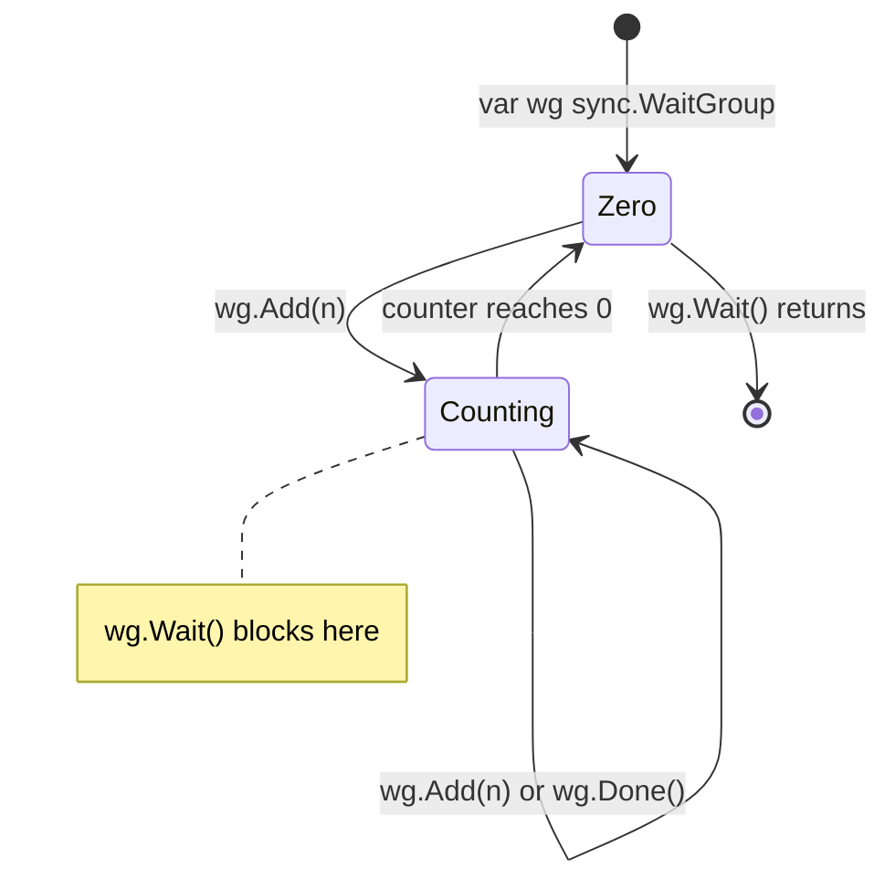

# sync.WaitGroup: Coordinating Goroutine Completion

`sync.WaitGroup` is the standard Go mechanism for waiting until a collection of goroutines has finished. It is a counter: you increment it before launching a goroutine and decrement it when the goroutine finishes. The caller blocks on `Wait` until the counter reaches zero. It is conceptually simple but has precise usage rules — violating them causes panics or deadlocks.

## How It Works Internally

A `WaitGroup` contains an internal counter. Three operations act on it:



- `Add(n)` increments the counter by `n` (can be negative, but counter must never go below zero).
- `Done()` is equivalent to `Add(-1)`.
- `Wait()` blocks until the counter is zero. If the counter is already zero, `Wait` returns immediately.

When the counter drops to zero, `Wait` is unblocked and all `Done()` operations that caused the drop happen-before the code after `Wait` returns.

## Basic Usage

```go
package main

import (
	"fmt"
	"sync"
	"time"
)

func main() {
	var wg sync.WaitGroup

	for i := 0; i < 5; i++ {
		// highlight-next-line
		wg.Add(1) // increment BEFORE launching the goroutine
		go func(id int) {
			// highlight-next-line
			defer wg.Done() // decrement when goroutine exits
			time.Sleep(time.Duration(id) * 10 * time.Millisecond)
			fmt.Printf("worker %d done\n", id)
		}(i)
	}

	// highlight-next-line
	wg.Wait() // block until all 5 goroutines call Done()
	fmt.Println("all workers finished")
}
```

<codapi-snippet sandbox="go" editor="basic">
</codapi-snippet>

`defer wg.Done()` is the canonical form. `defer` ensures `Done` is called even if the goroutine panics or returns early through multiple code paths.

## Add Must Be Called Before the Goroutine Starts

:::danger
**Never call `Add` inside the goroutine itself.** If the goroutine starts executing before `Add` is called, `Wait` may observe a count of zero and return before the goroutine finishes — or the goroutine may never be waited on at all.
:::

```go
// WRONG — race between Add and Wait
var wg sync.WaitGroup
go func() {
    wg.Add(1) // might execute after wg.Wait() already returned!
    defer wg.Done()
    doWork()
}()
wg.Wait()

// CORRECT — Add before go
var wg sync.WaitGroup
wg.Add(1)
go func() {
    defer wg.Done()
    doWork()
}()
wg.Wait()
```

## Reusing a WaitGroup

A `WaitGroup` can be reused after `Wait` returns, but only if **all previous `Done` calls have completed** before the next `Add` call. The safe pattern: call `Add` only after `Wait` has returned.

```go
package main

import (
	"fmt"
	"sync"
)

func runBatch(wg *sync.WaitGroup, batch int) {
	for i := 0; i < 3; i++ {
		wg.Add(1)
		go func(id int) {
			defer wg.Done()
			fmt.Printf("batch %d: worker %d\n", batch, id)
		}(i)
	}
	wg.Wait()
}

func main() {
	var wg sync.WaitGroup
	// highlight-next-line
	runBatch(&wg, 1) // Wait returns — safe to reuse wg
	runBatch(&wg, 2)
	runBatch(&wg, 3)
}
```

<codapi-snippet sandbox="go" editor="basic">
</codapi-snippet>

## Do Not Copy a WaitGroup

`sync.WaitGroup` contains internal state (mutex, counters). Copying it creates an independent counter, losing synchronization.

:::danger
Never copy a `WaitGroup` after first use. Pass it by pointer — always. The `go vet` tool catches this as `copylocks`.
:::

```go
// WRONG — wg is copied into the function; Done() affects the copy, not the original
func worker(wg sync.WaitGroup) {
    defer wg.Done()
    doWork()
}

// CORRECT — pass by pointer
func worker(wg *sync.WaitGroup) {
    defer wg.Done()
    doWork()
}
```

## Collecting Errors from Goroutines

`WaitGroup` doesn't collect return values. The standard pattern is a channel or a slice protected by a mutex:

```go
package main

import (
	"fmt"
	"sync"
)

func process(id int) error {
	if id == 3 {
		return fmt.Errorf("worker %d: simulated error", id)
	}
	return nil
}

func main() {
	var (
		wg   sync.WaitGroup
		mu   sync.Mutex
		errs []error
	)

	for i := 0; i < 5; i++ {
		wg.Add(1)
		go func(id int) {
			defer wg.Done()
			if err := process(id); err != nil {
				// highlight-next-line
				mu.Lock()
				errs = append(errs, err)
				mu.Unlock()
			}
		}(i)
	}

	wg.Wait()

	if len(errs) > 0 {
		fmt.Println("errors:", errs)
	} else {
		fmt.Println("all workers succeeded")
	}
}
```

<codapi-snippet sandbox="go" editor="basic">
</codapi-snippet>

For more ergonomic goroutine error handling, consider `golang.org/x/sync/errgroup`, which combines WaitGroup semantics with error propagation and optional context cancellation.

## WaitGroup vs. Channel for Coordination

import Tabs from '@theme/Tabs';
import TabItem from '@theme/TabItem';

<Tabs>
  <TabItem value="wg" label="sync.WaitGroup" default>

Use `WaitGroup` when:
- You need to wait for a **fixed set** of goroutines to finish
- You don't need the goroutines' return values (or collect them separately)
- You're firing off independent, parallel work and waiting for all of it

```go
var wg sync.WaitGroup
for _, item := range items {
    wg.Add(1)
    go func(item Item) {
        defer wg.Done()
        process(item)
    }(item)
}
wg.Wait()
```

  </TabItem>
  <TabItem value="ch" label="Channel">

Use a channel when:
- You need results from each goroutine
- You want to **process results as they arrive** (streaming)
- The number of goroutines is dynamic
- You need to cancel goroutines early

```go
results := make(chan Result, len(items))
for _, item := range items {
    go func(item Item) {
        results <- process(item)
    }(item)
}
for range items {
    r := <-results
    handle(r)
}
```

  </TabItem>
</Tabs>

## The Counter Must Never Go Negative

`Add` with a negative argument is allowed, but the counter must never drop below zero — that panics immediately.

:::danger
Calling `Done()` more times than `Add()` was called panics: `sync: negative WaitGroup counter`. This is not recoverable and will crash your program.
:::

```go
var wg sync.WaitGroup
wg.Add(1)
wg.Done()
wg.Done() // panic: sync: negative WaitGroup counter
```

The `defer wg.Done()` pattern prevents most double-Done bugs because `defer` runs exactly once per function return.

## Key Takeaways

- `Add(n)` increments the counter; `Done()` decrements it; `Wait()` blocks until the counter is zero.
- Always call `Add` **before** launching the goroutine — never inside it.
- Always use `defer wg.Done()` to ensure the counter is decremented even on panic or early return.
- Never copy a `WaitGroup`; always pass by pointer.
- The counter must never go negative — `Done()` called more than `Add()` panics immediately.
- For collecting errors from goroutines, combine `WaitGroup` with a mutex-protected error slice or use `errgroup`.
