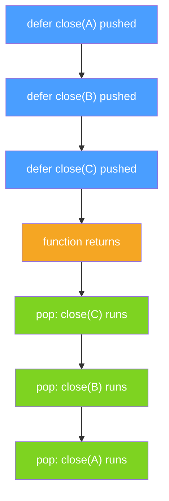

# defer Internals: Stack, Argument Evaluation, and Hot Loop Cost

`defer` is one of Go's most elegant constructs: it guarantees that a function call runs when the surrounding function returns, regardless of which return path is taken. But understanding it deeply — how arguments are captured, how the runtime implements it, and when it becomes expensive — separates code that merely works from code that performs well.

## What defer Does

When you write `defer f(args)`, the Go runtime registers a deferred call to `f`. That call is placed on a per-function deferred call list. When the surrounding function returns (normally, via `return`, or due to a `panic`), all deferred calls are executed in **LIFO order** — last deferred, first run. Think of it as a stack of cleanup tasks.

This makes `defer` ideal for paired operations: open/close, lock/unlock, `wg.Add`/`wg.Done`. You write the cleanup immediately after the acquisition, and it runs no matter how the function exits.

## Argument Evaluation Happens at defer Time

This is the most commonly misunderstood aspect of `defer`. **Arguments to a deferred function are evaluated immediately when the `defer` statement is executed**, not when the deferred call actually runs.

```go
package main

import "fmt"

func main() {
	x := 10
	defer fmt.Println("deferred x:", x) // x is evaluated NOW: captures 10
	x = 99
	fmt.Println("current x:", x)
}
```
<codapi-snippet sandbox="go" editor="basic"></codapi-snippet>

The output is `current x: 99` followed by `deferred x: 10`. The value `10` was captured at the point the `defer` statement was reached, not at function exit.

To capture the value at return time instead, use a **closure**:

```go
package main

import "fmt"

func main() {
	x := 10
	defer func() { fmt.Println("closure x:", x) }() // captures x by reference
	x = 99
	fmt.Println("current x:", x)
}
```
<codapi-snippet sandbox="go" editor="basic"></codapi-snippet>

Now the output is `closure x: 99` — the anonymous function closes over the variable `x` itself, so it sees the final value. This distinction is critical when you intend the deferred function to observe or modify the final state of a variable.

## Named Return Values: Deferred Mutation

Deferred functions can read and **modify** named return values because named returns are just variables in the function's scope. This is useful for wrapping errors or adding context on the way out:

```go
package main

import (
	"errors"
	"fmt"
)

func riskyOperation() (err error) {
	defer func() {
		if err != nil {
// highlight-next-line
			err = fmt.Errorf("riskyOperation: %w", err)
		}
	}()
	return errors.New("something went wrong")
}

func main() {
	fmt.Println(riskyOperation())
}
```
<codapi-snippet sandbox="go" editor="basic"></codapi-snippet>

The deferred closure intercepts the named return value `err` and wraps it before the caller sees it. This pattern is used extensively in production Go code for consistent error annotation.

## LIFO Order: Multiple Defers

When multiple defers are registered in a single function, they execute in reverse order — the last `defer` statement encountered runs first:

```go
package main

import "fmt"

func main() {
	defer fmt.Println("first defer — runs last")
	defer fmt.Println("second defer — runs second")
	defer fmt.Println("third defer — runs first")
	fmt.Println("function body")
}
```
<codapi-snippet sandbox="go" editor="basic"></codapi-snippet>

Output:
```
function body
third defer — runs first
second defer — runs second
first defer — runs last
```

This LIFO property mirrors a stack of cleanup operations. If you open resource A then resource B, you defer close(B) then defer close(A). When the function exits, close(B) runs first, then close(A) — the correct teardown order.



## Runtime Implementation: Open-Coded Defers (Go 1.14+)

Before Go 1.14, every `defer` statement allocated a defer record on the heap and linked it into the goroutine's deferred-call chain. This meant every `defer` added heap allocation overhead.

Go 1.14 introduced **open-coded defers**: when a function has **8 or fewer defers** and **no defer inside a loop**, the compiler can inline the deferred calls directly as cleanup code at each return site. No heap allocation, no linked list traversal — the compiler generates bitmasked epilogue code. Benchmarks showed a 30% or better reduction in `defer` overhead for the common case.

The runtime falls back to **heap-allocated defer records** when:
- The function has more than 8 defers
- A `defer` appears inside a loop (the compiler cannot statically enumerate them)
- The function is very complex and the compiler opts out

## defer in Hot Loops: The Anti-Pattern

When a `defer` appears inside a loop, the compiler must use the slower heap-allocated path — open-coded optimization does not apply. Worse, each iteration of the loop registers a new deferred call. All of them accumulate and fire only when the enclosing function returns, not at the end of each iteration. This means:

1. Resources are not released promptly (e.g., a mutex held for the entire function instead of per-iteration)
2. Memory pressure grows with each loop iteration

import Tabs from '@theme/Tabs';
import TabItem from '@theme/TabItem';

<Tabs>
  <TabItem value="bad" label="defer in loop (bad)">

```go
package main

import (
	"fmt"
	"sync"
)

var mu sync.Mutex
var counter int

func processItems(items []int) {
	for _, item := range items {
		mu.Lock()
		// highlight-next-line
		defer mu.Unlock() // BAD: deferred until processItems returns, not end of iteration
		counter += item
		fmt.Printf("processed %d, counter=%d\n", item, counter)
	}
	// ALL the deferred mu.Unlock() calls run here — but mu was locked N times
	// This is a deadlock waiting to happen
}

func main() {
	// Only safe with one item here to avoid deadlock in this illustration
	processItems([]int{1})
	fmt.Println("final counter:", counter)
}
```

  </TabItem>
  <TabItem value="good" label="helper function with defer (good)">

```go
package main

import (
	"fmt"
	"sync"
)

var mu sync.Mutex
var counter int

func processItem(item int) {
	mu.Lock()
// highlight-next-line
	defer mu.Unlock() // GOOD: deferred until processItem returns — one iteration
	counter += item
	fmt.Printf("processed %d, counter=%d\n", item, counter)
}

func processItems(items []int) {
	for _, item := range items {
		processItem(item) // lock acquired and released per iteration
	}
}

func main() {
	processItems([]int{1, 2, 3, 4, 5})
	fmt.Println("final counter:", counter)
}
```
<codapi-snippet sandbox="go" editor="basic"></codapi-snippet>

  </TabItem>
</Tabs>

:::warning
**Never defer inside a hot loop.** Defers inside loops are not released per-iteration — they accumulate until the enclosing function returns. This causes resource leaks (held locks, open files), defeats the purpose of defer, and forces the runtime onto the slower heap-allocated defer path. Extract the loop body into a helper function and use defer there.
:::

:::tip
`defer` is perfect for cleanup at the start of a function — `defer mu.Unlock()` right after `mu.Lock()`, `defer f.Close()` right after `os.Open()`, `defer wg.Done()` at the top of a goroutine. This placement guarantees cleanup regardless of how many return paths the function has. Just keep defers at the function level, not inside loops.
:::

## Key Takeaways

- `defer` arguments are evaluated **immediately** at the `defer` statement, not at function return. Use closures to capture variables by reference.
- Named return values can be modified by deferred functions — useful for wrapping errors.
- Multiple defers in one function execute in **LIFO** (last-in, first-out) order.
- Go 1.14+ uses **open-coded defers** (no heap allocation) for functions with ≤8 defers and no defer in loops.
- **Defer inside a loop** forces the slow heap-allocated path and delays resource release until the outer function returns. Fix it by extracting the loop body into a helper function.
- The right pattern: defer cleanup immediately after resource acquisition, at the function level.
