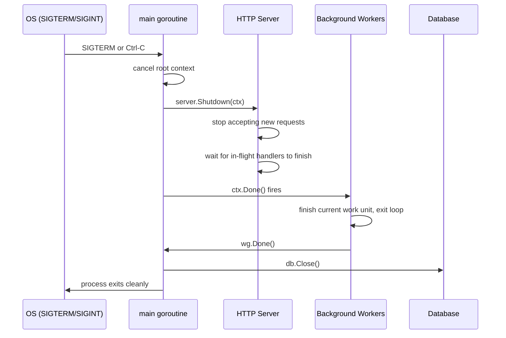

# Graceful Shutdown: Signals, Context, and Cleanup

A graceful shutdown means stopping a process in an orderly way: finish in-flight requests, flush buffers, close database connections, and release resources — before exiting. Abruptly killing a process (`SIGKILL`, `os.Exit`) skips all cleanup and can corrupt data, leave connections half-open, or drop requests that were mid-flight.

In Go, graceful shutdown is built from three primitives: **OS signal handling**, **context cancellation**, and **sync.WaitGroup** for draining active work.

## The Shutdown Flow



## Catching OS Signals

`os/signal.NotifyContext` (Go 1.16+) is the idiomatic way to turn OS signals into context cancellation:

```go
package main

import (
	"context"
	"fmt"
	"os"
	"os/signal"
	"syscall"
	"time"
)

func main() {
	// highlight-next-line
	ctx, stop := signal.NotifyContext(context.Background(), os.Interrupt, syscall.SIGTERM)
	defer stop() // stop signal forwarding when we're done

	fmt.Println("server running — press Ctrl+C to stop")

	select {
	case <-ctx.Done():
		fmt.Println("\nshutdown signal received")
	case <-time.After(5 * time.Second):
		fmt.Println("timeout reached")
	}

	fmt.Println("cleaning up...")
	time.Sleep(100 * time.Millisecond)
	fmt.Println("done")
}
```

<codapi-snippet sandbox="go" editor="basic">
</codapi-snippet>

`signal.NotifyContext` returns a context that is cancelled when the process receives one of the listed signals. `stop()` deregisters the signal handler — call it as soon as you've received the signal to restore default signal behavior (so a second Ctrl-C kills the process immediately).

## HTTP Server: net/http Graceful Shutdown

`http.Server.Shutdown(ctx)` stops the server from accepting new connections and waits for active connections to become idle (handlers return). It returns when all connections are closed or when `ctx` expires.

```go
package main

import (
	"context"
	"fmt"
	"net/http"
	"os"
	"os/signal"
	"syscall"
	"time"
)

func main() {
	mux := http.NewServeMux()
	mux.HandleFunc("/", func(w http.ResponseWriter, r *http.Request) {
		time.Sleep(2 * time.Second) // simulate slow handler
		fmt.Fprintln(w, "hello")
	})

	server := &http.Server{
		Addr:    ":8080",
		Handler: mux,
	}

	// Start server in background goroutine
	go func() {
		fmt.Println("listening on :8080")
		if err := server.ListenAndServe(); err != http.ErrServerClosed {
			fmt.Fprintf(os.Stderr, "server error: %v\n", err)
			os.Exit(1)
		}
	}()

	// Wait for shutdown signal
	ctx, stop := signal.NotifyContext(context.Background(), os.Interrupt, syscall.SIGTERM)
	defer stop()
	<-ctx.Done()

	fmt.Println("shutdown signal received — draining connections")

	// Give in-flight handlers up to 30 seconds to finish
	// highlight-next-line
	shutdownCtx, cancel := context.WithTimeout(context.Background(), 30*time.Second)
	defer cancel()

	if err := server.Shutdown(shutdownCtx); err != nil {
		fmt.Fprintf(os.Stderr, "shutdown error: %v\n", err)
	}

	fmt.Println("server stopped cleanly")
}
```

Key points:
- `ListenAndServe` returns `http.ErrServerClosed` when `Shutdown` is called — this is normal, not an error.
- The shutdown context sets a deadline. If handlers don't finish in 30 seconds, `Shutdown` returns an error and active connections are forcibly closed.
- Never use `context.Background()` alone for the shutdown timeout — always add a deadline so a stuck handler can't block shutdown forever.

## Draining Background Workers

Background goroutines (queue consumers, batch processors, cron jobs) need to finish their current work unit cleanly before the process exits.

```go
package main

import (
	"context"
	"fmt"
	"os"
	"os/signal"
	"sync"
	"syscall"
	"time"
)

func worker(ctx context.Context, id int, wg *sync.WaitGroup) {
	defer wg.Done()
	for {
		select {
		// highlight-next-line
		case <-ctx.Done():
			fmt.Printf("worker %d: shutting down\n", id)
			return
		default:
			// simulate processing a work item
			fmt.Printf("worker %d: processing\n", id)
			time.Sleep(500 * time.Millisecond)
		}
	}
}

func main() {
	ctx, stop := signal.NotifyContext(context.Background(), os.Interrupt, syscall.SIGTERM)
	defer stop()

	var wg sync.WaitGroup
	for i := 1; i <= 3; i++ {
		wg.Add(1)
		go worker(ctx, i, &wg)
	}

	<-ctx.Done()
	fmt.Println("waiting for workers to finish current task...")
	// highlight-next-line
	wg.Wait() // block until all workers have returned
	fmt.Println("all workers stopped")
}
```

<codapi-snippet sandbox="go" editor="basic">
</codapi-snippet>

Workers check `ctx.Done()` at natural loop boundaries — between work units, not mid-computation. This ensures they finish their current item before exiting. `wg.Wait()` blocks `main` until all goroutines have called `wg.Done()`.

## The Full Pattern: Server + Workers

A production service combines both patterns:

```go
func main() {
    ctx, stop := signal.NotifyContext(context.Background(),
        os.Interrupt, syscall.SIGTERM)
    defer stop()

    // Start HTTP server
    server := startHTTPServer()

    // Start background workers
    var wg sync.WaitGroup
    for i := 0; i < numWorkers; i++ {
        wg.Add(1)
        go func() {
            defer wg.Done()
            runWorker(ctx)
        }()
    }

    // Wait for shutdown signal
    <-ctx.Done()
    stop() // restore default signal behavior immediately

    // Phase 1: stop accepting new work
    shutCtx, cancel := context.WithTimeout(context.Background(), 30*time.Second)
    defer cancel()
    server.Shutdown(shutCtx)

    // Phase 2: drain in-flight work
    wg.Wait()

    // Phase 3: release shared resources
    db.Close()
    cache.Flush()
}
```

## Common Mistakes

:::danger
**Calling `os.Exit` directly skips all cleanup**. `os.Exit` terminates the process immediately — deferred functions do NOT run. Never call `os.Exit` in a function that has registered cleanup work. Only call it in `main` after cleanup is complete, or in `init` if startup fails before any cleanup is registered.
:::

:::warning
**No timeout on `wg.Wait()`** — If a worker gets stuck, your process never exits. Add a second `context.WithTimeout` and select between `wg.Wait()` returning and the timeout. Force-kill stuck workers by checking the timeout context inside the worker.
:::

:::warning
**Re-using the signal context as the shutdown deadline** — The signal context is already cancelled when you reach `server.Shutdown`. Create a fresh `context.WithTimeout` for the shutdown deadline, as shown above.
:::

## Key Takeaways

- Graceful shutdown = stop accepting new work → drain in-flight work → release resources → exit.
- Use `signal.NotifyContext` to convert OS signals (SIGTERM, SIGINT) into context cancellation.
- `http.Server.Shutdown(ctx)` stops the server from accepting connections and waits for active handlers to return — always give it a timeout.
- Background workers should check `ctx.Done()` between work units and return when cancelled; `sync.WaitGroup` blocks `main` until they finish.
- Call `stop()` (the function returned by `signal.NotifyContext`) as soon as you've received the signal so a second signal kills the process immediately.
- Never call `os.Exit` mid-cleanup — deferred functions are skipped.
