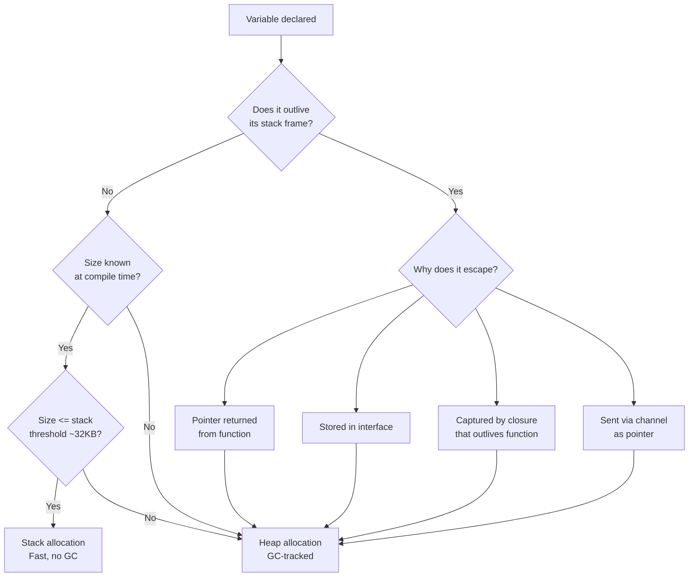

# Escape Analysis: Stack vs Heap Allocation

When you write `x := 42` in Go, where does `x` actually live? The answer is not always obvious, and it matters for performance. The Go compiler runs a pass called **escape analysis** to decide whether each variable should be allocated on the current goroutine's stack or promoted to the garbage-collected heap. Understanding this decision — and learning to read the compiler's output — is one of the most practical skills for writing efficient Go.

## Stack Allocation: Fast and Free

The stack is a contiguous region of memory that grows and shrinks as functions are called and return. Allocating on the stack is essentially free: the runtime just decrements a pointer. When a function returns, its entire stack frame is reclaimed in one step — no garbage collector involvement, no scanning, no latency spike.

The Go compiler strongly prefers stack allocation. If it can prove that a variable's lifetime does not outlive the function that created it, the variable lives on the stack. Most local variables, loop counters, small structs, and slices with compile-time-known sizes end up here.

## Heap Allocation: Necessary but Costly

The heap is managed by Go's garbage collector. Allocating on the heap requires the runtime to find a free block, potentially run the GC, and later scan the value during GC mark phases. This adds latency and CPU overhead that compounds when many short-lived objects are heap-allocated in a hot path.

A variable "escapes to the heap" when the compiler cannot prove it will stay within its stack frame. Once a variable escapes, it stays on the heap for its entire lifetime and the GC must track it.

## When Variables Escape

The compiler applies conservative rules. If any of the following conditions hold, the variable escapes:

**1. Returning a pointer to a local variable.** The stack frame is gone after the function returns, so the pointed-to value must survive on the heap.

**2. Storing a value in an interface.** Interfaces hold a `data unsafe.Pointer`. The compiler cannot always prove the concrete value won't outlive the interface, so it heap-allocates the value and stores a pointer to it in the interface's data word.

**3. Sending a pointer through a channel.** The sender and receiver run in different goroutines with separate stacks. The runtime cannot guarantee which goroutine's stack frame will outlive the other, so the pointed-to value escapes.

**4. A closure captures a variable and outlives the function.** If you return a closure, or assign it to a variable that outlives the enclosing function, any captured variables must be heap-allocated so the closure can continue to access them.

**5. The variable is too large for the stack.** Large objects (typically over 32 KB) are placed on the heap regardless of lifetime.

**6. The size is not known at compile time.** `make([]byte, n)` where `n` is a runtime variable escapes because the compiler cannot reserve the right amount of stack space statically.

## Reading Escape Analysis Output

Run the compiler with the `-m` flag to see escape analysis decisions:

```
go build -gcflags='-m' ./...
```

Use `-m -m` for more detail, including inlining decisions:

```
go build -gcflags='-m -m' ./...
```

Typical output lines:

```
./main.go:10:6:  moved to heap: x
./main.go:15:14: x does not escape
./main.go:22:6:  inlining call to foo
```

`moved to heap: x` means the variable at that line escaped. `does not escape` is what you want to see for performance-sensitive variables. `inlining call to foo` is important because inlining often changes escape behavior — a variable that would escape through a function call boundary may not escape once the call is inlined.

## Concrete Examples

### Example 1: Return by Pointer vs Return by Value

The classic escape example is returning a pointer to a local variable.

```go
package main

import "fmt"

// newInt allocates on the heap — the compiler sees that the returned pointer
// will outlive this stack frame.
// go build -gcflags='-m' output: "moved to heap: x"
func newInt(v int) *int {
	// highlight-next-line
	x := v  // x escapes to heap
	return &x
}

// newIntVal returns a copy — x stays on the stack.
// go build -gcflags='-m' output: "x does not escape"
func newIntVal(v int) int {
	x := v
	return x
}

func main() {
	p := newInt(42)
	fmt.Println(*p)

	n := newIntVal(42)
	fmt.Println(n)
}
```
<codapi-snippet sandbox="go" editor="basic"></codapi-snippet>

### Example 2: Interface Conversion Causes Escape

```go
package main

import "fmt"

type Point struct{ X, Y float64 }

func main() {
	p := Point{1.0, 2.0}

	// highlight-next-line
	var i interface{} = p  // p is copied and the copy escapes to heap
	// The compiler must heap-allocate the value stored in the interface
	// because it cannot track the interface's lifetime statically.
	fmt.Println(i)

	// But if we just use p directly, it stays on the stack:
	fmt.Println(p.X, p.Y)
}
```
<codapi-snippet sandbox="go" editor="basic"></codapi-snippet>

### Example 3: Closure Capturing a Variable

```go
package main

import "fmt"

func makeCounter() func() int {
	// highlight-next-line
	count := 0  // count escapes — the closure outlives makeCounter's stack frame
	return func() int {
		count++
		return count
	}
}

func main() {
	counter := makeCounter()
	fmt.Println(counter()) // 1
	fmt.Println(counter()) // 2
	fmt.Println(counter()) // 3
}
```
<codapi-snippet sandbox="go" editor="basic"></codapi-snippet>

### Example 4: Stack-Allocated Buffer vs Heap-Allocated Slice

```go
package main

import (
	"fmt"
	"strconv"
)

func formatID(id int) string {
	// highlight-next-line
	var buf [32]byte  // fixed-size array — stays on the stack, no allocation
	b := strconv.AppendInt(buf[:0], int64(id), 10)
	return string(b)
}

func formatIDHeap(id int) string {
	// highlight-next-line
	buf := make([]byte, 0, 32)  // may escape depending on compiler version and usage
	buf = strconv.AppendInt(buf, int64(id), 10)
	return string(buf)
}

func main() {
	fmt.Println(formatID(12345))
	fmt.Println(formatIDHeap(12345))
}
```
<codapi-snippet sandbox="go" editor="basic"></codapi-snippet>

## The Compiler's Decision Flow



## How to Reduce Heap Allocations

**Pass small structs by value.** A struct with two or three fields is cheaper to copy than to heap-allocate and pointer-chase. The crossover point depends on the struct size and how often it is passed, but under roughly 64 bytes, value passing is usually a win.

**Avoid storing values in interfaces in hot paths.** Every time you box a concrete value into an interface, the runtime may allocate. In tight loops, work with concrete types and only convert to interfaces at the boundary.

**Use `sync.Pool` for large temporary buffers.** `sync.Pool` maintains a per-P (processor) cache of objects. Getting a buffer from the pool is a fast local operation; putting it back makes it available for the next caller on the same P, avoiding repeated heap allocations and GC pressure.

**Prefer fixed-size arrays over slices for small buffers.** `var buf [64]byte` is a stack allocation. `make([]byte, 64)` may or may not escape depending on context, but the array is guaranteed to stay on the stack.

**Understand inlining's effect.** When the compiler inlines a function call, escape analysis runs on the merged code. A variable that appeared to escape through a function boundary may no longer escape once the call is inlined. Use `-gcflags='-m -m'` to see both inlining and escape decisions together.

:::note
Escape analysis is per-function and is re-evaluated whenever inlining changes the call graph. Adding `//go:noinline` to a function forces it not to be inlined and can change which variables escape in callers.
:::

:::warning
Do not chase escape analysis improvements before profiling. Use `go tool pprof` with a heap profile (`runtime/pprof.WriteHeapProfile` or the `net/http/pprof` endpoint) to identify which allocation sites actually matter. Micro-optimizing escape behavior in rarely-called code has no measurable effect on production latency.
:::

## Key Takeaways

- **Stack allocation** is fast and free — the compiler prefers it. Variables stay on the stack when the compiler can prove they don't outlive their function's stack frame.
- **Heap allocation** is necessary when a variable escapes its function: via returned pointer, interface storage, closure capture, channel send, or excessive size.
- Use `go build -gcflags='-m'` to see escape decisions. `moved to heap: x` means a heap allocation. `does not escape` means stack.
- Inlining changes escape behavior — always check `-m -m` for the full picture.
- Practical fixes: pass small structs by value, avoid boxing in hot paths, use `sync.Pool` for large reusable buffers, and prefer `var buf [N]byte` over `make([]byte, N)` for temporary buffers.
- Measure first with pprof. Escape analysis optimization without profiling data is premature.
