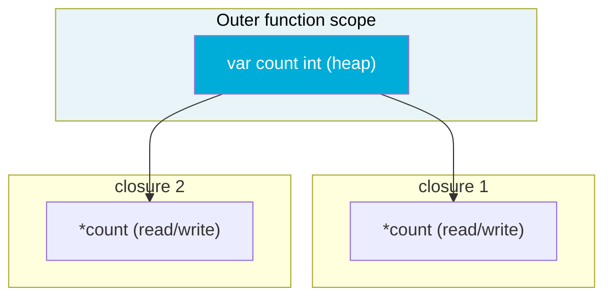

# Closures: Captured Variables and Common Pitfalls

A closure is a function value that references variables from outside its own body. In Go, every function literal (anonymous function) that references a variable from an enclosing scope is a closure. The closure doesn't copy the value — it captures a **reference to the variable itself**. This is precise, powerful, and the source of one of Go's most common bugs.

## How Closures Capture Variables

When a function literal references an outer variable, the Go compiler promotes that variable to the heap and makes both the outer scope and the closure point to the same memory location.



Both closures share the same underlying variable. A write through one is immediately visible to the other.

```go
package main

import "fmt"

func makeCounter() (func(), func() int) {
	count := 0 // promoted to heap — shared by both closures

	increment := func() {
		// highlight-next-line
		count++ // modifies the shared variable
	}

	get := func() int {
		return count
	}

	return increment, get
}

func main() {
	inc, get := makeCounter()

	inc()
	inc()
	inc()
	fmt.Println(get()) // 3
}
```

<codapi-snippet sandbox="go" editor="basic">
</codapi-snippet>

`increment` and `get` both close over the same `count`. This makes closures a clean way to encapsulate state without defining a struct.

## Function Factories

Closures are the basis of function factories — functions that return specialized functions configured by their arguments:

```go
package main

import "fmt"

func multiplier(factor int) func(int) int {
	// highlight-next-line
	return func(x int) int { return x * factor }
}

func main() {
	double := multiplier(2)
	triple := multiplier(3)

	fmt.Println(double(5))  // 10
	fmt.Println(triple(5))  // 15
	fmt.Println(double(triple(4))) // 24
}
```

<codapi-snippet sandbox="go" editor="basic">
</codapi-snippet>

Each call to `multiplier` creates a new closure capturing a different `factor`. The closures are independent — they don't share any state.

## The Loop Variable Capture Bug

This is the most common Go closure pitfall, and it was present in all Go versions before 1.22.

```go
package main

import (
	"fmt"
	"sync"
)

func main() {
	var wg sync.WaitGroup

	for i := 0; i < 5; i++ {
		wg.Add(1)
		go func() {
			defer wg.Done()
			// highlight-next-line
			fmt.Println(i) // captures the variable i, not its value
		}()
	}

	wg.Wait()
}
```

<codapi-snippet sandbox="go" editor="basic">
</codapi-snippet>

**Before Go 1.22**: all goroutines likely print `5` because they all share the same `i`, and by the time they run, the loop has finished. The loop variable is a single variable that gets updated each iteration — the closures hold a reference to it, not a snapshot.

**Go 1.22+**: loop variables are re-declared per iteration, so each closure captures its own independent copy. The bug is fixed by default.

### The Pre-1.22 Fix: Shadow the Variable

```go
package main

import (
	"fmt"
	"sync"
)

func main() {
	var wg sync.WaitGroup

	for i := 0; i < 5; i++ {
		// highlight-next-line
		i := i // shadow: new variable per iteration, captured independently
		wg.Add(1)
		go func() {
			defer wg.Done()
			fmt.Println(i)
		}()
	}

	wg.Wait()
}
```

<codapi-snippet sandbox="go" editor="basic">
</codapi-snippet>

The `i := i` line creates a new variable in the inner scope each iteration. Each goroutine's closure captures its own copy. This pattern is important to recognize in older codebases targeting pre-1.22 Go.

### Alternative: Pass as Argument

```go
for i := 0; i < 5; i++ {
	wg.Add(1)
	// highlight-next-line
	go func(n int) { // n is a copy passed by value
		defer wg.Done()
		fmt.Println(n)
	}(i)
}
```

Passing the value as an argument is explicit and works in all Go versions. Some teams prefer this style for clarity.

## Closures and defer

`defer` uses closures, which means deferred functions can read and modify named return values even after the `return` statement:

```go
package main

import (
	"errors"
	"fmt"
)

func riskyOperation() (err error) {
	defer func() {
		if err != nil {
			// highlight-next-line
			err = fmt.Errorf("riskyOperation: %w", err) // wraps the return value
		}
	}()

	return errors.New("something went wrong")
}

func main() {
	fmt.Println(riskyOperation())
}
```

<codapi-snippet sandbox="go" editor="basic">
</codapi-snippet>

The deferred closure captures `err` by reference. When the `return errors.New(...)` statement executes, it assigns to `err`, then the deferred function runs and wraps it. The caller sees the wrapped error.

## Memoization with Closures

Closures make it straightforward to add memoization to an expensive function:

```go
package main

import "fmt"

func memoize(f func(int) int) func(int) int {
	cache := map[int]int{}
	return func(n int) int {
		if v, ok := cache[n]; ok {
			return v
		}
		// highlight-next-line
		result := f(n)
		cache[n] = result
		return result
	}
}

func slowFib(n int) int {
	if n <= 1 {
		return n
	}
	return slowFib(n-1) + slowFib(n-2)
}

func main() {
	fib := memoize(slowFib)
	for i := 0; i <= 10; i++ {
		fmt.Printf("fib(%d) = %d\n", i, fib(i))
	}
}
```

<codapi-snippet sandbox="go" editor="basic">
</codapi-snippet>

The `cache` map lives inside the closure. It persists across calls because the closure holds a reference to it. Each unique input is computed once.

## Escape Analysis: When Does Closure State Go to the Heap?

When a closure outlives the function that created it (returned from a function, sent to a goroutine), the captured variables must survive on the heap. The Go compiler's escape analysis determines this automatically — you don't manage it manually. But it does mean captured variables incur a heap allocation.

```go
func makeAdder(x int) func(int) int {
	// x escapes to heap because the returned closure outlives makeAdder
	return func(y int) int { return x + y }
}
```

If you're in a hot path and concerned about allocations, you can verify with `go build -gcflags="-m"` to see what escapes.

:::tip
Closures are ideal for encapsulating small amounts of state without defining a full struct. But if the state grows complex or needs to be shared by many functions, a struct with methods is cleaner and more testable.
:::

## Key Takeaways

- Closures capture variables **by reference** — a write through the closure changes the original variable.
- Multiple closures over the same variable share it; this enables stateful function factories but also causes bugs.
- **Loop variable capture** (pre-Go 1.22): all closures in a loop share the loop variable. Fix by shadowing (`i := i`) or passing as an argument. Go 1.22+ fixes this by default.
- `defer` uses closures — deferred functions can modify named return values, which is useful for wrapping errors.
- Captured variables that outlive their scope are moved to the heap by the compiler (escape analysis).
- Use closures for encapsulating small state; use structs when state grows complex.
