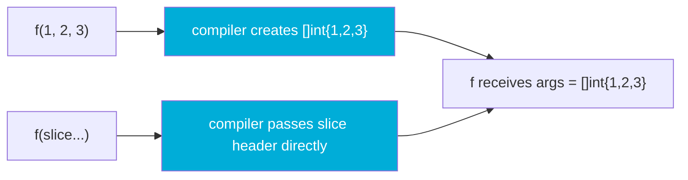

# Variadic Functions: How ...T Works Under the Hood

A variadic function accepts a variable number of arguments of the same type. Go uses the `...T` syntax for this. They appear throughout the standard library — `fmt.Println`, `append`, `errors.Join` — and understanding how they actually work prevents a class of subtle bugs when forwarding arguments or passing slices.

## How the Compiler Handles ...T

When you declare `func f(args ...int)`, the parameter `args` inside `f` is **exactly** `[]int`. The compiler bundles all the extra arguments into a slice on the heap (or stack, if it can escape-analyze them away), then passes a slice header to the function.



Two call forms exist:

- **Individual arguments**: `f(1, 2, 3)` — the compiler allocates a new `[]int{1, 2, 3}` and passes it.
- **Slice unpacking**: `f(slice...)` — no allocation; the existing slice header is passed directly.

These two forms behave differently with respect to memory — passing `slice...` does NOT copy the slice.

## Basic Usage

```go
package main

import "fmt"

func sum(nums ...int) int {
	total := 0
	for _, n := range nums {
		total += n
	}
	return total
}

func main() {
	fmt.Println(sum(1, 2, 3))        // 6
	fmt.Println(sum(10, 20))         // 30
	fmt.Println(sum())               // 0 — zero args is valid

	nums := []int{4, 5, 6}
	// highlight-next-line
	fmt.Println(sum(nums...))        // 15 — unpack slice
}
```

<codapi-snippet sandbox="go" editor="basic">
</codapi-snippet>

The `...` unpacking operator on the call site is the mirror of `...T` on the declaration site.

## Variadic with Other Parameters

The variadic parameter must always be **last**. You can have any number of regular parameters before it:

```go
package main

import (
	"fmt"
	"strings"
)

func join(sep string, parts ...string) string {
	return strings.Join(parts, sep)
}

func main() {
	fmt.Println(join(", ", "go", "is", "great"))  // go, is, great
	fmt.Println(join("-", "2024", "01", "15"))     // 2024-01-15
	fmt.Println(join("/"))                          // "" — zero parts
}
```

<codapi-snippet sandbox="go" editor="basic">
</codapi-snippet>

## Forwarding Variadic Arguments

When you want to forward variadic arguments to another variadic function, use `...` to unpack — otherwise you pass a `[]T` as a single element:

```go
package main

import "fmt"

func logAll(prefix string, args ...any) {
	// highlight-next-line
	fmt.Println(append([]any{prefix + ":"}, args...)...)
}

func main() {
	logAll("INFO", "server started", "port", 8080)
}
```

<codapi-snippet sandbox="go" editor="basic">
</codapi-snippet>

The classic forwarding pattern with `fmt.Sprintf`:

```go
package main

import "fmt"

func errorf(format string, args ...any) error {
	// highlight-next-line
	return fmt.Errorf(format, args...) // forward args... not args
}

func main() {
	err := errorf("user %d not found in %s", 42, "production")
	fmt.Println(err)
}
```

<codapi-snippet sandbox="go" editor="basic">
</codapi-snippet>

## The Slice Aliasing Gotcha

:::danger
When you call `f(slice...)`, the function receives a slice **backed by the same underlying array**. If the function appends to it without growing the capacity, it will overwrite the caller's data.
:::

```go
package main

import "fmt"

func badAppend(dst ...int) []int {
	// highlight-next-line
	return append(dst, 99) // may mutate caller's backing array if cap > len
}

func main() {
	original := make([]int, 3, 5)
	original[0], original[1], original[2] = 1, 2, 3

	result := badAppend(original...)

	fmt.Println("original:", original) // might still be [1 2 3], but...
	fmt.Println("result:  ", result)   // [1 2 3 99]

	// The backing array of original was mutated at index 3
	// Check by peeking: original[:4]
	fmt.Println("original[0:4]:", original[:4]) // [1 2 3 99] — surprise!
}
```

<codapi-snippet sandbox="go" editor="basic">
</codapi-snippet>

The fix: copy the slice at the start of the function if you intend to modify it:

```go
func safeAppend(dst ...int) []int {
	// highlight-next-line
	tmp := make([]int, len(dst))
	copy(tmp, dst)
	return append(tmp, 99)
}
```

## Variadic Functions Are Not Generically Typed Per Element

Unlike some languages, Go's variadic `...T` requires all arguments to be the same type. To accept mixed types, use `...any` (formerly `...interface{}`):

```go
package main

import "fmt"

func printAll(values ...any) {
	for i, v := range values {
		fmt.Printf("[%d] %T = %v\n", i, v, v)
	}
}

func main() {
	printAll(42, "hello", true, 3.14)
}
```

<codapi-snippet sandbox="go" editor="basic">
</codapi-snippet>

:::warning
`...any` loses type safety at compile time. Prefer typed variadic parameters when all arguments are the same type. Use `...any` only when you genuinely need heterogeneous arguments (like `fmt.Println` does).
:::

## When to Use Variadic Functions

import Tabs from '@theme/Tabs';
import TabItem from '@theme/TabItem';

<Tabs>
<TabItem value="good" label="Good fits" default>

- **Convenience constructors**: `NewServer(opts ...Option)` — functional options pattern
- **Aggregation functions**: `sum`, `max`, `min` — operating on any number of same-type values
- **Logging / formatting**: wrapping `fmt.Sprintf` or building log entry helpers
- **Joining / collecting**: building slices from scattered elements without forcing callers to construct a slice first

</TabItem>
<TabItem value="bad" label="Poor fits">

- **When you need at least one argument**: variadic allows zero args; use a required first param + variadic rest: `func f(first T, rest ...T)`
- **Mixed types with complex dispatch**: better to define an interface or use explicit overloads
- **Performance-critical hot paths**: every call with individual args allocates a new slice — prefer passing an explicit `[]T` in tight loops

</TabItem>
</Tabs>

## Key Takeaways

- `...T` in a declaration makes the parameter a `[]T` inside the function — it's just syntactic sugar over a slice.
- Calling with individual arguments allocates a new backing slice; calling with `slice...` passes the existing slice header directly — no copy.
- Because `slice...` shares the backing array, appending inside the function can silently corrupt the caller's data if capacity allows it.
- The variadic parameter must be the last parameter; there can only be one per function.
- Forward variadic args to other variadic functions using `args...`, not `args` — the latter wraps the slice as a single `[]T` element.
