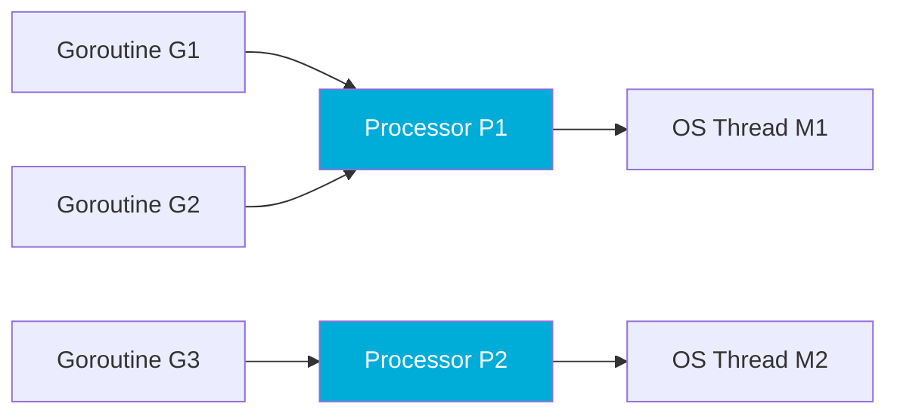

import Tabs from '@theme/Tabs';
import TabItem from '@theme/TabItem';

# Getting Started with Go Basics

Welcome to **Go Basics** — a collection of in-depth articles on Go internals and best practices.

:::tip What this site covers
Each article dives deep into a specific Go topic — from goroutine scheduling to GC internals — with interactive code examples you can run right in the browser.
:::

## Interactive Go Code

Every article includes runnable Go code powered by [Codapi](https://codapi.org). Click **Run** to execute:

```go
package main

import "fmt"

func main() {
	fmt.Println("Hello from Go Basics!")
}
```

<codapi-snippet sandbox="go" editor="basic">
</codapi-snippet>

## Goroutine Scheduling Overview

Go uses a work-stealing scheduler built around three core abstractions:



- **G** (Goroutine): a lightweight thread managed by the Go runtime
- **M** (Machine): an OS thread
- **P** (Processor): a logical processor that mediates between G and M

:::note
`GOMAXPROCS` controls the number of **P**s, not the number of OS threads.
:::

## Value vs Pointer Receivers

<Tabs>
  <TabItem value="value" label="Value Receiver" default>

```go
package main

import "fmt"

type Point struct {
	X, Y int
}

// highlight-next-line
func (p Point) Translate(dx, dy int) Point {
	return Point{p.X + dx, p.Y + dy}
}

func main() {
	p := Point{1, 2}
	p2 := p.Translate(3, 4)
	fmt.Println(p, "→", p2)
}
```

<codapi-snippet sandbox="go" editor="basic">
</codapi-snippet>

Value receivers get a **copy** of the struct. The original is never modified.

  </TabItem>
  <TabItem value="pointer" label="Pointer Receiver">

```go
package main

import "fmt"

type Point struct {
	X, Y int
}

// highlight-next-line
func (p *Point) Translate(dx, dy int) {
	p.X += dx
	p.Y += dy
}

func main() {
	p := Point{1, 2}
	p.Translate(3, 4)
	fmt.Println(p)
}
```

<codapi-snippet sandbox="go" editor="basic">
</codapi-snippet>

Pointer receivers modify the **original** struct in place.

  </TabItem>
</Tabs>

:::warning Mixing receiver types
If any method on a type uses a pointer receiver, consider using pointer receivers for **all** methods on that type. Mixing can lead to subtle bugs with interface satisfaction.
:::

## What's Next?

Explore the articles in the sidebar — each one covers a topic from the curated list of Go topics with the same depth and interactive examples shown here.
