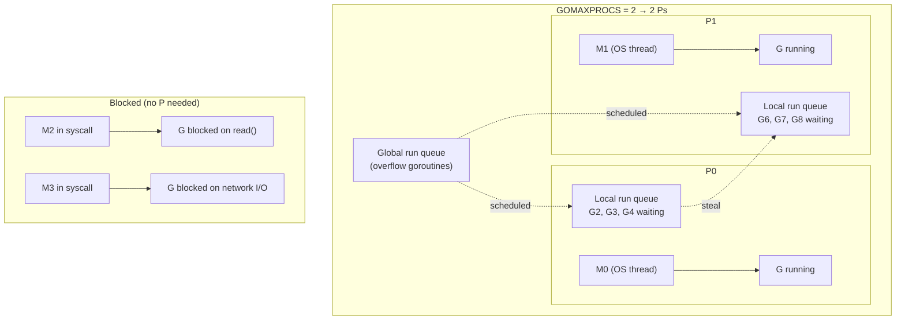

# GOMAXPROCS: What It Really Controls

`GOMAXPROCS` is one of the most commonly cited Go runtime settings and one of the most commonly misunderstood. The name implies it controls the number of processes. It does not. It controls the number of **P** (processor) objects in Go's scheduler — and understanding what a P actually is is the key to understanding what this setting does and does not change.

## The GMP Model in Brief

Go's runtime scheduler is built on three abstractions:

- **G** (goroutine): a unit of concurrent execution. Your program creates thousands of these.
- **M** (machine): an OS thread. The runtime creates and destroys these as needed.
- **P** (processor): a scheduling context that an M must hold in order to execute Go code.

The relationship between them: an M can only run Go code when it is paired with a P. A G can only run when it is scheduled onto an M+P pair. `GOMAXPROCS` controls the number of Ps. Therefore, `GOMAXPROCS` controls the maximum number of goroutines executing Go code simultaneously.



Each P has a local run queue of goroutines waiting to execute. When a P's local queue is empty, it tries to steal goroutines from another P's queue. Goroutines that overflow all local queues go into a global run queue.

## What GOMAXPROCS Controls

GOMAXPROCS precisely controls one thing: **how many Ps exist**. Since every running goroutine needs a P, this is simultaneously the maximum number of goroutines that can be actively executing Go code at any instant.

The default value is `runtime.NumCPU()` — the number of logical CPU cores reported by the OS. This default is correct for CPU-bound workloads: you want one goroutine running per core, maximizing CPU utilization without context-switch overhead.

```go
package main

import (
	"fmt"
	"runtime"
	"sync"
	"sync/atomic"
	"time"
)

func cpuBound(iterations int) int64 {
	var sum int64
	for i := 0; i < iterations; i++ {
		sum += int64(i * i)
	}
	return sum
}

func runWithProcs(n int) time.Duration {
	old := runtime.GOMAXPROCS(n)
	defer runtime.GOMAXPROCS(old)

	const goroutines = 8
	const work = 10_000_000

	var wg sync.WaitGroup
	var total atomic.Int64

	start := time.Now()
	for i := 0; i < goroutines; i++ {
		wg.Add(1)
		go func() {
			defer wg.Done()
			total.Add(cpuBound(work))
		}()
	}
	wg.Wait()
	return time.Since(start)
}

func main() {
	cpus := runtime.NumCPU()
	fmt.Printf("Logical CPUs: %d\n\n", cpus)

	for _, p := range []int{1, 2, 4} {
		if p > cpus {
			continue
		}
		d := runWithProcs(p)
		fmt.Printf("GOMAXPROCS=%d  duration=%v\n", p, d.Round(time.Millisecond))
	}
}
```
<codapi-snippet sandbox="go" editor="basic"></codapi-snippet>

On a multi-core machine you should see wall-clock time decrease as GOMAXPROCS increases up to the CPU count. Beyond the CPU count, there is no benefit for CPU-bound work — adding more Ps does not create more CPU execution capacity.

## What GOMAXPROCS Does NOT Control

### Total OS thread count

The number of M (OS thread) objects is unbounded and is managed entirely by the runtime. When a goroutine makes a blocking syscall — `read()`, `write()`, `sleep()` — the runtime detaches its P from the current M and hands the P to another M (creating a new M if necessary). This allows other goroutines to continue running on the P while the original M is stuck in the syscall.

The result: you can have far more OS threads than GOMAXPROCS. A Go program with GOMAXPROCS=4 that fires 1,000 goroutines each doing a blocking file read may temporarily have 1,000+ OS threads — 4 running Go code and the rest blocked in syscalls.

:::note
The `runtime/debug.SetMaxThreads` function caps the total OS thread count (default: 10,000). This limit exists to catch runaway thread creation, not to control normal concurrency. You rarely need to change it.
:::

### Number of goroutines

GOMAXPROCS has no effect on how many goroutines you can create. Goroutines are scheduled, not threads — you can have millions of goroutines with GOMAXPROCS=1. Only one goroutine runs at a time in that case, but all of them exist.

### Threads blocked in network I/O

Go's network poller uses the OS's I/O multiplexing interface (epoll on Linux, kqueue on macOS). Goroutines waiting on network I/O are not blocked in an OS syscall — they are parked by the scheduler, with the network poller watching their file descriptors. They consume no M and no P while waiting.

## Setting GOMAXPROCS Programmatically

```go
package main

import (
	"fmt"
	"runtime"
)

func main() {
	// highlight-next-line
	previous := runtime.GOMAXPROCS(4) // returns the old value
	fmt.Printf("was %d, now %d\n", previous, runtime.GOMAXPROCS(0))
	// Passing 0 queries the current value without changing it.

	// highlight-next-line
	runtime.GOMAXPROCS(previous) // restore
	fmt.Printf("restored to %d\n", runtime.GOMAXPROCS(0))
}
```
<codapi-snippet sandbox="go" editor="basic"></codapi-snippet>

You can also set it via the environment variable before the process starts:

```bash
GOMAXPROCS=4 ./myservice
```

The environment variable is read once at program startup. Calls to `runtime.GOMAXPROCS()` in code take effect immediately and can change at runtime, though this is rarely useful in practice.

## GOMAXPROCS=1: Single-Threaded Go Execution

Setting GOMAXPROCS to 1 makes all goroutines share a single P — only one goroutine can execute Go code at a time. Multiple OS threads may still exist for syscall handling, but from Go's perspective, execution is single-threaded.

This setting is useful for:
- **Testing goroutine scheduling behavior**: with a single P, goroutines yield only at explicit blocking points (channel ops, `runtime.Gosched()`, function calls in some cases). Bugs that only manifest with specific interleavings may be easier or harder to reproduce.
- **Debugging race conditions**: some races disappear under GOMAXPROCS=1, which can help confirm they are true concurrency bugs.
- **Minimal-resource deployments**: a background sidecar that primarily does I/O with minimal CPU work may not need multiple Ps.

## The Container CPU Limit Gotcha

This is the most impactful practical implication of understanding GOMAXPROCS.

When a Go program starts, it calls `runtime.NumCPU()` to determine the default GOMAXPROCS. `runtime.NumCPU()` reads from the OS — it counts the number of logical CPUs available to the machine. In a container environment, this is the number of CPUs on the **host**, not the CPU limit allocated to the container.

Consider this scenario:

- Host machine: 96-core server.
- Container: deployed with `--cpus=2` (Linux CFS quota enforcement: 2 CPU-equivalents).
- Go process starts: `runtime.NumCPU()` returns 96. GOMAXPROCS is set to 96.
- The runtime creates 96 Ps. Goroutines compete for scheduling across 96 Ps.
- But the container's CFS quota allows only 2 CPUs of execution at any moment.

The 96 Ps all try to schedule goroutines. The OS context-switches between them, but can only run 2 threads worth of work per scheduling period. The result is excessive context switching, inflated scheduler overhead, and degraded throughput — the opposite of what you want.

:::warning
If your Go service runs in a container with a CPU limit, `runtime.NumCPU()` will return the host CPU count, not your container's allocated CPUs. This causes GOMAXPROCS to be set far too high, leading to scheduler thrash and increased latency. This is a real production issue, not a theoretical concern.
:::

### The Fix: automaxprocs

The [`uber-go/automaxprocs`](https://github.com/uber-go/automaxprocs) package reads the Linux CFS quota from `/sys/fs/cgroup` and sets GOMAXPROCS to the correct value for the container's CPU allocation. Usage is a single import:

```go
package main

import (
	"fmt"
	"runtime"

	// highlight-next-line
	_ "go.uber.org/automaxprocs" // sets GOMAXPROCS from CFS quota on import
)

func main() {
	fmt.Printf("GOMAXPROCS=%d\n", runtime.GOMAXPROCS(0))
	// On a host with 96 CPUs, in a container with --cpus=2:
	// Without automaxprocs: 96
	// With automaxprocs:    2
}
```

The blank import triggers the package's `init()` function, which reads the CFS quota and calls `runtime.GOMAXPROCS()` before `main()` runs. If no CFS quota is set (bare metal or VMs), it falls back to `runtime.NumCPU()`.

If you deploy Go services in containers — and most production Go services run in containers — importing `automaxprocs` should be a default practice. The cost is negligible and the benefit under CPU-limited containers is significant.

## I/O-Bound vs CPU-Bound Workloads

For purely I/O-bound work, GOMAXPROCS matters less than for CPU-bound work. Goroutines waiting on network I/O are parked and hold no P. The number of goroutines you can usefully have waiting on I/O is limited by connection counts and backend capacity, not by GOMAXPROCS.

However, even I/O-bound services have CPU-bound phases: JSON deserialization, TLS encryption, request routing, metric collection. For these phases, GOMAXPROCS determines maximum throughput. A web service handling 10,000 RPS is not purely I/O-bound — it spends real CPU time per request.

The practical recommendation:

| Workload type | GOMAXPROCS recommendation |
|---|---|
| CPU-bound (compression, math, crypto) | `runtime.NumCPU()` (default) |
| I/O-bound (web service, proxy) | `runtime.NumCPU()` (default is fine) |
| Container with CPU limits | Use `automaxprocs` |
| Testing scheduling behavior | 1 (explicitly) |
| Latency-sensitive, few goroutines | Profile and tune — default is usually best |

## Key Takeaways

- GOMAXPROCS controls the number of **P** objects — the scheduling contexts required to run Go code. It is not the thread count and not the goroutine count.
- The default is `runtime.NumCPU()`, which is correct for bare-metal and VM deployments.
- OS threads blocked in syscalls do not consume a P. The runtime creates new threads as needed to keep Ps busy.
- In containers with CPU limits, `runtime.NumCPU()` returns the host CPU count, causing GOMAXPROCS to be set far too high. Import `uber-go/automaxprocs` to fix this automatically.
- For CPU-bound work, scaling GOMAXPROCS up to CPU count improves throughput linearly. Beyond the CPU count, there is no further benefit.
- `runtime.GOMAXPROCS(0)` queries the current value without changing it.
