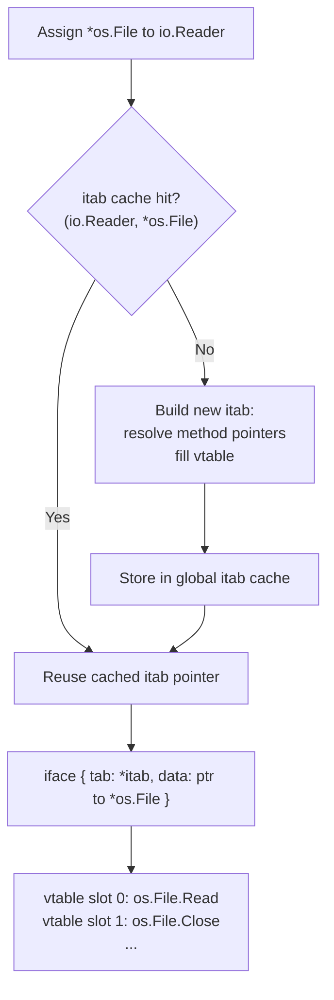

# Interfaces Under the Hood: itab, Dynamic Type, and Dynamic Value

Go interfaces are elegant on the surface: define a set of methods, and any type that satisfies them implicitly implements the interface. But what happens at the binary level when you assign a value to an interface variable, call a method through it, or check `err != nil`? The answers explain some of Go's most subtle bugs and most important performance characteristics.

## The Two-Word Interface Value

Every interface value in Go is a two-word struct at runtime. The exact layout depends on whether the interface is empty or non-empty.

**Non-empty interfaces** (any interface with at least one method) use `iface`:

```
iface {
    tab  *itab          // pointer to the interface/type metadata + vtable
    data unsafe.Pointer // pointer to the concrete value (or the value itself if it fits)
}
```

**Empty interfaces** (`interface{}` / `any`) use `eface`:

```
eface {
    _type *_type        // pointer to the runtime type descriptor
    data  unsafe.Pointer
}
```

The empty interface does not need a vtable since it has no methods, so it skips the itab and stores only the type descriptor directly. This makes `eface` slightly simpler than `iface`, but the data layout is otherwise the same.

Both layouts are exactly two machine words wide (16 bytes on 64-bit systems). An interface variable is never "just" the value — it always carries type information alongside.

## The `itab` Structure

The `itab` is the central data structure for non-empty interfaces. It is shared across all interface values of the same `(interface type, concrete type)` pair. Its layout (simplified from `runtime/iface.go`) is:

```
itab {
    inter *interfacetype  // descriptor for the interface type (e.g., io.Reader)
    _type *_type          // descriptor for the concrete type (e.g., *os.File)
    hash  uint32          // copy of _type.hash — used for fast type switches
    _     [4]byte         // padding
    fun   [1]uintptr      // variable-length array of method function pointers (vtable)
}
```

The `fun` array is the vtable. It contains one function pointer per method required by the interface, in the order defined by the interface type. When you call `r.Read(buf)` on an `io.Reader`, the runtime loads `itab.fun[0]` and calls through that pointer. There is no name lookup — the slot index is determined at compile time.

## Dynamic Dispatch: What It Actually Costs

Calling a method through an interface is more expensive than a direct function call, but the overhead is modest and well-defined:

1. Load `iface.tab` — one pointer dereference.
2. Load `itab.fun[i]` — one pointer dereference plus an offset (the slot index `i` is a compile-time constant).
3. Call through the function pointer — an indirect call, which may prevent the CPU branch predictor from warming up perfectly.

The total overhead is typically two extra memory loads and one indirect call. On a modern out-of-order CPU with hot caches, this is on the order of a few nanoseconds. It is dramatically cheaper than Java reflection (which involves name lookup and security checks) but slightly more expensive than a direct `(*os.File).Read(buf)` call.

## itab Caching

itabs are not constructed on every assignment. The first time you assign a `*os.File` to an `io.Reader`, the runtime checks a global hash table of cached itabs. If a `(io.Reader, *os.File)` itab already exists, the cached pointer is reused immediately. If not, the runtime builds a new itab, stores it in the cache, and returns a pointer to it.

This means interface assignments are nearly free after the first one. In practice, all the itabs for common `(interface, type)` pairs in your program are built at startup or on first use and then reused for the program's lifetime.



## The Nil Interface Bug

This is the most famous Go interface gotcha, and it causes real production bugs. Understanding it requires knowing the two-word structure.

A nil interface value has **both** words set to nil: `tab == nil` and `data == nil`. The expression `err == nil` checks whether the tab pointer is nil.

A non-nil interface containing a nil pointer has a **non-nil tab** (pointing to the itab for the concrete type) and a **nil data** pointer. The expression `err == nil` is therefore `false`, even though the concrete value is nil.

```go
package main

import "fmt"

type MyError struct {
	code int
}

func (e *MyError) Error() string {
	return fmt.Sprintf("error %d", e.code)
}

// BUG: this function appears to return nil on success, but it does not.
func riskyOperation(fail bool) error {
	// highlight-next-line
	var err *MyError // nil *MyError
	if fail {
		err = &MyError{code: 500}
	}
	// highlight-next-line
	return err // BUG: returns iface{tab: *itab(error,*MyError), data: nil}
	// The interface is NOT nil even when err is nil!
}

func main() {
	err := riskyOperation(false)
	// highlight-next-line
	if err != nil { // this is TRUE even though *MyError is nil
		fmt.Println("got an error:", err) // this line executes — surprise!
	} else {
		fmt.Println("no error")
	}
}
```
<codapi-snippet sandbox="go" editor="basic"></codapi-snippet>

The fix is to return an untyped nil directly:

```go
package main

import "fmt"

type MyError struct{ code int }

func (e *MyError) Error() string { return fmt.Sprintf("error %d", e.code) }

func riskyOperation(fail bool) error {
	if fail {
		return &MyError{code: 500}
	}
	// highlight-next-line
	return nil // returns iface{tab: nil, data: nil} — truly nil interface
}

func main() {
	err := riskyOperation(false)
	if err != nil {
		fmt.Println("got an error:", err)
	} else {
		// highlight-next-line
		fmt.Println("no error") // correctly reached
	}
}
```
<codapi-snippet sandbox="go" editor="basic"></codapi-snippet>

:::danger
Never return a typed nil pointer as an interface. The interface wrapping a nil `*T` is not nil. If your function signature returns `error`, return bare `nil` on success — never `var err *MyError; return err`. This is one of the most common sources of subtle bugs in production Go code.
:::

## Type Assertions

A type assertion `x.(T)` inspects the dynamic type of an interface value. The runtime compares `iface.tab._type` with the type descriptor for `T`. If they match, the concrete value is returned. If they don't match, the two-return form returns `(zero, false)` and the single-return form panics.

```go
package main

import "fmt"

type Animal interface {
	Sound() string
}

type Dog struct{ Name string }
type Cat struct{ Name string }

func (d Dog) Sound() string { return "woof" }
func (c Cat) Sound() string { return "meow" }

func describe(a Animal) {
	// highlight-next-line
	if dog, ok := a.(Dog); ok { // safe type assertion — no panic on failure
		fmt.Printf("Dog named %s says %s\n", dog.Name, dog.Sound())
		return
	}
	// highlight-next-line
	if cat, ok := a.(Cat); ok {
		fmt.Printf("Cat named %s says %s\n", cat.Name, cat.Sound())
		return
	}
	fmt.Println("unknown animal:", a.Sound())
}

func main() {
	animals := []Animal{Dog{Name: "Rex"}, Cat{Name: "Whiskers"}}
	for _, a := range animals {
		describe(a)
	}
}
```
<codapi-snippet sandbox="go" editor="basic"></codapi-snippet>

## Type Switches

A type switch is syntactic sugar over a sequence of type assertions, but the runtime implements it efficiently. Each itab stores a `hash` field — a 32-bit hash of the concrete type's identity. The type switch implementation first compares hashes (cheap integer comparison), then falls through to a full pointer comparison only on hash collision. For most type switches with five or fewer cases, this is effectively O(1).

```go
package main

import "fmt"

func classify(v interface{}) string {
	// highlight-next-line
	switch x := v.(type) { // type switch — x has the concrete type in each case
	case int:
		return fmt.Sprintf("int: %d", x)
	case string:
		return fmt.Sprintf("string: %q", x)
	case bool:
		return fmt.Sprintf("bool: %v", x)
	case []int:
		return fmt.Sprintf("[]int with %d elements", len(x))
	default:
		return fmt.Sprintf("unknown type: %T", x)
	}
}

func main() {
	values := []interface{}{42, "hello", true, []int{1, 2, 3}, 3.14}
	for _, v := range values {
		fmt.Println(classify(v))
	}
}
```
<codapi-snippet sandbox="go" editor="basic"></codapi-snippet>

:::note
Empty interfaces (`any` / `interface{}`) use the `eface` layout, not `iface`. They have no itab — just `_type` and `data`. Type assertions and type switches on `any` values compare `eface._type` directly. This is slightly simpler than the `iface` path but follows the same O(1) hash-then-pointer-compare strategy.
:::

## Key Takeaways

- An interface value is always **two words**: a type/method pointer and a data pointer. It is never a bare value.
- Non-empty interfaces use `iface { tab *itab, data unsafe.Pointer }`. The `itab` contains a vtable of function pointers for each interface method.
- Empty interfaces use `eface { _type *_type, data unsafe.Pointer }` — no vtable needed since there are no methods.
- Dynamic dispatch costs two pointer loads plus an indirect call. This is cheap but not free; it precludes inlining through the interface call.
- itabs are cached globally per `(interface type, concrete type)` pair. After the first assignment, reuse is nearly free.
- A nil interface (`tab == nil`) is not the same as an interface containing a nil pointer (`tab != nil, data == nil`). Return bare `nil` from functions that return an interface type — never a typed nil pointer.
- Type assertions and type switches use a hash in the itab for O(1) type matching before doing a full type pointer comparison.
