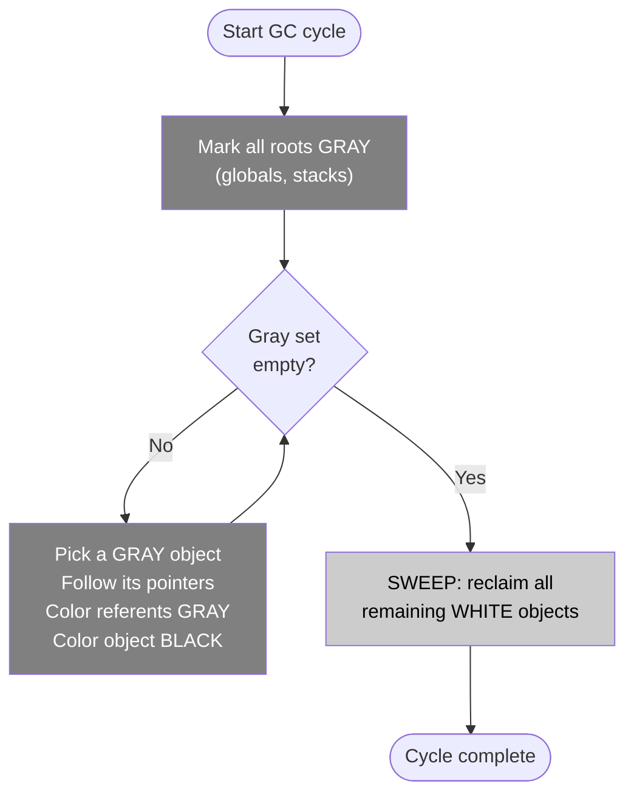

# GC Basics: Tri-Color Marking and STW Phases

Go is a garbage-collected language. You allocate memory — by creating structs, slices, maps, and interface values — and the runtime automatically reclaims memory that is no longer reachable. This frees you from manual memory management, but it is not free. Understanding what the GC actually does, when it runs, and what makes it run more often is essential for writing Go code that performs well at scale.

## Why a Garbage Collector

Without a GC, every heap allocation requires a corresponding free. Getting this wrong causes either memory leaks (forgot to free) or memory corruption (freed too early, freed twice). In a concurrent program with goroutines sharing data, manual memory management becomes a correctness nightmare. Go's GC removes this entire class of bugs.

The trade-off is that the GC consumes CPU cycles and introduces occasional latency. Modern Go GC is designed to minimize both, but the trade-off never disappears entirely.

## The Tri-Color Mark-and-Sweep Algorithm

Go's GC uses a **tri-color mark-and-sweep** algorithm. Every heap object is conceptually colored one of three colors:

- **White**: not yet visited. At the start of each GC cycle, all objects are white. At the end, any object still white is unreachable garbage.
- **Gray**: discovered (reachable from a root or from another object) but not fully scanned yet. Its outgoing pointers have not been followed.
- **Black**: fully scanned. All objects it points to have been added to the gray set. A black object is definitely alive.

The algorithm proceeds as follows:

1. **Mark roots gray.** Roots are globals, goroutine stack variables, and a few runtime-internal pointers. These are the initial set of definitely-live objects.
2. **Process the gray set.** Pick any gray object. Follow all of its pointer fields. For each referent that is white, color it gray. Then color the original object black.
3. **Repeat** until no gray objects remain.
4. **Sweep.** All remaining white objects are unreachable. The runtime reclaims their memory.



The invariant that makes this work is called the **tri-color invariant**: no black object may point directly to a white object. If this invariant holds throughout marking, then when the gray set is empty, all remaining white objects are truly unreachable. The write barrier (covered in the next article) enforces this invariant while the GC runs concurrently with your program.

## Concurrent GC: Running Alongside Your Program

Go's GC does not stop the world for the entire duration of marking. Most of the marking work happens **concurrently** — GC goroutines run on available CPUs while your goroutines (the "mutator") continue executing. This is what keeps Go's GC latency low even with large heaps.

Concurrency introduces a correctness problem: your program might modify pointers while the GC is tracing them. Go solves this with a write barrier — extra code the compiler inserts around pointer writes. The write barrier ensures that when your code moves a pointer from one location to another, the GC's invariant is maintained. (The write barrier is detailed in the next article.)

## Stop-the-World Phases

Even with a concurrent GC, there are two brief **stop-the-world (STW)** pauses per cycle where all goroutines are suspended:

**1. Mark setup (STW pause 1).** The runtime suspends all goroutines to enable write barriers and to scan the roots (goroutine stacks, globals). This pause is typically in the range of tens to hundreds of microseconds. After this, write barriers are active and marking proceeds concurrently.

**2. Mark termination (STW pause 2).** When the concurrent marking phase finishes, the runtime pauses again to finalize marking (handle any objects that were shaded after the concurrent phase concluded) and to disable write barriers. Then the sweep phase begins — and sweep is concurrent, running in the background as your program runs.

These two STW pauses are what you see as GC latency spikes in latency-sensitive applications. As of Go 1.21, typical STW durations are under 1 millisecond for most workloads and under 100 microseconds for workloads with modest heap sizes.

:::note
Go's GC is not generational as of Go 1.21. There are no young/old generations — no nursery, no tenured space. Every live object on the heap is scanned during every GC cycle. This design is simpler and avoids the complexity of generational write barriers, but it means long-lived objects contribute to GC cost on every cycle, unlike in JVM or .NET GCs where tenured objects are scanned infrequently.
:::

## GC Trigger and GOGC

The GC does not run on a fixed timer. It triggers based on heap growth. The default policy is: **run GC when the total heap size reaches twice the live heap size from the previous cycle**.

This is controlled by the `GOGC` environment variable (or `runtime/debug.SetGCPercent`). The default value is `100`, meaning "trigger when heap grows by 100% of the previous live size." Setting `GOGC=200` means "trigger at 200% growth" — the GC runs half as often, at the cost of using more memory. Setting `GOGC=50` makes the GC run more aggressively. `GOGC=off` disables the GC entirely (useful for benchmarks or short-lived batch jobs where you want zero GC overhead).

## GOMEMLIMIT

Go 1.19 introduced `GOMEMLIMIT` — a soft memory limit for the Go runtime. When total memory usage approaches the limit, the GC runs more aggressively to stay under it, even if the normal `GOGC` trigger has not been reached. This prevents OOM kills in memory-constrained environments.

Set it with `GOMEMLIMIT=512MiB` (or via `runtime/debug.SetMemoryLimit`). The unit suffixes are `B`, `KiB`, `MiB`, `GiB`, `TiB`.

:::tip
Setting `GOGC=200` or higher dramatically reduces GC frequency at the cost of higher peak memory usage. For batch jobs that process a fixed dataset and exit, this is almost always the right trade-off. For long-running services with stable heap sizes, `GOMEMLIMIT` is often more useful than tuning `GOGC`.
:::

## Observing GC with runtime.ReadMemStats

```go
package main

import (
	"fmt"
	"runtime"
)

func allocateJunk() {
	// Allocate a bunch of short-lived objects to create GC pressure
	for i := 0; i < 100000; i++ {
		_ = make([]byte, 1024)
	}
}

func printStats(label string, ms runtime.MemStats) {
	fmt.Printf("=== %s ===\n", label)
	fmt.Printf("  Alloc (live heap):   %d KB\n", ms.Alloc/1024)
	fmt.Printf("  TotalAlloc (cumul):  %d KB\n", ms.TotalAlloc/1024)
	fmt.Printf("  NumGC:               %d\n", ms.NumGC)
	fmt.Printf("  PauseTotalNs:        %d ns\n", ms.PauseTotalNs)
}

func main() {
	var ms runtime.MemStats

	runtime.ReadMemStats(&ms)
	printStats("Before allocations", ms)

	allocateJunk()

	// Force a GC cycle so we can see the stats after collection
	// highlight-next-line
	runtime.GC()

	runtime.ReadMemStats(&ms)
	printStats("After GC", ms)
}
```
<codapi-snippet sandbox="go" editor="basic"></codapi-snippet>

`runtime.ReadMemStats` is a useful diagnostic tool. Note that calling it during a GC cycle briefly stops the world to ensure a consistent snapshot — do not call it in tight loops in production. For production monitoring, use the `runtime/metrics` package (Go 1.16+) which is lower overhead and more structured.

## What Drives GC Pressure

GC pressure is a term for how much work the GC has to do per unit of time. Higher pressure means more CPU used by the GC, more frequent cycles, and potentially more STW latency.

The main drivers are:

**Allocation rate.** The more heap memory your program allocates per second, the faster the heap grows, and the sooner the GC triggers. Short-lived allocations are the worst case: they constantly push the heap size up but leave little live data, forcing frequent cycles.

**Live heap size.** A larger live heap means more objects to scan during marking. Even if your allocation rate is low, a large working set increases the per-cycle cost.

**Pointer density.** Objects with many pointer fields require the GC to follow more edges during marking. A flat `[]int64` is much cheaper to scan than a `[]interface{}` or a linked list.

## Reducing GC Pressure

The most effective strategies are:

- **Reduce allocations in hot paths.** Use escape analysis (`go build -gcflags="-m"`) to find what is escaping to the heap unnecessarily.
- **Use `sync.Pool`** to reuse short-lived objects across GC cycles. The pool is cleared on each GC cycle, so it does not inflate live heap size.
- **Prefer value types over pointer types.** A `[]Point` where `Point` is a struct is one heap object with no interior pointers. A `[]*Point` is n+1 heap objects with n pointer edges.
- **Use flat data structures.** Arrays, slices of structs, and hash maps with value types are all GC-friendlier than trees, linked lists, and maps of pointers.

## Key Takeaways

- Go's GC uses tri-color mark-and-sweep. All objects start white; reachable ones are turned gray then black; remaining white objects are swept as garbage.
- Most marking is concurrent. Two brief STW pauses (mark setup and mark termination) bracket each cycle. Sweep is fully concurrent.
- GC triggers when the heap grows to `GOGC%` above the previous live heap size. Default `GOGC=100` means trigger at 2x live heap.
- `GOMEMLIMIT` (Go 1.19+) provides a soft memory ceiling that makes the GC run more aggressively near the limit.
- GC pressure is driven by allocation rate, live heap size, and pointer density. Reduce all three to reduce GC cost.
- Go's GC is not generational — every live object is scanned every cycle. Long-lived objects contribute to GC cost indefinitely.
