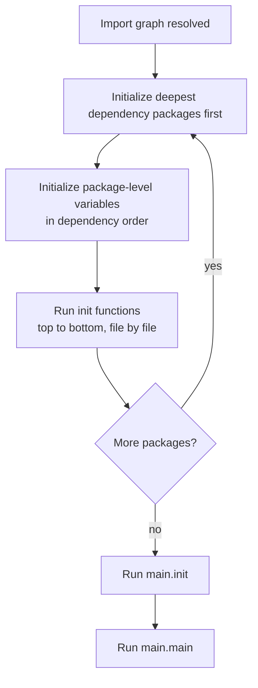

# init() Order and Package Init Traps

Every Go program has an initialization phase that happens before `main()` is called. This phase initializes packages in dependency order, sets up package-level variables, and runs `init()` functions. The rules are well-defined but easy to misread, and the traps they create — hard-to-test globals, panics that fire before your logger is ready, order dependencies between packages — are common sources of subtle bugs.

## What init() Is

`init()` is a special function with no parameters and no return value. A package can have any number of `init()` functions — even multiple in the same file — and they all run. You cannot call `init()` yourself; the runtime calls it automatically when the package is first imported.

```go
package main

import "fmt"

func init() {
// highlight-next-line
    fmt.Println("init() called")
}

func main() {
    fmt.Println("main() called")
}
```
<codapi-snippet sandbox="go" editor="basic"></codapi-snippet>

The output is always:

```
init() called
main() called
```

`init()` fires before `main()`, every time, without exception.

## Execution Order: The Full Rules

Go's initialization proceeds in five steps, applied recursively:

1. **All imported packages are initialized first.** If package `main` imports package `A`, and package `A` imports package `B`, then `B` is initialized first, then `A`, then `main`. Each package is initialized exactly once regardless of how many packages import it.

2. **Package-level variables are initialized in dependency order.** The compiler performs a dependency analysis. If `var b = a + 1` and `var a = computeA()`, then `a` is initialized before `b` because `b` depends on `a`. Variables with no dependencies are initialized in declaration order.

3. **init() functions run after all package-level variables are initialized.** This means `init()` can safely use package-level variables.

4. **If a package has multiple files, files are processed in lexical (alphabetical) filename order.** `a.go` before `b.go` before `config.go`. Package-level variables and init() functions from earlier files are processed before later files.

5. **Multiple init() functions in the same file run top to bottom.**



## Demonstrating Multiple init() Functions

```go
package main

import "fmt"

var message = initMessage()

func initMessage() string {
    fmt.Println("package-level var initialized")
    return "hello"
}

func init() {
// highlight-next-line
    fmt.Println("init() #1 — message is:", message)
}

func init() {
    fmt.Println("init() #2 — second init in same file")
}

func main() {
    fmt.Println("main() — message is:", message)
}
```
<codapi-snippet sandbox="go" editor="basic"></codapi-snippet>

Output:

```
package-level var initialized
init() #1 — message is: hello
init() #2 — second init in same file
main() — message is: hello
```

The package-level variable initializer runs first, then both `init()` functions in declaration order, then `main()`.

## The `_` Import: Side Effects Only

Sometimes you need a package's `init()` to run — to register a database driver, set up a codec, or configure a global — but you don't use any of its exported names. The blank import handles this:

```go
import _ "github.com/lib/pq" // runs pq's init(), registering the postgres driver
```

No symbols from `pq` are imported; only its `init()` side effects take effect. This is standard practice for `database/sql` drivers, `image` format decoders, and similar registry-based patterns.

## The Import Graph Guarantee

Go guarantees each package is initialized exactly once, even when multiple packages import it. If `A`, `B`, and `C` all import `util`, the `util` package's `init()` runs once — before any of `A`, `B`, `C`. The compiler detects circular imports and rejects them at compile time, so circular `init()` dependencies are impossible by construction.

## Package-Level Variable Initialization Order

The compiler analyzes dependencies between package-level variables to determine initialization order:

```go
var (
    a = 1
    b = a + 1  // b depends on a — initialized after a
    c = b * 2  // c depends on b — initialized after b
)
```

If there is a dependency cycle in variable initializers — `var a = b; var b = a` — the compiler rejects it. Functions called by variable initializers are opaque to the analysis; if `var x = f()` and `f` internally reads `y`, the compiler assumes `f` doesn't depend on `y` for ordering purposes.

## Traps and Anti-Patterns

### 1. Complex Logic in init()

`init()` is difficult to test. You can't call it directly, you can't pass parameters to it, and you can't get a return value out of it. Complex setup logic buried in `init()` is invisible to unit tests unless the package is imported.

Prefer explicit initialization in `main()` or in a function that callers invoke:

```go
// prefer this
func main() {
    db, err := database.Open(config.DSN)
    if err != nil {
        log.Fatalf("failed to open database: %v", err)
    }
    // ...
}

// over this
func init() {
    var err error
    db, err = database.Open(config.DSN)
    if err != nil {
        panic(err) // hard to test, hard to handle gracefully
    }
}
```

### 2. init() That Can Fail

`init()` cannot return an error. If initialization fails, the only options are `panic()` or `log.Fatal()` — both terminate the program immediately. There is no graceful error handling path. For anything that might fail in non-trivial environments (database connections, file reads, network calls), initialization belongs in `main()` where you can return an error to the caller or log a structured message before exiting.

:::warning
Avoid complex logic in `init()`. It runs before `main()` and before your structured logger, metrics systems, or error reporters are set up. A panic in `init()` is a raw crash with no context. Move fallible initialization to `main()` where you control the error handling.
:::

### 3. Global State That's Hard to Reset in Tests

Variables mutated in `init()` become global state. Tests that import the package inherit that state, and tests run in the same process share it. If `init()` opens a database connection and stores it in a global, every test that imports the package gets that connection — and resetting it between tests requires careful setup/teardown.

### 4. Order Dependency Between Packages

If your `init()` in package `A` assumes that package `B`'s `init()` has already run, you are relying on import order. If someone reorganizes imports, the assumption breaks. Dependencies between `init()` functions across packages should be explicit — use function calls, not shared global state initialized in `init()`.

### 5. Circular Imports (Compile Error)

If package `A` imports package `B` and package `B` imports package `A`, Go will not compile. There is no `init()` ordering question — the code simply won't build.

## Use sync.Once for Optional Lazy Initialization

When initialization is optional or expensive, `sync.Once` is more flexible than `init()`. It defers the work until it's actually needed, avoids the global-state trap, and integrates with error handling:

```go
package main

import (
    "fmt"
    "sync"
)

var (
    once     sync.Once
    resource string
)

func getResource() string {
    once.Do(func() {
        // expensive or fallible setup
        resource = "initialized resource"
        fmt.Println("resource initialized (once)")
    })
    return resource
}

func main() {
    fmt.Println(getResource())
    fmt.Println(getResource()) // once.Do is a no-op the second time
    fmt.Println(getResource())
}
```
<codapi-snippet sandbox="go" editor="basic"></codapi-snippet>

:::tip
Use `sync.Once` for lazy initialization instead of `init()` for optional or expensive features. It delays cost until first use, integrates with testing (you can reset the `Once` in tests), and keeps the initialization logic close to where it's consumed.
:::

## Key Takeaways

- `init()` functions run automatically before `main()`, in the order: imported packages → package-level variables → `init()` functions.
- Multiple `init()` functions are allowed in one file and one package; they all run.
- Files within a package are processed in alphabetical filename order.
- Each package is initialized exactly once, regardless of how many packages import it.
- `import _ "pkg"` runs a package's `init()` for its side effects without importing any symbols.
- `init()` cannot return an error; failures must `panic` or `os.Exit`, making complex logic in `init()` dangerous.
- Prefer explicit initialization in `main()` for fallible operations, and `sync.Once` for optional lazy initialization.
- Avoid shared mutable state set up in `init()` — it makes tests flaky and hard to reason about.
