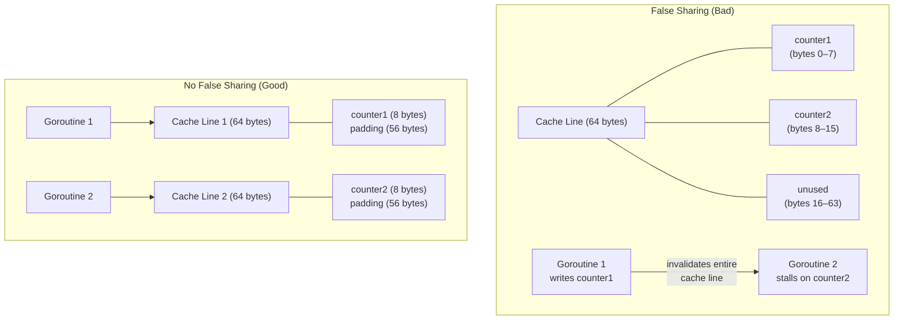

# Memory Alignment and False Sharing in Structs

Two of the most subtle performance pitfalls in Go involve struct layout: wasted space from padding between fields, and cache-line contention between goroutines writing to different fields of the same struct. Neither is obvious from reading the code, both show up as measurable slowdowns, and both are straightforward to fix once you know what to look for.

## Alignment Basics

Modern CPUs do not read arbitrary bytes from memory — they operate on aligned addresses. An `int64` must sit at an address that is a multiple of 8. An `int32` at a multiple of 4. A `bool` at any address (it is 1 byte and has alignment 1).

The alignment requirement for a type is the minimum multiple of that type's size at which it can be placed. For scalars, alignment equals size (up to pointer size, which is 8 bytes on 64-bit platforms). The rules in Go:

| Type | Size | Alignment |
|------|------|-----------|
| `bool`, `int8`, `uint8`, `byte` | 1 | 1 |
| `int16`, `uint16` | 2 | 2 |
| `int32`, `uint32`, `float32` | 4 | 4 |
| `int64`, `uint64`, `float64`, `complex64` | 8 | 8 |
| `int`, `uint`, `uintptr` | 8 (64-bit) | 8 (64-bit) |
| pointers, slices, maps, interfaces | 8 (64-bit) | 8 (64-bit) |

When the compiler lays out a struct, it inserts **padding bytes** between fields to satisfy each field's alignment requirement, and it pads the end of the struct to a multiple of the largest alignment in the struct (so that arrays of the struct work correctly).

## How Field Order Affects Size

The padding inserted depends entirely on the order in which you declare fields. Consider a struct with a `bool`, an `int64`, and another `bool`:

```
{ bool, int64, bool }

Offset 0: bool      (1 byte)
Offset 1–7: padding (7 bytes, to align int64 to offset 8)
Offset 8: int64     (8 bytes)
Offset 16: bool     (1 byte)
Offset 17–23: padding (7 bytes, to align total to multiple of 8)

Total: 24 bytes
```

Reorder to put the largest field first:

```
{ int64, bool, bool }

Offset 0: int64     (8 bytes)
Offset 8: bool      (1 byte)
Offset 9: bool      (1 byte)
Offset 10–15: padding (6 bytes, to align total to multiple of 8)

Total: 16 bytes
```

The same three fields take 24 or 16 bytes depending on their order. For a struct used in a large slice or as a map value, this is a 33% difference in memory usage — and in cache efficiency.

## Inspecting Layout with unsafe

You do not need to do the arithmetic manually. The `unsafe` package provides three intrinsics that work at compile time:

```go
package main

import (
	"fmt"
	"unsafe"
)

type BadOrder struct {
	a bool
	b int64
	c bool
}

type GoodOrder struct {
	b int64
	a bool
	c bool
}

func main() {
	var bad BadOrder
	var good GoodOrder

	fmt.Printf("BadOrder:  size=%d, align=%d\n",
		unsafe.Sizeof(bad), unsafe.Alignof(bad))
	fmt.Printf("  a: offset=%d, size=%d\n",
		unsafe.Offsetof(bad.a), unsafe.Sizeof(bad.a))
	fmt.Printf("  b: offset=%d, size=%d\n",
		unsafe.Offsetof(bad.b), unsafe.Sizeof(bad.b))
	fmt.Printf("  c: offset=%d, size=%d\n",
		unsafe.Offsetof(bad.c), unsafe.Sizeof(bad.c))

	fmt.Printf("\nGoodOrder: size=%d, align=%d\n",
		unsafe.Sizeof(good), unsafe.Alignof(good))
	fmt.Printf("  b: offset=%d, size=%d\n",
		unsafe.Offsetof(good.b), unsafe.Sizeof(good.b))
	fmt.Printf("  a: offset=%d, size=%d\n",
		unsafe.Offsetof(good.a), unsafe.Sizeof(good.a))
	fmt.Printf("  c: offset=%d, size=%d\n",
		unsafe.Offsetof(good.c), unsafe.Sizeof(good.c))
}
```
<codapi-snippet sandbox="go" editor="basic"></codapi-snippet>

`unsafe.Sizeof`, `unsafe.Alignof`, and `unsafe.Offsetof` are compiler intrinsics — they are evaluated at compile time and produce zero-cost constants. Using them in production code to assert layout assumptions is perfectly safe and has no runtime overhead.

The rule for minimizing padding: **order fields from largest alignment to smallest.** In practice: pointer-sized fields first, then `int32`/`float32`, then `int16`, then `bool`/`byte`. When fields have the same alignment, order does not matter for size (though it may matter for cache access patterns).

## False Sharing: The Invisible Bottleneck

Struct layout interacts with CPU cache architecture in a way that can cause dramatic performance degradation in concurrent code even when goroutines are writing to completely different fields.

A CPU cache line is the unit of transfer between cache and memory — typically 64 bytes on x86 and ARM. When a CPU core writes to any byte within a cache line, that entire 64-byte line is marked dirty in that core's cache. If another core reads or writes any byte in the same cache line, the hardware cache coherence protocol forces a synchronization: the dirty line must be flushed and re-fetched. This is **false sharing** — two goroutines that share a cache line without sharing any data, yet cause each other to stall.



The fix is to pad each hot field so it occupies its own cache line:

```go
package main

import (
	"fmt"
	"sync"
	"sync/atomic"
)

// Bad: both counters likely share a cache line
type Counters struct {
	a int64
	b int64
}

// Good: each counter on its own 64-byte cache line
type PaddedCounters struct {
	// highlight-next-line
	a int64
	_ [56]byte // pad to 64 bytes total
	// highlight-next-line
	b int64
	_ [56]byte
}

func runBenchmark(label string, inc func()) {
	var wg sync.WaitGroup
	wg.Add(2)
	go func() { defer wg.Done(); for i := 0; i < 10000000; i++ { inc() } }()
	go func() { defer wg.Done(); for i := 0; i < 10000000; i++ { inc() } }()
	wg.Wait()
	fmt.Println(label, "done")
}

func main() {
	var c Counters
	var p PaddedCounters

	runBenchmark("unpadded", func() {
		atomic.AddInt64(&c.a, 1)
	})
	runBenchmark("padded", func() {
		atomic.AddInt64(&p.a, 1)
	})

	fmt.Println("a:", atomic.LoadInt64(&c.a), atomic.LoadInt64(&p.a))
}
```
<codapi-snippet sandbox="go" editor="basic"></codapi-snippet>

The blank identifier field `_ [56]byte` consumes space without being named or addressable. The 56 comes from 64 (cache line size) minus 8 (size of `int64`). This ensures `b` starts at a cache-line boundary.

:::warning
False sharing is notoriously hard to diagnose from Go-level profiling alone. It appears as high CPU utilization with unexpectedly low throughput. Linux `perf stat` with cache miss counters (`cache-misses`, `LLC-load-misses`) or hardware performance counters in pprof can reveal it. If two goroutines are "doing nothing wrong" but their throughput halves when run concurrently versus sequentially, suspect false sharing.
:::

## 64-bit Atomics and Alignment on 32-bit Platforms

The `sync/atomic` package requires that 64-bit values (`int64`, `uint64`) be 8-byte aligned when using atomic operations. On 64-bit platforms, this is guaranteed for any variable declared at package level or as the first field of a struct (the allocator aligns all heap objects to at least 8 bytes).

On 32-bit platforms (or in structs where a `uint64` is not the first field), alignment is not guaranteed, and `atomic.AddUint64` will panic at runtime with "unaligned 64-bit atomic operation."

The fix: always place 64-bit atomic fields at the start of a struct, or use `//go:linkname` tricks to force alignment. The simplest and most portable rule:

```go
// Safe on all platforms: uint64 fields come first
type Stats struct {
	// highlight-next-line
	Hits   uint64 // must be first, or at offset that is multiple of 8
	Misses uint64
	Name   string
}
```

## Practical Field Ordering Rule

For production code, a practical ordering strategy for structs:

1. All pointer-sized fields (`*T`, `[]T`, `map`, `interface`, `func`, `string`, `int`, `uint`, `uintptr`) — 8 bytes each
2. `int64`, `uint64`, `float64`, `complex64` — 8 bytes each
3. `int32`, `uint32`, `float32` — 4 bytes each
4. `int16`, `uint16` — 2 bytes each
5. `bool`, `byte`, `int8`, `uint8` — 1 byte each

Within each group, order by semantic meaning (readability), not by size, since all fields in a group have the same alignment.

:::tip
For performance-critical concurrent data structures where two goroutines write to different fields of the same struct, add explicit padding to place each hot field on its own 64-byte cache line. The memory cost is negligible (a few dozen bytes per instance), and the throughput gain can be substantial — often 2–10x on highly contended counters.
:::

## Key Takeaways

- Every Go type has an alignment requirement. The compiler inserts padding between struct fields to satisfy these requirements.
- Struct size depends on field order. Ordering fields from largest to smallest alignment minimizes padding.
- Use `unsafe.Sizeof`, `unsafe.Alignof`, and `unsafe.Offsetof` to inspect struct layout at compile time without any runtime cost.
- A CPU cache line is 64 bytes. If two goroutines write to different fields within the same cache line, cache coherence traffic stalls both cores — this is false sharing.
- Fix false sharing by adding `_ [56]byte` padding after hot fields to ensure each occupies its own cache line.
- On 32-bit platforms, 64-bit atomic values must be 8-byte aligned. Place them at the start of the struct to guarantee this.
- False sharing is invisible in Go profiles but visible as high CPU / low throughput. Diagnose with hardware performance counters.
