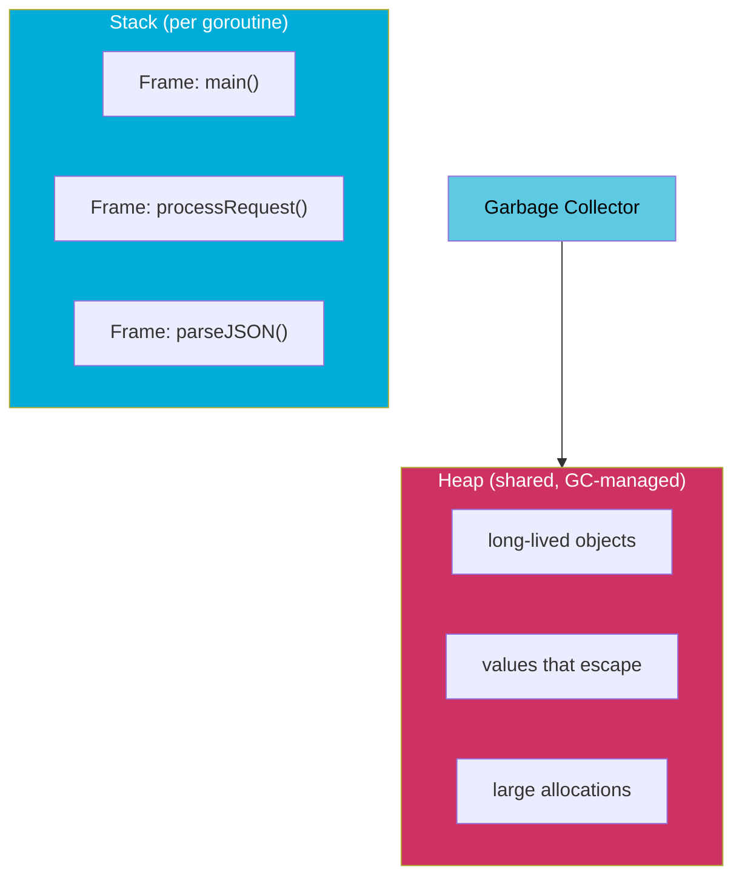
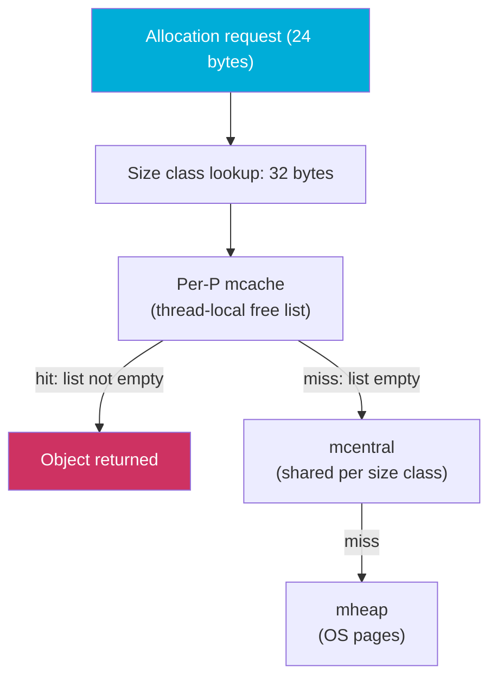

# Memory Management in Go: Stack, Heap, and the Allocator

Go manages memory automatically. You don't call `malloc` or `free`. But "automatic" doesn't mean invisible — the allocator, the stack, and the garbage collector each have distinct roles, and understanding them explains why some code allocates heavily and other code doesn't, why escape analysis matters, and how to reason about the performance characteristics of your programs.

## The Two Allocation Regions

Every Go value lives either on the **stack** or the **heap**:



| Property | Stack | Heap |
|---|---|---|
| Allocation cost | Near-zero (adjust stack pointer) | Higher (allocator, GC pressure) |
| Lifetime | Tied to the function's stack frame | Until GC collects it |
| Managed by | Runtime (deterministic) | Garbage collector |
| Initial size | 2–8 KB per goroutine | Limited by process memory |
| Growth | Automatic (copying stack) | Unlimited (until OOM) |

## Stack Allocation

Each goroutine starts with a small stack (2 KB in recent Go versions) that **grows and shrinks dynamically**. When a function call would overflow the current stack, the runtime allocates a larger stack, copies the old one, and updates all pointers. This happens transparently.

```go
package main

import (
	"fmt"
	"runtime"
)

func stackDepth(n int) int {
	if n == 0 {
		var s runtime.MemStats
		runtime.ReadMemStats(&s)
		return 0
	}
	return stackDepth(n-1) + 1
}

func main() {
	fmt.Println(stackDepth(10000)) // deeply recursive — stack grows automatically
}
```

<codapi-snippet sandbox="go" editor="basic">
</codapi-snippet>

Stack allocation is essentially free — it just moves the stack pointer. No locking, no GC involvement, no fragmentation. The goal of escape analysis is to keep as much as possible on the stack.

## Heap Allocation: The TCMalloc-Inspired Allocator

Go's heap allocator is inspired by Google's TCMalloc (Thread-Caching Malloc). The key insight is that most allocations are **small and short-lived**, so the allocator is optimized for those.

The allocator organizes memory into size classes (about 70 of them, from 8 bytes to 32 KB). Each size class has its own free list. Allocating a 24-byte object grabs from the "32-byte" size class — a fast list pop operation.



Three levels of caches:
- **`mcache`**: per-P (per-processor) cache — no locking required, very fast.
- **`mcentral`**: shared across Ps for each size class — requires a brief lock.
- **`mheap`**: the global heap that requests pages from the OS via `mmap`/`VirtualAlloc`.

Objects larger than 32 KB are allocated directly from `mheap`.

## What Triggers a Heap Allocation?

The compiler's **escape analysis** determines whether each value goes to the stack or heap at compile time. A value escapes to the heap when:

1. **Its address is returned**: `return &localVar` — the variable must outlive the stack frame.
2. **It is stored in a heap-allocated variable**: `slice = append(slice, &localVar)`.
3. **It is sent to a channel**: channel sends copy to the heap.
4. **It is captured by a closure that outlives the function**: the captured variable is promoted to the heap.
5. **Its size is unknown at compile time**: variable-length arrays, `interface{}` boxing.
6. **It is too large for the stack**: objects over a compiler-defined threshold.

```go
package main

import "fmt"

func escapes() *int {
	x := 42
	// highlight-next-line
	return &x // x escapes: must outlive escapes()'s stack frame
}

func noEscape() int {
	x := 42
	return x // x stays on the stack: value is copied, no escape
}

func main() {
	p := escapes()
	fmt.Println(*p)
	fmt.Println(noEscape())
}
```

<codapi-snippet sandbox="go" editor="basic">
</codapi-snippet>

Verify what escapes in your code:
```bash
go build -gcflags="-m" ./...
```

## Interface Boxing and Hidden Allocations

Assigning a concrete type to an interface causes a heap allocation when the value does not fit in a pointer:

```go
package main

import "fmt"

func printVal(v any) {
	fmt.Println(v)
}

func main() {
	x := 42
	// highlight-next-line
	printVal(x) // x is boxed into an interface{} — may allocate on heap

	y := "hello"
	printVal(y) // string header fits in interface — may or may not allocate
}
```

<codapi-snippet sandbox="go" editor="basic">
</codapi-snippet>

The Go compiler optimizes some interface boxing to avoid allocations (small integers, for example, are often stored inline), but in general, `any` / `interface{}` in hot paths deserves scrutiny.

## Reducing Allocations in Practice

import Tabs from '@theme/Tabs';
import TabItem from '@theme/TabItem';

<Tabs>
  <TabItem value="sync-pool" label="sync.Pool" default>

`sync.Pool` recycles heap objects between goroutines, reducing allocator pressure:

```go
var pool = sync.Pool{
    New: func() any { return make([]byte, 4096) },
}

func handler() {
    buf := pool.Get().([]byte)
    defer pool.Put(buf)
    // use buf — avoids per-request allocation
}
```

Pooled objects are cleared between GC cycles. See [sync.Pool](/concurrency/sync-pool) for details.

  </TabItem>
  <TabItem value="prealloc" label="Pre-allocate slices">

Append to a pre-sized slice rather than letting it grow:

```go
// Bad: multiple reallocations as the slice grows
var result []Item
for _, v := range input {
    result = append(result, transform(v))
}

// Good: one allocation of exact size
result := make([]Item, 0, len(input))
for _, v := range input {
    result = append(result, transform(v))
}
```

  </TabItem>
  <TabItem value="value-types" label="Avoid pointer indirection">

Use value types where possible:

```go
// More allocations: each Item is heap-allocated
items := make([]*Item, n)
for i := range items {
    items[i] = &Item{...}
}

// Fewer allocations: one allocation for the whole slice
items := make([]Item, n)
for i := range items {
    items[i] = Item{...}
}
```

  </TabItem>
</Tabs>

## Profiling Memory with pprof

The best way to understand your program's allocation patterns is profiling:

```go
import _ "net/http/pprof"

// Then:
// go tool pprof http://localhost:6060/debug/pprof/heap
// go tool pprof -alloc_objects http://localhost:6060/debug/pprof/heap
```

`-alloc_objects` shows total allocations (not just live ones), which reveals hot allocation sites. See [pprof Basics](/tooling/pprof-basics) for the full workflow.

:::tip
Run benchmarks with `-benchmem` to measure allocations per operation:
```bash
go test -bench=. -benchmem ./...
```
This reports `B/op` (bytes per operation) and `allocs/op` (allocations per operation) — the two numbers to minimize in hot code.
:::

## Key Takeaways

- Go allocates values on the **stack** (fast, no GC involvement) or **heap** (GC-managed) — the compiler decides via escape analysis.
- Stack allocation is near-free; heap allocation involves the allocator and adds GC pressure.
- Go's allocator is TCMalloc-inspired: per-P caches (`mcache`) make small allocations lock-free in the common case.
- A value escapes to the heap when it outlives its stack frame: returned by address, captured by a long-lived closure, stored in an interface, or sent through a channel.
- Interface boxing (`any`) can cause hidden heap allocations in hot paths.
- Reduce allocations by pre-allocating slices, using `sync.Pool` for reusable buffers, and preferring value types over pointer types in slices.
- Profile with `pprof` and `-benchmem` to find real allocation hot spots before optimizing.
