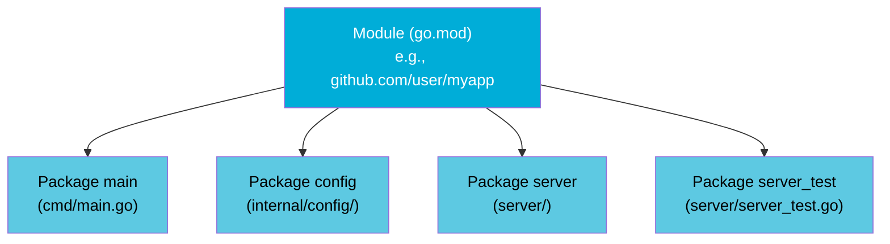
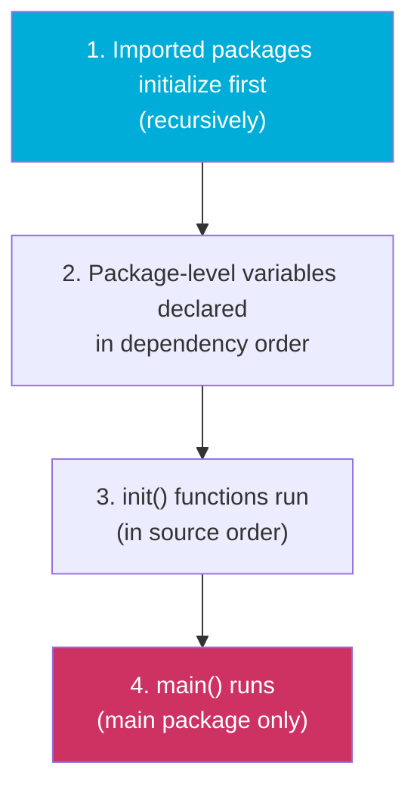

# Packages and the Go Module System

Every Go source file belongs to a package. Packages are the unit of code organization, compilation, and reuse in Go. Understanding how packages and modules relate — and how visibility, initialization, and imports work — is foundational to structuring any real Go program.

## Packages vs. Modules

These two concepts are distinct but related:



| Concept | Definition | Identified by |
|---|---|---|
| **Package** | A directory of `.go` files sharing a `package` declaration | Directory path |
| **Module** | A collection of packages with a single `go.mod` | Module path in `go.mod` |

A module declares its identity in `go.mod`:

```
module github.com/user/myapp

go 1.22
```

Every package inside the module is imported using the module path as a prefix: `github.com/user/myapp/server`, `github.com/user/myapp/internal/config`.

## Package Naming Rules

```go
// Every .go file in a directory must share the same package name
package config

// Exception: test files may use package config_test (external test package)
// package config_test
```

The package name (e.g., `config`) is what callers use to qualify identifiers: `config.Load()`. The import path is the directory path. These can differ — `package main` is the canonical example: the directory might be `cmd/server`, but the package is always `main`.

:::tip
Use short, lowercase, single-word package names. The name is a qualifier — callers write `http.Get`, not `httputils.GetHTTPRequest`. Avoid stutter: `config.Config` is redundant; just `config.Config` becomes acceptable only when the type name adds information beyond the package name.
:::

## Visibility: Exported vs. Unexported

Go uses capitalization as the visibility modifier. There are no `public`, `private`, or `protected` keywords.

```go
package geometry

// Exported — accessible from any package
type Point struct {
	X float64 // exported field
	Y float64 // exported field
}

// highlight-next-line
type circle struct { // unexported — only accessible within geometry package
	center Point
	radius float64 // unexported field
}

// Exported function
func NewCircle(center Point, radius float64) *circle {
	return &circle{center: center, radius: radius}
}

// Unexported function
func validate(r float64) bool {
	return r > 0
}
```

Unexported identifiers (types, functions, variables, fields) are visible only within the **same package** — all `.go` files in the same directory. External packages, including test files using `package geometry_test`, cannot access them.

## The internal Package

Go enforces an additional visibility rule for directories named `internal`:

```
myapp/
├── internal/
│   └── auth/          ← importable only by code in myapp/
│       └── token.go
├── server/
│   └── handler.go     ← CAN import myapp/internal/auth
└── cmd/
    └── main.go        ← CAN import myapp/internal/auth
```

Code in `myapp/internal/auth` can only be imported by packages rooted at `myapp/`. An external module trying to import `myapp/internal/auth` will get a compile error. This is enforced by the `go` tool, not just convention.

Use `internal` for implementation details you want to share across your module but not expose as a public API.

## init Functions

Every package can declare one or more `init` functions. They run automatically after all variable declarations in the package are initialized, and before `main()` in the `main` package.

```go
package database

import (
	"database/sql"
	"log"

	_ "github.com/lib/pq" // import for side effects — registers postgres driver
)

var db *sql.DB

// highlight-next-line
func init() {
	var err error
	db, err = sql.Open("postgres", "postgres://localhost/mydb?sslmode=disable")
	if err != nil {
		log.Fatalf("failed to open database: %v", err)
	}
}
```

Key rules about `init`:
- You cannot call `init` directly — it is only called by the runtime.
- A package can have multiple `init` functions (even in the same file); they run in the order they appear.
- `init` in imported packages runs before `init` in the importing package.
- The blank import `import _ "pkg"` runs the package's `init` (for side effects like driver registration) without making any exported names available.

See also [init order](/docs/internals/init-order) for the full package initialization sequence.

:::warning
Avoid complex logic in `init`. If initialization can fail, consider explicit `Setup()` functions that return errors — `init` can only call `log.Fatal` to abort, which makes testing harder and error reporting opaque.
:::

## Blank Imports and Side Effects

```go
import _ "net/http/pprof" // registers /debug/pprof HTTP handlers as a side effect
```

The blank identifier `_` discards the package name but still runs its `init` functions. This is the standard pattern for:
- Registering database drivers (`database/sql` drivers)
- Registering HTTP handlers (`net/http/pprof`)
- Registering codecs or plugins

## Package Initialization Order

Within a package, Go guarantees the following order:



Package-level variables are initialized in dependency order: if `var b = a + 1` depends on `var a = 2`, then `a` is initialized first regardless of declaration order.

## How the Linker Uses Packages

The `go` toolchain compiles each package into an object file. The linker then performs **dead code elimination**: if a package is imported but none of its exported symbols are reachable from `main`, the linker discards it. This is why Go binaries can be statically linked without excessive bloat — unused packages (and their dependencies) are stripped.

One practical consequence: importing a package purely for its type definitions (zero function calls) results in the package being compiled but potentially stripped by the linker. Blank imports for side effects bypass this because `init` is always considered reachable.

## Key Takeaways

- A **package** is a directory of `.go` files sharing a `package` name; a **module** is a collection of packages with a single `go.mod`.
- Capitalized identifiers are exported (public); lowercase identifiers are unexported (package-private).
- The `internal` directory enforces import restrictions: only packages within the parent of `internal` can import it.
- `init` functions run automatically before `main`, after all package-level variables are initialized. You cannot call `init` directly.
- Blank imports (`import _ "pkg"`) run a package's `init` for side effects without making its names available.
- The linker performs dead code elimination — only packages reachable from `main` are included in the binary.
