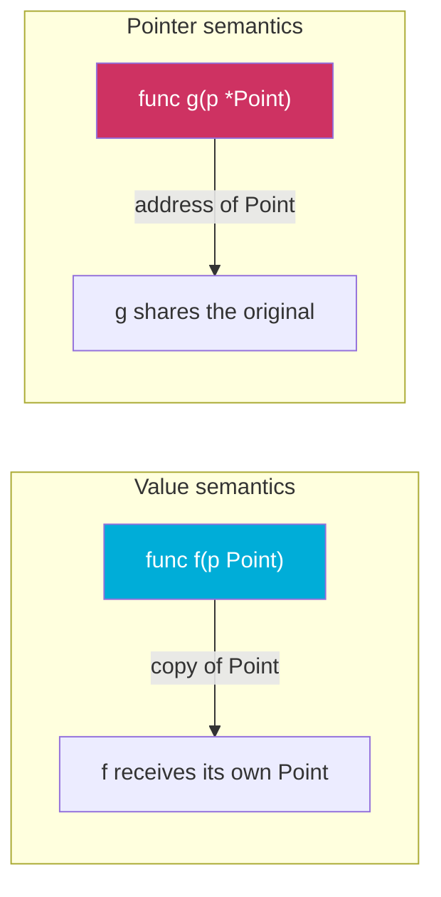

# Pointers in Go: Semantics, Safety, and Escape Analysis

A pointer holds the memory address of a value. Go has pointers, but not pointer arithmetic — you can't add integers to a pointer to walk memory. This deliberate restriction, combined with automatic garbage collection, makes Go pointers safe by default while retaining the expressiveness needed for efficient programs.

## Value vs. Pointer Semantics

Every value in Go can be passed in two ways:



**Value semantics**: a copy is made. The function receives its own version; mutations don't affect the caller's copy.

**Pointer semantics**: the address is passed. The function and caller share the same memory; mutations are visible to the caller.

```go
package main

import "fmt"

type Point struct{ X, Y float64 }

func moveByValue(p Point, dx, dy float64) {
	p.X += dx // modifies the copy
	p.Y += dy
}

func moveByPointer(p *Point, dx, dy float64) {
	// highlight-next-line
	p.X += dx // modifies the original through the pointer
	p.Y += dy
}

func main() {
	pt := Point{1, 2}

	moveByValue(pt, 10, 10)
	fmt.Println(pt) // {1 2} — unchanged

	moveByPointer(&pt, 10, 10)
	fmt.Println(pt) // {11 12} — changed
}
```

<codapi-snippet sandbox="go" editor="basic">
</codapi-snippet>

## Declaring and Using Pointers

```go
package main

import "fmt"

func main() {
	x := 42
	// highlight-next-line
	p := &x     // & takes the address of x; p is *int

	fmt.Println(*p) // * dereferences: reads the value at p's address → 42

	*p = 100        // write through the pointer
	fmt.Println(x)  // 100 — x was modified via p
}
```

<codapi-snippet sandbox="go" editor="basic">
</codapi-snippet>

The two pointer operators:
- `&v` — address-of: returns a pointer to `v` (`*T` for a value of type `T`)
- `*p` — dereference: reads or writes the value at the address `p` holds

## The new Built-in

`new(T)` allocates zeroed memory for type `T` and returns a pointer to it. It is equivalent to `var v T; return &v`:

```go
package main

import "fmt"

func main() {
	p := new(int)      // allocates a zeroed int, returns *int
	fmt.Println(*p)    // 0

	*p = 99
	fmt.Println(*p)    // 99

	// Equivalent:
	var v int
	q := &v
	fmt.Println(q == p) // false — different allocations, but same pattern
}
```

<codapi-snippet sandbox="go" editor="basic">
</codapi-snippet>

In practice, composite literals with `&` are more common than `new`: `&Point{X: 1, Y: 2}` instead of `p := new(Point); p.X = 1; p.Y = 2`.

## nil Pointers

The zero value of any pointer type is `nil` — it does not point to any valid memory. Dereferencing a nil pointer panics.

```go
package main

import "fmt"

type Node struct {
	Value int
	Next  *Node
}

func main() {
	var n *Node       // nil pointer
	fmt.Println(n)    // <nil>

	// Check before dereferencing
	if n != nil {
		fmt.Println(n.Value)
	}

	// This would panic:
	// fmt.Println(n.Value) // panic: nil pointer dereference
}
```

<codapi-snippet sandbox="go" editor="basic">
</codapi-snippet>

:::danger
Dereferencing a nil pointer always panics. Always check `p != nil` before dereferencing a pointer that could be nil. The Go runtime cannot protect you from this — the nil check is your responsibility.
:::

## Pointer to Struct: Field Access

When you have a pointer to a struct, Go automatically dereferences it for field access. You don't need to write `(*p).Field`:

```go
package main

import "fmt"

type Config struct {
	Host string
	Port int
}

func main() {
	cfg := &Config{Host: "localhost", Port: 8080}

	// Both are equivalent:
	fmt.Println((*cfg).Host) // explicit dereference
	// highlight-next-line
	fmt.Println(cfg.Host)    // automatic dereference — idiomatic Go
}
```

<codapi-snippet sandbox="go" editor="basic">
</codapi-snippet>

## When to Use Pointers

import Tabs from '@theme/Tabs';
import TabItem from '@theme/TabItem';

<Tabs>
  <TabItem value="use" label="Use a pointer when..." default>

- **The function needs to mutate the value**: methods that modify struct fields must have pointer receivers.
- **The value is large**: copying a large struct on every call wastes CPU and memory. A pointer is always one machine word.
- **Representing absence**: a `*T` can be `nil` to indicate "no value"; a `T` always has a zero value but can't express absence.
- **Sharing a value across goroutines**: when multiple goroutines need to observe mutations to the same object (protected by a mutex).

  </TabItem>
  <TabItem value="value" label="Use a value when...">

- **The type is small and immutable**: `int`, `bool`, `float64`, small structs — copying is cheap and avoids heap allocation.
- **You want defensive copies**: functions receive their own copy, preventing accidental mutation.
- **Concurrency without sharing**: value semantics make data-race analysis simpler — no shared pointer means no concurrent write.
- **Maps, slices, channels, functions**: these are already reference types internally — passing them by value passes the reference, not a deep copy.

  </TabItem>
</Tabs>

## Escape Analysis: Stack vs. Heap

Whether a pointer's target lives on the stack or heap is determined by the compiler's **escape analysis** at compile time — not at runtime.

```go
func stackAlloc() *int {
	x := 42
	// highlight-next-line
	return &x // x escapes to heap — it outlives the function call
}

func noEscape() int {
	x := 42
	return x + 1 // x stays on the stack — doesn't escape
}
```

When you return a pointer to a local variable, the compiler detects that the variable's lifetime exceeds the stack frame and allocates it on the heap instead. This is safe — the garbage collector tracks it. You can verify what escapes with:

```bash
go build -gcflags="-m" ./...
```

See [Escape Analysis](/docs/internals/escape-analysis) for a deep dive.

:::note
In Go, unlike C, returning a pointer to a local variable is always safe. The compiler ensures the value lives long enough. You never have dangling pointers in Go (assuming no `unsafe` usage).
:::

## No Pointer Arithmetic

Go deliberately has no pointer arithmetic. You cannot do `p + 1` to advance to the next element of an array. This eliminates a large class of memory safety bugs (buffer overflows, use-after-free). If you need direct memory manipulation, the `unsafe` package provides it, but that's outside normal Go code.

```go
// This is illegal in Go:
// p := &arr[0]
// p++ // compile error

// Use slice indexing instead:
arr := [5]int{1, 2, 3, 4, 5}
for i := range arr {
    fmt.Println(arr[i])
}
```

## Key Takeaways

- `&v` takes the address of `v`; `*p` dereferences a pointer `p`.
- Value semantics pass a copy; pointer semantics share the original — mutations through a pointer are visible to all holders of that pointer.
- The zero value of any pointer is `nil`; dereferencing `nil` panics.
- `new(T)` allocates a zeroed `T` and returns `*T` — equivalent to `var x T; return &x`.
- For struct pointers, Go auto-dereferences field access: `p.Field` instead of `(*p).Field`.
- Escape analysis decides stack vs. heap allocation — returning a pointer to a local is always safe in Go.
- Go has no pointer arithmetic, eliminating buffer overflows and dangling pointer bugs (without `unsafe`).
