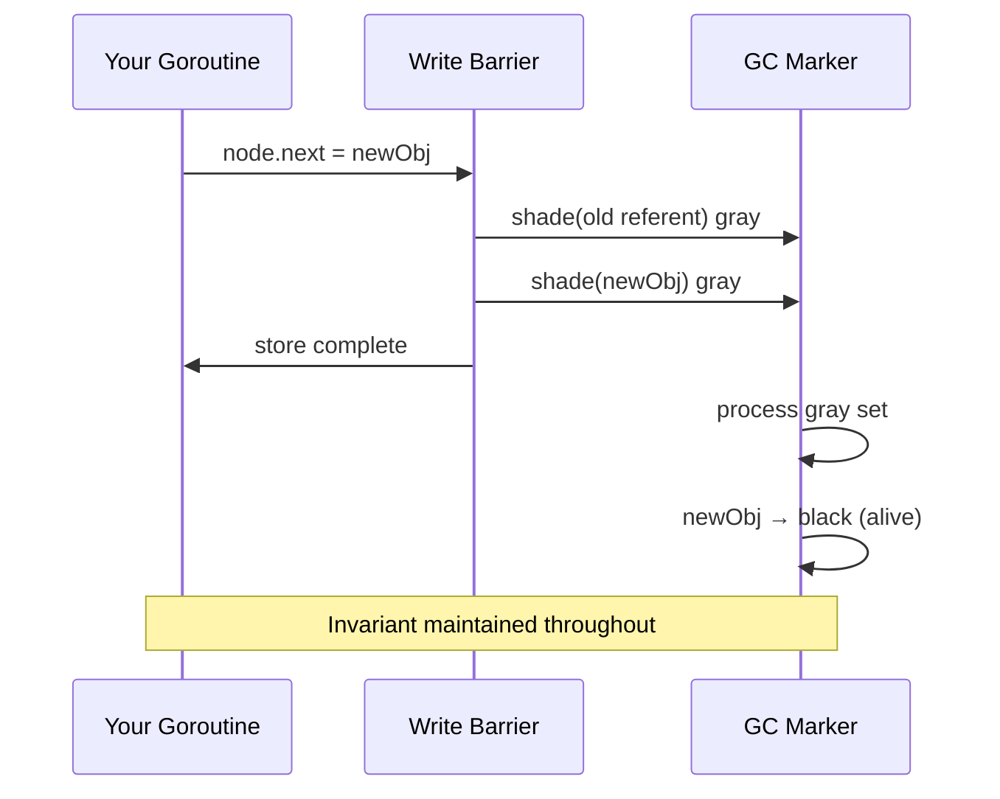

# Write Barrier: Why It Exists and Its Performance Impact

Go's garbage collector runs mostly concurrently with your program. This is the key reason Go applications can have sub-millisecond GC pause times even with gigabyte-scale heaps. But concurrency between the GC and your program creates a fundamental correctness problem: your program modifies pointers while the GC is tracing them. The **write barrier** is the mechanism that keeps these two activities from corrupting each other.

## The Problem: Concurrent Pointer Mutation

Recall from the GC basics article that the tri-color mark-and-sweep algorithm maintains a critical invariant: **no black object may point directly to a white object.** Black objects are fully scanned; the GC will not revisit them. White objects are presumed unreachable garbage. If a black object were to gain a pointer to a white object, that white object would be swept as garbage even though it is actually live — a use-after-free bug.

During concurrent marking, your goroutines keep running. They write to structs, update slice elements, swap interface values, and reassign map entries. Any of these operations can create a black-to-white pointer, violating the invariant. Consider this scenario:

1. GC marks object A black (fully scanned).
2. Your goroutine writes `A.child = B`, where B is a white object.
3. GC finishes marking. B is still white. GC sweeps B as garbage.
4. Your program accesses `A.child` — it now points to freed memory.

Without protection, this is a silent memory corruption bug. The write barrier prevents it.

## What the Write Barrier Does

The write barrier is **extra code inserted by the compiler around every pointer write that targets the heap.** When your Go code executes a statement like:

```go
node.next = other
```

the compiler emits not just the store instruction but also a call to the write barrier logic. The barrier is only active during the GC's marking phase; outside of that window, pointer writes are plain stores.

You never write write barrier code yourself. You never call any write barrier function. The compiler inserts all of it transparently based on the types involved. If you write to a `*T` field, the compiler knows it is a pointer and injects the barrier. If you write to an `int` field, no barrier is needed.

## Go's Hybrid Barrier

Go's current write barrier (adopted in Go 1.17) is called the **hybrid barrier**, combining ideas from two classical algorithms:

- **Dijkstra insertion barrier**: when a new pointer is written into a slot, shade the new referent gray if it is white.
- **Yuasa deletion barrier**: when an old pointer is overwritten, shade the old referent gray if it is white.

Go's hybrid barrier does both:

```
On pointer write (slot ← new):
    shade(old referent) gray  // Yuasa: preserve snapshot of what existed
    shade(new referent) gray  // Dijkstra: ensure new referent is not missed
    perform the actual store
```

By shading both the old and new referents, the barrier ensures that neither is overlooked by the GC. The old referent is shaded because some concurrent goroutine might hold the only reference to it and we have just destroyed our reference — if we do not shade it now, the GC might miss it. The new referent is shaded because we are introducing it to a black object which the GC will not revisit.



## When the Barrier Is Active

The write barrier is only enabled during the **mark phase** of a GC cycle — from mark setup (STW 1) through mark termination (STW 2). Outside of this window, every pointer write in your program is a plain memory store with no overhead whatsoever.

This matters for understanding profiling data. If you profile your application during a period with frequent GC cycles, you will see write barrier overhead in your profiles. If GC is infrequent (e.g., you have set `GOGC=off` for a benchmark), write barriers are never active and their cost is zero.

## The Performance Cost

The write barrier adds overhead to pointer writes in two ways:

**Extra instructions.** Each pointer write that the compiler believes could target the heap requires additional instructions to shade the old and new referents. In the best case this is a handful of register operations and a conditional branch.

**Potential function call.** When the barrier logic determines that shading is actually necessary (the referent is white and GC is active), it calls into the runtime. This is a more expensive operation: a function call, cache pressure, potential interaction with the GC's work queues.

In practice, the overhead depends heavily on how pointer-intensive your code is:

- **Scalar-heavy code** (math, numeric processing, value types): write barrier overhead is negligible. There are few pointer writes.
- **Pointer-heavy code** (linked lists, trees, maps with pointer values, heavily interface-typed APIs): during GC cycles, you can measure 5–10% throughput reduction.
- **Code that rewrites many pointers in a hot loop** (e.g., moving nodes in a tree, updating a large slice of pointers): this is the worst case and can show higher overhead.

:::note
You never write write barrier code yourself — the compiler inserts it automatically for all pointer writes that target the heap. But understanding it helps explain why pointer-heavy code can be measurably slower during GC cycles than during GC-free periods.
:::

## Goroutine Stacks Are Different

The write barrier applies only to **heap writes**. Writes to goroutine stack variables do not need a barrier. This is because goroutine stacks are scanned during the STW mark setup phase: when the GC pauses to initialize, it scans all goroutine stacks and marks anything they reference. After that initial scan, any new stack writes are safe because the GC will re-scan stacks during mark termination.

This is also why escape analysis matters for GC performance: variables that stay on the stack avoid both heap allocation cost and write barrier cost when they are written to.

## Unsafe.Pointer and the Barrier

Code using `unsafe.Pointer` can bypass the write barrier if the programmer is not careful. The Go runtime's own implementation uses `unsafe.Pointer` manipulations that are specifically audited to be GC-safe, using `//go:noescape`, `//go:nosplit`, and explicit barrier calls from the runtime package.

For application code, never use `unsafe.Pointer` to write pointers to heap objects in a way that bypasses the type system. The compiler cannot insert barriers for writes it cannot see. Doing this during a GC cycle will cause memory corruption that manifests as cryptic panics or silent data corruption, typically far from the actual bug.

## How to Reduce Write Barrier Cost

If GC overhead is significant in your profiles, reducing write barrier cost is about reducing pointer writes in hot paths:

**Use value types instead of pointer types.** A `[]Point` (slice of struct values) has no pointer fields inside each element. A `[]*Point` has a pointer per element, generating a write barrier on every element assignment. For large slices that are frequently updated, this difference is measurable.

**Use flat arrays instead of pointer-linked structures.** A linked list with n nodes has n pointer fields that each generate a barrier when updated. An equivalent slice-backed list has no interior pointers — only the slice header itself has a pointer.

**Batch pointer writes.** Instead of updating individual pointer fields one by one in a tight loop, batch the work to amortize the barrier overhead. This also improves cache locality.

**Reduce the GC marking window.** Fewer, shorter GC cycles means the barrier is active for less total time. Reducing allocation rate (via escape analysis, sync.Pool, and value types) reduces GC frequency and thus the cumulative write barrier cost.

:::tip
If GC overhead is visible in CPU profiles, look at pointer density in your hot data structures. Replacing arrays of pointers with arrays of values, or linked lists with slice-backed structures, reduces write barrier invocations and improves cache locality simultaneously — two wins from one change.
:::

## Key Takeaways

- Go's GC runs concurrently with your program, creating the risk that pointer mutations violate the tri-color invariant and cause live objects to be swept as garbage.
- The write barrier is code the compiler automatically inserts around heap pointer writes to shade old and new referents gray, preserving the invariant.
- Go's hybrid barrier (since Go 1.17) combines Dijkstra insertion shading and Yuasa deletion shading for correctness with minimal STW requirements.
- The barrier is only active during the GC mark phase. Outside of GC, pointer writes are plain stores with no overhead.
- Pointer-heavy code (linked lists, trees, interface-typed values, maps of pointers) sees measurable overhead — typically 5–10% throughput reduction during GC cycles.
- Reduce write barrier cost by preferring value types, flat data structures, and reducing the overall GC marking window by lowering allocation rate.
- Never bypass the write barrier with `unsafe.Pointer` in application code. The consequences are silent memory corruption.
