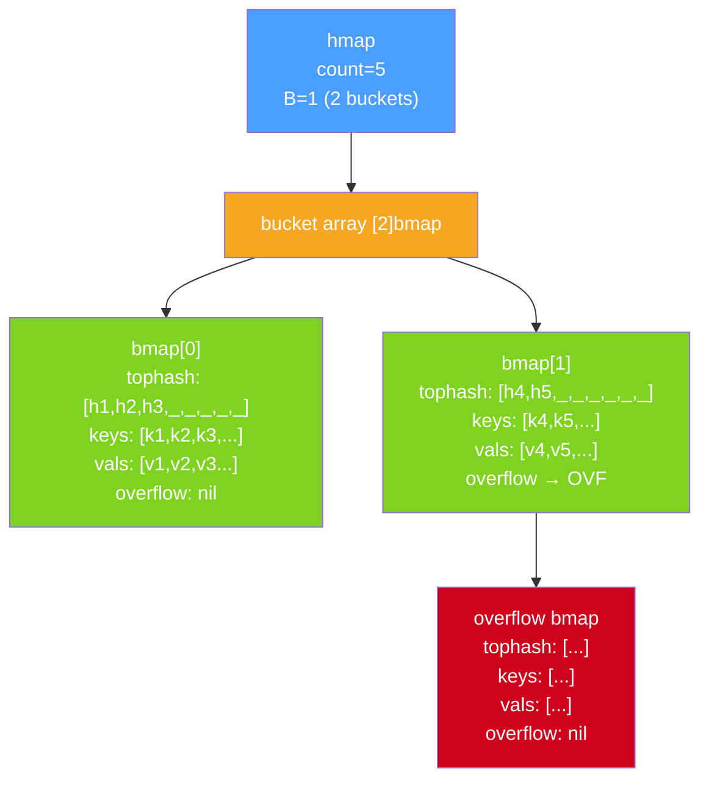

# Map Internals: Hashing, Buckets, Growth, and Random Iteration

Go maps look simple on the surface — a built-in key-value store with O(1) amortized access. Under the hood they are a sophisticated hash table implementation with carefully tuned bucket structures, an incremental growth strategy, and intentionally randomized iteration. Understanding the internals helps you write code that avoids common pitfalls and performs well at scale.

## The hmap Structure

Every Go map is represented at runtime as a pointer to an `hmap` struct (defined in `runtime/map.go`). The fields that matter most for understanding behavior:

| Field | Type | Purpose |
|---|---|---|
| `count` | `int` | Number of key-value pairs currently in the map |
| `B` | `uint8` | log₂ of the number of buckets (so there are 2^B buckets) |
| `buckets` | pointer | Points to the array of `bmap` (bucket) structs |
| `oldbuckets` | pointer | Non-nil during incremental rehashing; points to old bucket array |
| `nevacuate` | `uintptr` | Progress counter for incremental evacuation |
| `flags` | `uint8` | Bit flags including the concurrency-write detector |

When you write `m := make(map[string]int)`, the runtime allocates an `hmap` and an initial bucket array. The map variable `m` is simply a pointer to this `hmap` — passing a map to a function passes the pointer, not a copy of the data.

## The Bucket Structure (bmap)

The fundamental storage unit is a **bucket** (`bmap`). Each bucket holds up to **8 key-value pairs**. The layout inside a bucket is:

```
tophash [8]uint8   // top 8 bits of the hash for each of the 8 slots
keys    [8]K       // the 8 keys, stored contiguously
values  [8]V       // the 8 values, stored contiguously
overflow *bmap     // pointer to overflow bucket (or nil)
```

Keys and values are stored in separate contiguous arrays (not as interleaved key-value pairs) for better cache utilization. When the key and value types are small, the CPU can scan 8 keys in a cache line without touching any values.



## The Lookup Algorithm

When you access `m[key]`, the runtime:

1. **Hashes the key** using a hash function seeded with a per-map random seed (chosen at map creation). The seed prevents hash-flooding attacks.
2. **Uses the bottom B bits** of the hash to compute the bucket index (0 to 2^B - 1).
3. **Scans the `tophash` array** of that bucket using the top 8 bits of the hash. If none of the 8 tophash entries match, the key definitely isn't in that slot — no need to compare full keys. This is a fast rejection step.
4. For any tophash match, **compares the full key** to confirm equality.
5. If not found in the primary bucket, follows the **overflow pointer** chain.

The tophash fast-rejection step means most lookups avoid expensive full-key comparisons. For a map that isn't overloaded, a lookup typically touches only one bucket.

## Basic Map Operations

```go
package main

import "fmt"

func main() {
	// Create with make, specifying initial capacity hint
// highlight-next-line
	m := make(map[string]int, 10) // hint: expect ~10 entries

	// Write
	m["alpha"] = 1
	m["beta"] = 2
	m["gamma"] = 3

	// Read with existence check
	val, ok := m["beta"]
	fmt.Printf("beta: %d, exists: %v\n", val, ok)

	val, ok = m["delta"]
	fmt.Printf("delta: %d, exists: %v\n", val, ok) // 0, false

	// Delete
	delete(m, "gamma")
	fmt.Println("after delete, len:", len(m))

	// Iterate
	for k, v := range m {
		fmt.Printf("  %s -> %d\n", k, v)
	}
}
```
<codapi-snippet sandbox="go" editor="basic"></codapi-snippet>

## Growth: Incremental Rehashing

Go maps grow when one of two conditions is met:

- **Load factor exceeded**: average keys per bucket exceeds **6.5**. At this threshold, the runtime doubles the number of buckets (B increments by 1, so 2^B doubles).
- **Too many overflow buckets**: if there are many overflow chains even at a low load factor (caused by many deletions leaving holes), the runtime triggers a "same-size rehash" to consolidate.

Crucially, map growth is **incremental**. When growth is triggered, the runtime allocates the new bucket array and sets `oldbuckets`. It does NOT immediately move all entries. Instead, each time a map operation touches a bucket that hasn't been evacuated yet, the runtime evacuates that bucket (moves its entries to the new array) as a side effect. This spreads the rehashing cost across many operations rather than causing one large pause.

During incremental growth, lookups check both the new bucket array and `oldbuckets` (if the relevant old bucket hasn't been evacuated yet).

## Random Iteration Order

Go **intentionally randomizes map iteration order**. Every time you use `for k, v := range m`, the iteration starts at a randomly chosen bucket, and even the starting offset within that bucket is random. Two iterations over the same map with no modifications between them will typically produce different orderings.

```go
package main

import (
	"fmt"
	"sort"
)

func main() {
	m := map[string]int{
		"apple":  1,
		"banana": 2,
		"cherry": 3,
		"date":   4,
		"elderberry": 5,
	}

	fmt.Println("First iteration:")
	for k, v := range m {
		fmt.Printf("  %s=%d\n", k, v)
	}

	fmt.Println("Second iteration (different order):")
	for k, v := range m {
		fmt.Printf("  %s=%d\n", k, v)
	}

	// If you need deterministic order, collect keys and sort them
// highlight-next-line
	keys := make([]string, 0, len(m))
	for k := range m {
		keys = append(keys, k)
	}
	sort.Strings(keys)
	fmt.Println("Sorted iteration:")
	for _, k := range keys {
		fmt.Printf("  %s=%d\n", k, m[k])
	}
}
```
<codapi-snippet sandbox="go" editor="basic"></codapi-snippet>

This randomization is deliberate. Before Go 1, map iteration happened to be somewhat consistent (though never guaranteed). Programs began relying on this — an unwritten contract with the implementation. Go 1 broke this by actively randomizing iteration to force correctness: if your code requires a specific order, you must sort explicitly. **Go maps do not preserve insertion order** (unlike Python 3.7+ `dict`).

The randomization also has a security dimension: a predictable hash traversal order could assist attackers in crafting inputs that degrade hash table performance.

:::note
Maps are NOT safe for concurrent use. A concurrent read and write, or two concurrent writes, will be detected by the Go runtime and cause a fatal (unrecoverable) crash. See the [Map Concurrency](./map-concurrency) article for the full explanation and solutions.
:::

## Overflow Buckets and Performance Degradation

When all 8 slots in a primary bucket are occupied, the runtime allocates an overflow bucket and chains it. Lookups that miss in the primary bucket must follow the overflow chain — linear scan territory. A map with many overflow chains sees degraded performance even if the total load factor isn't high.

The "too many overflows" growth trigger exists for exactly this case: maps that have had many entries deleted (leaving holes in primary buckets that don't reduce the overflow chain) can be compacted by a same-size rehash.

## Key Takeaways

- Go maps are hash tables backed by an `hmap` struct containing 2^B buckets.
- Each bucket (`bmap`) holds up to 8 key-value pairs plus a tophash array for fast mismatch rejection.
- Lookup: hash the key, select a bucket with bottom B bits, use top 8 bits for fast tophash comparison, then full-key compare.
- Growth is **incremental**: when load factor exceeds 6.5, the bucket array doubles and entries are evacuated lazily on subsequent operations.
- **Iteration order is intentionally randomized** every time. Never rely on map iteration order.
- To iterate in order, collect keys into a slice and sort it.
- Map literals do not preserve insertion order.
