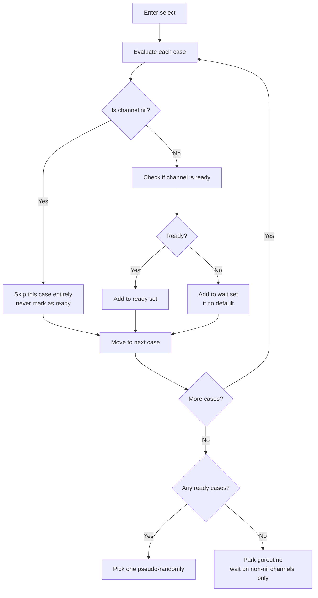

# Nil Channels: The Disabled Case Pattern

A nil channel is one of the few values in Go that has a deliberate, useful runtime behavior rather than simply being an error state. Once you understand what happens when you operate on a nil channel, you can use it as a precise tool to control which cases in a `select` are active at any moment.

## What Is a Nil Channel?

The zero value of any channel type is `nil`. A channel variable that has been declared but not initialized with `make` is nil:

```go
var ch chan int   // ch == nil
ch2 := (chan int)(nil) // also nil
```

A nil channel is distinct from a closed channel. A closed channel still delivers buffered values and then zero values. A nil channel is inert in every direction.

## Operations on a Nil Channel

| Operation | Result |
|---|---|
| Send: `ch <- v` | Blocks forever |
| Receive: `<-ch` | Blocks forever |
| Close: `close(ch)` | Panics immediately |
| Length: `len(ch)` | Returns 0 |
| Capacity: `cap(ch)` | Returns 0 |
| In a `select` case | The case is **never selected** |

The blocking behavior of nil channel sends and receives is not accidental — it is documented as part of the language specification. The runtime checks whether the channel pointer is nil before any other operation and, if so, calls `gopark` immediately, parking the goroutine indefinitely.

:::tip
The most important entry in the table above is the last one: a `select` case whose channel expression is nil is simply skipped during case evaluation. It is never ready. This is the foundation of the disabled case pattern.
:::

## The Problem: Spinning on a Closed Channel

Consider merging two channels into one using a `select` loop:

```go
package main

import "fmt"

// broken: spins forever once one channel closes
func mergeNaive(a, b <-chan int) <-chan int {
	out := make(chan int, 10)
	go func() {
		defer close(out)
		for {
			select {
			case v := <-a:
				out <- v
			case v := <-b:
				out <- v
			}
		}
	}()
	return out
}

func main() {
	a := make(chan int, 3)
	b := make(chan int, 3)
	a <- 1; a <- 2; close(a)
	b <- 3; b <- 4; close(b)

	// This will spin forever printing zero values after channels close
	count := 0
	for v := range mergeNaive(a, b) {
		fmt.Println(v)
		count++
		if count == 6 { // manually break to avoid infinite loop
			break
		}
	}
}
```
<codapi-snippet sandbox="go" editor="basic"></codapi-snippet>

The problem: once `a` is closed, `case v := <-a` is always immediately ready (returning `0, false`). The select loop spins, emitting zero values forever. The goroutine never terminates and `out` is never closed.

## The Fix: Nil Channel to Disable a Case

When a channel is closed and drained, set the variable holding it to `nil`. Its `select` case becomes permanently inactive:

```go
package main

import "fmt"

func merge(a, b <-chan int) <-chan int {
	out := make(chan int, 10)
	go func() {
		defer close(out)
		// highlight-next-line
		for a != nil || b != nil { // loop while at least one is active
			select {
			case v, ok := <-a:
				if !ok {
					// highlight-next-line
					a = nil // disable this case — it will never be selected again
					continue
				}
				out <- v
			case v, ok := <-b:
				if !ok {
					// highlight-next-line
					b = nil // disable this case
					continue
				}
				out <- v
			}
		}
	}()
	return out
}

func main() {
	a := make(chan int, 3)
	b := make(chan int, 3)
	a <- 1; a <- 2; a <- 3; close(a)
	b <- 10; b <- 20; close(b)

	for v := range merge(a, b) {
		fmt.Println(v)
	}
	fmt.Println("done")
}
```
<codapi-snippet sandbox="go" editor="basic"></codapi-snippet>

The loop terminates naturally: when both `a` and `b` are nil, the `for` condition is false, the goroutine returns, and `defer close(out)` fires. The caller's `range` loop on `out` then exits cleanly.

## How the Runtime Skips Nil Cases



The nil check happens before the readiness check. A nil case contributes nothing to the ready set and nothing to the wait set — it is as if the case does not exist.

## Disabling a Timer Case

The same pattern applies to any dynamic condition, including disabling a timeout case after it has fired:

```go
package main

import (
	"fmt"
	"time"
)

func main() {
	work := make(chan int, 5)
	for i := range 5 {
		work <- i
	}
	close(work)

	// highlight-next-line
	var timeout <-chan time.Time = time.After(200 * time.Millisecond)

	for {
		select {
		case v, ok := <-work:
			if !ok {
				fmt.Println("work done")
				return
			}
			fmt.Println("work:", v)
		// highlight-next-line
		case <-timeout:
			fmt.Println("timed out")
			// highlight-next-line
			timeout = nil // disable the timeout case; won't fire again
		}
	}
}
```
<codapi-snippet sandbox="go" editor="basic"></codapi-snippet>

:::tip
Setting `timeout = nil` after the timeout fires prevents the timeout case from being re-selected on subsequent iterations. Without this, the `select` would see a closed `time.After` channel and immediately re-enter the timeout case every iteration after the first fire.
:::

## Key Takeaways

- A nil channel is the zero value of a channel type; it is not the same as a closed channel.
- Sending to or receiving from a nil channel blocks forever; closing a nil channel panics.
- In a `select`, a case whose channel is nil is never selected — it is completely skipped.
- The disabled case pattern: after detecting a channel is closed (`ok == false`), set the variable to `nil` to permanently disable that case in the `select` loop.
- This pattern is the idiomatic way to implement fan-in merge functions that terminate cleanly when all input channels are exhausted.
- The for loop condition `for a != nil || b != nil` combined with nil-setting inside the select gives you a clean, panic-free way to merge an arbitrary number of channels.
