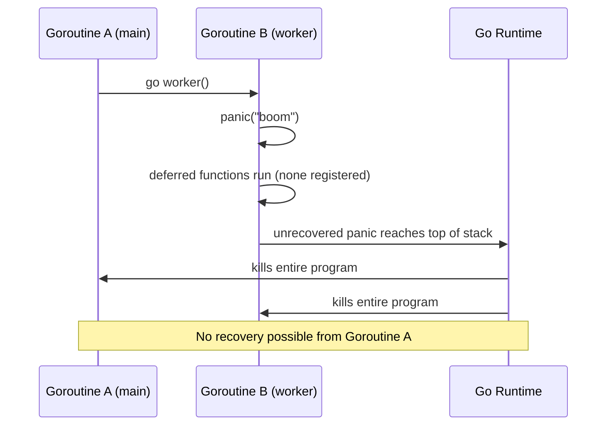

# panic and recover: Rules and Goroutine Boundaries

Most Go programs handle failure through explicit error return values. But some situations — invalid array indexing, nil pointer dereference, or truly unrecoverable programmer errors — produce a `panic`. Understanding how panics propagate, how `recover` intercepts them, and critically why goroutine boundaries are an uncrossable wall is essential for writing robust Go servers and long-running workers.

## What panic Does

When a goroutine panics, Go does the following in order:

1. **Immediately stops execution** of the current function at the point of panic.
2. **Begins unwinding** the goroutine's call stack, working upward through the chain of callers.
3. At each frame during unwinding, **runs any deferred functions** registered in that frame.
4. If the unwind reaches the **top of the goroutine's stack** without being recovered, the runtime prints the panic value and a full stack trace, then **crashes the entire program** — every goroutine, every OS thread.

You trigger a panic explicitly with `panic(value)` where value can be anything: an `error`, a `string`, an `int`, or any interface value. The runtime also generates panics automatically for things like nil pointer dereferences, out-of-bounds slice accesses, and type assertion failures.

## recover: Stopping the Unwind

`recover` is a built-in function that can halt a panic in progress. It returns the value that was passed to `panic`. After `recover` returns, the panic is gone — the deferred function continues executing normally and returns, and the function frame that contained the triggering panic returns zero values to its caller.

However, `recover` is only effective under one precise condition: **it must be called directly inside a deferred function**. Not in a function called by a deferred function — directly in one.

```go
package main

import "fmt"

func safeDivide(a, b int) (result int, err error) {
	defer func() {
		if r := recover(); r != nil {
// highlight-next-line
			err = fmt.Errorf("recovered panic: %v", r)
		}
	}()
	result = a / b // panics if b == 0
	return result, nil
}

func main() {
	result, err := safeDivide(10, 2)
	fmt.Println("10/2:", result, err)

	result, err = safeDivide(10, 0)
	fmt.Println("10/0:", result, err)
}
```
<codapi-snippet sandbox="go" editor="basic"></codapi-snippet>

The anonymous function passed to `defer` calls `recover()` directly. When `a / b` panics on a zero divisor, the runtime runs the deferred function, `recover()` captures the panic value, and execution continues past `safeDivide` normally — returning a descriptive error rather than crashing.

## The Three Rules of recover

**Rule 1: recover must be called directly in a deferred function.**

This does NOT work:

```go
package main

import "fmt"

func tryRecover() {
	// recover() here is not in a deferred function — it does nothing
	if r := recover(); r != nil {
		fmt.Println("recovered:", r)
	}
}

func main() {
	defer tryRecover() // tryRecover is deferred, but recover() is called inside it, not directly in the defer
	panic("this will not be caught")
}
```

Wait — actually this is a subtle point. `defer tryRecover()` does defer the call, but `recover()` is not called *directly* in the `defer` expression — it is called in a function invoked by the deferred call. In Go's specification, this does NOT work for recovery. The deferred function must itself call `recover()`, not delegate it.

```go
package main

import "fmt"

func main() {
	defer func() {
		// recover() called directly in the deferred function — this works
		if r := recover(); r != nil {
// highlight-next-line
			fmt.Println("caught:", r)
		}
	}()
	panic("something bad")
}
```
<codapi-snippet sandbox="go" editor="basic"></codapi-snippet>

**Rule 2: recover() outside of a panic returns nil.**

If no panic is in progress when `recover()` is called, it simply returns `nil`. Checking `r != nil` in the deferred function handles both cases safely.

**Rule 3: recover() called outside a deferred function has no effect.**

Calling `recover()` in normal (non-panicking) code, or in a function called by a deferred function but not directly in the defer itself, returns `nil` and does not intercept any panic.

## The Goroutine Boundary Rule

This is the most important safety constraint around panics, and it trips up many developers coming from other languages.

**A goroutine's panic can only be recovered by that same goroutine.** There is no mechanism for goroutine A to catch a panic from goroutine B.

If goroutine B panics and has no `defer recover()` of its own, the panic propagates to the top of goroutine B's stack and kills the **entire program** — including goroutine A and every other goroutine running.



The implication is clear: **every goroutine that might panic must protect itself**. In server code, where goroutines handle individual requests, a single handler panic without a recovery wrapper will crash the whole server.

:::danger
A goroutine that panics without a recovery in its own call stack brings down the entire program — no exceptions. Goroutine A cannot catch a panic from goroutine B. There is no try/catch across goroutine boundaries.
:::

## The HTTP Server Recovery Pattern

The `net/http` package's server uses this pattern internally. Each request handler runs in its own goroutine, and the server wraps each handler invocation in a deferred recovery. This prevents a single bad handler from taking down the whole server.

Here is the same pattern you should apply to long-running workers:

```go
package main

import (
	"fmt"
	"log"
	"time"
)

func safeGo(fn func()) {
	go func() {
// highlight-next-line
		defer func() {
			if r := recover(); r != nil {
				log.Printf("goroutine panicked (recovered): %v", r)
			}
		}()
		fn()
	}()
}

func riskyHandler(id int) {
	if id == 3 {
		panic(fmt.Sprintf("handler %d encountered fatal error", id))
	}
	fmt.Printf("handler %d completed successfully\n", id)
}

func main() {
	for i := 1; i <= 5; i++ {
		id := i
		safeGo(func() { riskyHandler(id) })
	}
	time.Sleep(100 * time.Millisecond)
	fmt.Println("server still running")
}
```
<codapi-snippet sandbox="go" editor="basic"></codapi-snippet>

`safeGo` is a wrapper that launches a goroutine with a built-in recovery. Handler 3 panics, the recovery logs the error, and the other handlers and the main goroutine continue unaffected.

## Panic Values Are Not Limited to Errors

You can pass any value to `panic`:

```go
package main

import "fmt"

func main() {
	defer func() {
		r := recover()
		switch v := r.(type) {
		case int:
			fmt.Println("recovered int panic:", v)
		case string:
			fmt.Println("recovered string panic:", v)
		case error:
			fmt.Println("recovered error panic:", v)
		}
	}()
// highlight-next-line
	panic(42) // panic with an integer
}
```
<codapi-snippet sandbox="go" editor="basic"></codapi-snippet>

Because `recover()` returns `interface{}`, you use a type switch to handle different panic value types. In practice, panicking with an `error` or a descriptive `string` is the most common approach, as it gives useful diagnostic information.

:::warning
Do not use `panic` for normal error handling. Return `error` values instead. `panic` is for genuinely unrecoverable situations: programming errors (invalid state that should never occur), initialization failures, or violations of invariants. Using panic for expected failure modes (network errors, invalid input) makes code harder to reason about and test.
:::

:::tip
For long-running goroutines in server code — request handlers, background workers, queue consumers — wrap the goroutine body in a deferred recovery. Log the recovered value with enough context to debug the original panic. Then decide whether to restart the goroutine or propagate the error through a channel back to a supervisor.
:::

## Key Takeaways

- `panic` stops the current function, unwinds the stack running deferred functions, and crashes the program if not recovered.
- `recover()` stops a panic in progress but **only when called directly inside a deferred function**.
- `recover()` outside of a panic returns `nil` and has no effect.
- Panics **cannot cross goroutine boundaries** — a goroutine can only recover its own panics.
- An unrecovered goroutine panic kills the entire program.
- Every long-running goroutine in server/worker code should include a `defer func() { recover() }()` wrapper to prevent one panic from taking down the service.
- Use `panic` only for programming errors and unrecoverable state; use `error` return values for all expected failure modes.
