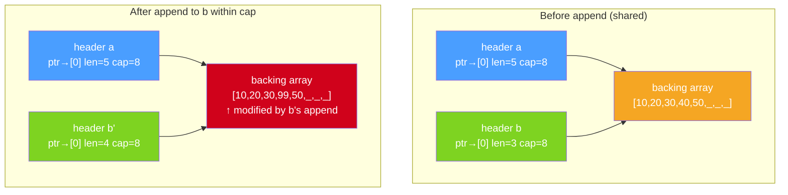

# Slice Internals: len, cap, append Growth, and Shared Backing Arrays

Slices are the workhorse of Go data structures. They look and feel like dynamic arrays, but their implementation is a three-word header that points into a separately allocated backing array. This distinction — header versus array — is the source of both their efficiency and their most subtle bugs.

## The Slice Header

A slice is not a pointer to a data structure. A slice **is** a data structure, specifically a three-word struct:

```
type slice struct {
    ptr *T   // pointer to first element of the backing array
    len int  // number of elements accessible through this slice
    cap int  // total capacity of the backing array from ptr onward
}
```

When you pass a slice to a function, you pass a **copy of this three-word header**. The copy has the same `ptr`, `len`, and `cap`. Modifying elements through the copy (e.g., `s[0] = 99`) affects the original because both point to the same backing array. But reassigning `s` inside the function (e.g., `s = append(s, x)`) only affects the local copy of the header — the caller's header is unchanged.

This three-word struct is passed entirely in registers on modern platforms. It's small, fast, and has no heap allocation overhead just for passing a slice to a function.

## nil vs Empty Slices

These two declarations produce different results:

```go
package main

import (
	"encoding/json"
	"fmt"
)

func main() {
	var nilSlice []int      // ptr=nil, len=0, cap=0
	emptySlice := []int{}  // ptr=(non-nil), len=0, cap=0

	fmt.Println("nil slice:", nilSlice, "is nil:", nilSlice == nil)
	fmt.Println("empty slice:", emptySlice, "is nil:", emptySlice == nil)

	// Both behave the same for most operations
	fmt.Println("len:", len(nilSlice), len(emptySlice))
	fmt.Println("append works on nil slice:", append(nilSlice, 1, 2, 3))

	// JSON marshaling differs — critical for API responses
// highlight-next-line
	nilJSON, _ := json.Marshal(nilSlice)
	emptyJSON, _ := json.Marshal(emptySlice)
	fmt.Println("nil JSON:", string(nilJSON))     // null
	fmt.Println("empty JSON:", string(emptyJSON)) // []
}
```
<codapi-snippet sandbox="go" editor="basic"></codapi-snippet>

A nil slice marshals to JSON `null`; an empty slice marshals to `[]`. For APIs where the distinction matters — returning an empty array instead of null — initialize with `[]T{}` or `make([]T, 0)`. For internal use where you just need an appendable slice, `var s []T` is fine and slightly cheaper.

## Slicing: No Allocation, Shared Memory

The expression `s[low:high]` creates a new slice header. It does **not** copy any data. The new header's `ptr` points `low` elements into the original backing array, `len` is `high-low`, and `cap` is `cap(s)-low`.

```go
package main

import "fmt"

func main() {
	original := []int{0, 1, 2, 3, 4, 5, 6, 7}

	// Create a sub-slice — no allocation, shared backing array
	sub := original[2:5]
	fmt.Printf("sub: %v, len=%d, cap=%d\n", sub, len(sub), cap(sub))
	// sub: [2 3 4], len=3, cap=6  (cap extends to end of original array)

// highlight-next-line
	sub[0] = 99 // modifies original[2] — same backing array!
	fmt.Println("original after sub[0]=99:", original)
}
```
<codapi-snippet sandbox="go" editor="basic"></codapi-snippet>

This zero-copy slicing is extremely efficient — you can pass sub-ranges of large arrays to functions with no allocation. But the shared backing array is also the source of the most common slice bug.

## The Shared Backing Array Bug



When `append` has room within the existing capacity (`len < cap`), it writes into the backing array at `ptr[len]` and returns a new header with `len+1`. But if another slice shares that backing array, the write is visible through it:

```go
package main

import "fmt"

func main() {
	a := make([]int, 5, 8) // len=5, cap=8
	a[0], a[1], a[2], a[3], a[4] = 10, 20, 30, 40, 50

	// b shares the backing array with a
	b := a[:3] // len=3, cap=8 — still points to the same array

	fmt.Println("a before:", a)
	fmt.Println("b before:", b)

// highlight-next-line
	b = append(b, 99) // fits within cap — writes into a's backing array at index 3!
	fmt.Println("a after append to b:", a) // a[3] is now 99, not 40
	fmt.Println("b after:", b)
}
```
<codapi-snippet sandbox="go" editor="basic"></codapi-snippet>

:::danger
This is one of the most common bugs in Go code. Two slices share a backing array. Appending to one (within its capacity) silently overwrites data in the other. The fix is either `copy()` to make an independent slice, or three-index slicing to limit the capacity of sub-slices.
:::

**Fix 1: copy to make an independent slice**

```go
package main

import "fmt"

func main() {
	a := make([]int, 5, 8)
	a[0], a[1], a[2], a[3], a[4] = 10, 20, 30, 40, 50

// highlight-next-line
	b := make([]int, 3)
	copy(b, a[:3]) // b is now independent — different backing array

	b = append(b, 99)
	fmt.Println("a unchanged:", a) // [10 20 30 40 50]
	fmt.Println("b:", b)           // [10 20 30 99]
}
```
<codapi-snippet sandbox="go" editor="basic"></codapi-snippet>

**Fix 2: three-index slicing to cap the sub-slice**

```go
package main

import "fmt"

func main() {
	a := make([]int, 5, 8)
	a[0], a[1], a[2], a[3], a[4] = 10, 20, 30, 40, 50

// highlight-next-line
	b := a[0:3:3] // three-index: low=0, high=3, max=3. cap(b) = max-low = 3
	// Now b has len=3, cap=3. Any append forces a new backing array.

	b = append(b, 99) // cap exceeded → allocates new array
	fmt.Println("a unchanged:", a) // [10 20 30 40 50]
	fmt.Println("b:", b)           // [10 20 30 99]
}
```
<codapi-snippet sandbox="go" editor="basic"></codapi-snippet>

The three-index slice `a[low:high:max]` sets the cap of the resulting slice to `max-low`. When `append` is called and `len == cap`, it must allocate a new backing array, cleanly separating the two slices.

## append Growth Strategy

When `append` needs more space (because `len == cap`), it allocates a new, larger backing array, copies existing elements, and returns a new header pointing to the new array. The old backing array becomes unreachable (if no other slices point to it) and is eventually garbage collected.

```go
package main

import "fmt"

func main() {
	var s []int
	prevCap := 0

	for i := 0; i < 20; i++ {
		s = append(s, i)
		if cap(s) != prevCap {
// highlight-next-line
			fmt.Printf("len=%2d  cap=%2d  (grew from %d)\n", len(s), cap(s), prevCap)
			prevCap = cap(s)
		}
	}
}
```
<codapi-snippet sandbox="go" editor="basic"></codapi-snippet>

The growth formula (as of Go 1.18):

- **len < 256**: new capacity doubles (approximately). This provides O(1) amortized `append`.
- **len >= 256**: capacity grows by approximately 25%, plus a smoothing term. The exact formula is `newcap = oldcap + (oldcap + 3*256) / 4`. This avoids the sudden shift from 2x to 1.25x growth that existed in earlier versions.

Because every reallocation copies all existing elements and creates a new backing array, previous slices of the old array are **unaffected** after a reallocation — the new slice has a completely independent copy.

## Pre-Allocating for Performance

When you know roughly how many elements you'll append, pre-allocate with `make`:

```go
package main

import "fmt"

func squaresPreallocated(n int) []int {
// highlight-next-line
	result := make([]int, 0, n) // len=0, cap=n — no reallocation needed
	for i := 0; i < n; i++ {
		result = append(result, i*i)
	}
	return result
}

func main() {
	s := squaresPreallocated(10)
	fmt.Println(s)
	fmt.Println("len:", len(s), "cap:", cap(s))
}
```
<codapi-snippet sandbox="go" editor="basic"></codapi-snippet>

Without the capacity hint, `append` would trigger multiple reallocations (at len 1, 2, 4, 8). With `make([]int, 0, n)`, there is exactly one allocation for the backing array and no copies. For hot paths building large slices, this matters significantly.

:::tip
`s = s[:0]` resets a slice to zero length while keeping its backing array and capacity intact. This is the idiomatic way to reuse a slice as a buffer — you avoid reallocating the backing array on every call. It's used extensively in connection handlers, buffer pools, and anywhere you need to repeatedly build and drain a collection.
:::

## Key Takeaways

- A slice is a **three-word struct**: pointer, length, capacity. Passing a slice copies the header, not the data.
- A **nil slice** (`var s []T`) is fully usable for `append`, `len`, `range`. An **empty slice** (`[]T{}`) is non-nil, which matters for JSON marshaling (`null` vs `[]`).
- `s[low:high]` creates a new header with **no allocation** — both the original and new slice share the backing array.
- **Shared backing arrays cause subtle bugs**: appending to a sub-slice within its capacity silently overwrites data visible through the original. Fix with `copy()` or three-index slicing `s[low:high:high]`.
- `append` grows capacity by ~2x for small slices, ~1.25x for large slices (Go 1.18+). Each growth allocates a new backing array.
- **Pre-allocate** with `make([]T, 0, expectedLen)` to avoid repeated reallocations in hot paths.
- `s = s[:0]` resets length to 0 while preserving capacity — efficient buffer reuse.
