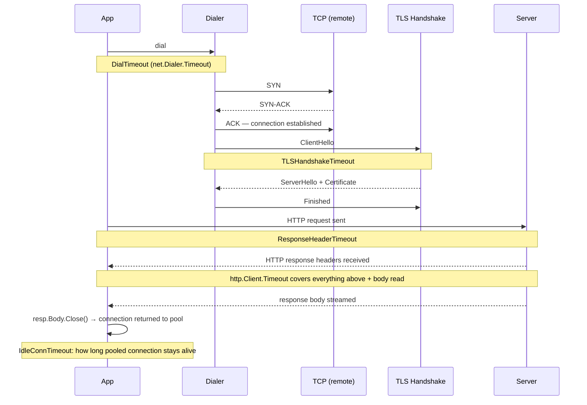

import Tabs from '@theme/Tabs';
import TabItem from '@theme/TabItem';

# net/http Transport Internals: Keep-Alive, Pooling, and Timeouts

Most Go programs that make HTTP requests use the standard library and assume things just work. They do — but only within a narrow set of default parameters that are optimized for casual scripting, not production services. Understanding how `http.Transport` manages connections, what its pool limits mean in practice, and which timeouts protect against which failure modes is the difference between an HTTP client that works in a load test and one that holds up under production traffic.

## Transport and Client: Two Layers

`http.Client` is the high-level type you interact with: it holds cookies, redirects, and an overall request timeout. It does not manage connections itself. That job belongs to `http.Transport`, which implements the `http.RoundTripper` interface — the single method `RoundTrip(*http.Request) (*http.Response, error)`.

`http.DefaultTransport` is a package-level `*http.Transport` shared across all calls that use `http.DefaultClient`, `http.Get()`, `http.Post()`, and friends. The transport maintains a pool of idle connections, keyed by host and protocol, and reuses them across requests. This is the feature that makes HTTP/1.1 keep-alive work.

When you write `http.Get(url)`, the call stack is:

1. `http.DefaultClient.Get(url)` — builds a `*http.Request`
2. `http.DefaultClient.Do(req)` — applies client-level timeout, handles redirects
3. `http.DefaultTransport.RoundTrip(req)` — finds or creates a connection, sends the request, returns the response

All the connection management — pooling, keep-alive, TLS — happens at the `Transport` level.

## Connection Pooling and Keep-Alive

HTTP/1.1 keep-alive (persistent connections) means that after a response is received, the underlying TCP connection is not immediately closed. Instead, it is returned to the transport's idle pool. The next request to the same host can reuse it, skipping the TCP handshake (3-way handshake, ~1 round-trip time) and, for HTTPS, the TLS handshake (1–2 additional round-trips). On a service with 100 ms round-trip latency, reusing a connection saves 200–400 ms per request.

`http.Transport` exposes three pool-size controls:

- **`MaxIdleConns`**: the maximum total number of idle (keep-alive) connections across all hosts. Default: 100.
- **`MaxIdleConnsPerHost`**: the maximum number of idle connections to keep per host. Default: 2.
- **`MaxConnsPerHost`**: the maximum total connections (idle + active) per host. Default: 0 (unlimited).

### The MaxIdleConnsPerHost=2 Gotcha

The default of 2 idle connections per host is the most common source of unexpected HTTP performance problems in Go services. Here is the scenario:

Your service makes 50 concurrent requests to an upstream API. Each request lands on a separate goroutine, and each goroutine calls `transport.RoundTrip()`. The first two goroutines find idle connections in the pool and reuse them. The remaining 48 goroutines find the pool empty (only 2 slots) and dial new connections. When those 48 requests finish, the transport tries to return connections to the pool. But the pool only holds 2 per host, so 46 connections are closed — discarded after a single use. The next batch of 50 concurrent requests repeats the pattern: 48 fresh TCP+TLS handshakes. Connection pooling is effectively disabled.

:::warning
`MaxIdleConnsPerHost` defaults to 2. If you make more than 2 concurrent requests to the same host, most connections are closed after use and not pooled. Every request in excess of 2 pays the full TCP and TLS handshake cost. For high-throughput services, set `MaxIdleConnsPerHost` to at least the expected concurrency level for that host.
:::

## The Five Timeout Types

Go's HTTP client has five distinct timeout controls, each protecting against a different failure mode. Knowing which covers what is essential for building a resilient client.



### 1. Dial Timeout

Set via `net.Dialer.Timeout` (or `DialContext`). Controls how long the transport waits to establish the TCP connection. If the remote host is unreachable or the network is congested, this prevents the request from hanging indefinitely at the TCP level.

### 2. TLS Handshake Timeout

`http.Transport.TLSHandshakeTimeout`. Controls how long the TLS negotiation can take after the TCP connection is established. Default: 10 seconds. A high-latency or misbehaving TLS terminator can stall here without this limit.

### 3. Response Header Timeout

`http.Transport.ResponseHeaderTimeout`. Controls how long the transport waits for the server to send the first response byte (the status line and headers) after the request is fully sent. No default — zero means no timeout. This is often the most important timeout to set explicitly.

### 4. Expect-Continue Timeout

`http.Transport.ExpectContinueTimeout`. Only relevant for requests with an `Expect: 100-continue` header — typically large uploads. Controls how long the client waits for the server's `100 Continue` response before sending the body. Default: 1 second.

### 5. Idle Connection Timeout

`http.Transport.IdleConnTimeout`. Controls how long an idle connection sits in the pool before being closed. Default: 90 seconds. If your upstream closes idle connections sooner (a common load balancer configuration), set this below that value to avoid using dead connections.

### Why http.Client.Timeout Alone Is Not Enough

`http.Client.Timeout` covers the total duration from the start of `Do()` until the response body is fully read. It sounds comprehensive, but it does not protect against a specific attack pattern: a server that sends headers immediately (beating `ResponseHeaderTimeout` or `http.Client.Timeout`'s initial check) and then trickles the body at one byte per second. The overall `Client.Timeout` will eventually fire, but `ResponseHeaderTimeout` is specifically tuned to catch servers that are slow to *start* responding.

Use both: `http.Client.Timeout` as a hard ceiling on total request time, and `ResponseHeaderTimeout` to catch slow-responding servers early.

## Properly Configured Transport

<Tabs>
<TabItem value="default" label="Default (avoid in production)">

```go
package main

import (
	"fmt"
	"io"
	"net/http"
)

func main() {
	// http.DefaultClient uses http.DefaultTransport.
	// Problems:
	//   - No dial timeout: hangs indefinitely if host is unreachable
	//   - No ResponseHeaderTimeout: hangs if server accepts connection but never responds
	//   - No Client.Timeout: a slow body read blocks forever
	//   - MaxIdleConnsPerHost=2: only 2 connections pooled per host
	resp, err := http.Get("https://example.com")
	if err != nil {
		fmt.Println("error:", err)
		return
	}
	// highlight-next-line
	defer resp.Body.Close()
	io.Copy(io.Discard, resp.Body) // must drain body for connection reuse
	fmt.Println("status:", resp.Status)
}
```

</TabItem>
<TabItem value="configured" label="Properly configured">

```go
package main

import (
	"context"
	"fmt"
	"io"
	"net"
	"net/http"
	"time"
)

func main() {
	// highlight-next-line
	transport := &http.Transport{
		DialContext: (&net.Dialer{
			// highlight-next-line
			Timeout:   5 * time.Second, // TCP connection establishment
			KeepAlive: 30 * time.Second,
		}).DialContext,
		// highlight-next-line
		TLSHandshakeTimeout:   10 * time.Second,
		// highlight-next-line
		ResponseHeaderTimeout: 10 * time.Second, // time to first byte of response headers
		ExpectContinueTimeout: 1 * time.Second,
		// highlight-next-line
		IdleConnTimeout:       90 * time.Second,
		// highlight-next-line
		MaxIdleConns:          200,
		// highlight-next-line
		MaxIdleConnsPerHost:   50,  // match your expected concurrency per host
		MaxConnsPerHost:       100,
	}

	client := &http.Client{
		Transport: transport,
		// highlight-next-line
		Timeout: 30 * time.Second, // hard ceiling on total request time
	}

	ctx := context.Background()
	req, err := http.NewRequestWithContext(ctx, http.MethodGet, "https://example.com", nil)
	if err != nil {
		fmt.Println("build request:", err)
		return
	}

	resp, err := client.Do(req)
	if err != nil {
		fmt.Println("request:", err)
		return
	}
	defer resp.Body.Close()
	io.Copy(io.Discard, resp.Body)
	fmt.Println("status:", resp.Status)
}
```

</TabItem>
</Tabs>

## Connection Draining: The Rule You Must Not Break

For the transport to return a connection to the idle pool after a request, two conditions must be met:

1. The response body must be **fully read**.
2. The response body must be **closed**.

If you close the body without reading it, the runtime cannot safely reuse the connection — it does not know if there are unread bytes buffered by the server. The connection is discarded, and the next request to the same host must establish a new one.

:::danger
Calling `resp.Body.Close()` without reading the body to EOF does not return the connection to the pool — it closes the connection entirely. Every such request pays the full TCP+TLS handshake cost on the next call. In a request handler that makes thousands of upstream calls per second, this is a serious performance regression.
:::

The correct pattern for draining:

```go
package main

import (
	"fmt"
	"io"
	"net/http"
)

func fetch(client *http.Client, url string) (int, error) {
	resp, err := client.Get(url)
	if err != nil {
		return 0, err
	}
	// highlight-next-line
	defer resp.Body.Close() // always close — even after draining
	// highlight-next-line
	_, err = io.Copy(io.Discard, resp.Body) // drain to EOF so the connection can be reused
	if err != nil {
		return 0, fmt.Errorf("draining body: %w", err)
	}
	return resp.StatusCode, nil
}

func main() {
	client := &http.Client{}
	code, err := fetch(client, "https://example.com")
	if err != nil {
		fmt.Println("error:", err)
		return
	}
	fmt.Println("status:", code)
}
```
<codapi-snippet sandbox="go" editor="basic"></codapi-snippet>

`io.Copy(io.Discard, resp.Body)` reads all remaining bytes and discards them. The `defer resp.Body.Close()` then closes the body, signaling to the transport that the connection is clean and can be returned to the pool. Both are required. The `defer` alone is not sufficient.

If you are reading the body for its content, the same rule applies: read until EOF, then close. If you read only part of the body (say, the first 100 bytes) and then close, the connection is discarded. If you need to abort early, accept that you will pay for a new connection on the next request — or consider using HTTP range requests to limit body size at the protocol level.

## Key Takeaways

- `http.Transport` manages connection pooling. `http.Client` handles cookies, redirects, and overall timeout. The transport is the performance-critical layer.
- `MaxIdleConnsPerHost` defaults to 2 — far too low for any service making concurrent requests to the same upstream. Set it to match your expected per-host concurrency.
- There are five distinct timeout types: dial, TLS handshake, response header, expect-continue, and idle connection timeout. `http.Client.Timeout` is a sixth, covering total request duration. Set all of them explicitly.
- `ResponseHeaderTimeout` catches servers that accept connections but are slow to respond. `http.Client.Timeout` catches slow body reads. Use both together.
- Always read the response body to EOF before closing it. Skipping the drain discards the connection instead of returning it to the pool, eliminating the benefit of keep-alive.
- Create one `http.Transport` and one `http.Client` per "type" of upstream connection. Reuse them across all requests. Never create a new transport per request.
