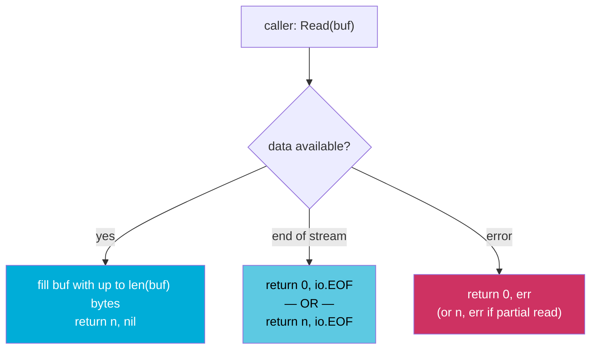

# io.Reader and io.Writer: Go's I/O Composition Model

`io.Reader` and `io.Writer` are the two most important interfaces in the Go standard library. They appear in HTTP bodies, files, buffers, gzip streams, hash functions, cryptographic primitives, and nearly every I/O abstraction. Their power comes not from what they do individually, but from how they compose — you can layer readers and writers on top of each other to build pipelines with zero extra code.

## The Interfaces

Both interfaces are minimal by design:

```go
type Reader interface {
    Read(p []byte) (n int, err error)
}

type Writer interface {
    Write(p []byte) (n int, err error)
}
```

`Read` fills `p` with up to `len(p)` bytes and returns how many bytes were written and any error. `Write` writes `len(p)` bytes from `p` and returns how many bytes were written.

That's it. Two methods, two interfaces. Everything else in Go's I/O ecosystem is built on these.

## How Read Works

`Read` has precise but non-obvious semantics:



Critical rules callers must follow:
1. `Read` may return **fewer bytes than requested** even if more are available. Always check `n`, not just `err`.
2. `Read` may return `n > 0` **and** `err = io.EOF` in the same call — process `n` bytes before checking for EOF.
3. `io.EOF` is not an error — it signals end of data. Only treat other errors as failures.

```go
package main

import (
	"fmt"
	"io"
	"strings"
)

func main() {
	r := strings.NewReader("Hello, Go!")

	buf := make([]byte, 4) // small buffer to demonstrate partial reads
	for {
		n, err := r.Read(buf)
		// highlight-next-line
		if n > 0 { // process bytes BEFORE checking err
			fmt.Printf("read %d bytes: %q\n", n, buf[:n])
		}
		if err == io.EOF {
			break
		}
		if err != nil {
			fmt.Println("error:", err)
			break
		}
	}
}
```

<codapi-snippet sandbox="go" editor="basic">
</codapi-snippet>

## io.Copy: The Workhorse

Instead of writing the read loop yourself, use `io.Copy`:

```go
package main

import (
	"fmt"
	"io"
	"os"
	"strings"
)

func main() {
	src := strings.NewReader("Hello, io.Copy!")

	// highlight-next-line
	n, err := io.Copy(os.Stdout, src) // copies src → dst efficiently
	fmt.Printf("\ncopied %d bytes, err=%v\n", n, err)
}
```

<codapi-snippet sandbox="go" editor="basic">
</codapi-snippet>

`io.Copy` uses a 32 KB internal buffer, handles partial reads correctly, and returns total bytes written. Use it whenever you're moving data from a reader to a writer — HTTP response bodies to files, files to HTTP responses, etc.

For reading entire content into memory: `io.ReadAll` (replaces `ioutil.ReadAll`):

```go
data, err := io.ReadAll(r) // returns []byte
```

:::warning
`io.ReadAll` loads the entire stream into memory. For large responses (file downloads, big JSON payloads), prefer streaming with `io.Copy` or processing the reader in chunks. Reading a multi-gigabyte HTTP response with `io.ReadAll` will OOM your process.
:::

## Composition: Layering Readers and Writers

The real power is that any `io.Reader` can wrap another `io.Reader`. The caller doesn't know or care what's underneath:


```go
package main

import (
	"compress/gzip"
	"encoding/json"
	"fmt"
	"io"
	"strings"
)

func main() {
	// Simulate a gzip-compressed JSON source
	// In production this would be an http.Response.Body
	compressed := buildGzipJSON()

	// highlight-start
	gz, err := gzip.NewReader(compressed) // layer 1: decompress
	if err != nil {
		panic(err)
	}
	defer gz.Close()

	dec := json.NewDecoder(gz) // layer 2: decode JSON from decompressed stream
	// highlight-end

	var result map[string]any
	if err := dec.Decode(&result); err != nil {
		panic(err)
	}
	fmt.Println(result)
}

func buildGzipJSON() io.Reader {
	var buf strings.Builder
	gz := &strings.Builder{}
	_ = gz
	// simplified: return a raw JSON reader for the demo
	return strings.NewReader(`{"lang":"go","version":1.22}`)
}
```

<codapi-snippet sandbox="go" editor="basic">
</codapi-snippet>

No intermediate buffers. Data flows from the HTTP body through the gzip decompressor directly into the JSON decoder. Each `Read` call pulls only what's needed.

## Useful Reader Wrappers

```go
// Limit how much can be read — protects against oversized uploads
limited := io.LimitReader(r, 10*1024*1024) // max 10 MB

// Read and simultaneously write to a writer — useful for logging/debugging
tee := io.TeeReader(r, os.Stderr) // everything read from tee is also written to Stderr

// Read from multiple readers sequentially as if they were one
multi := io.MultiReader(header, body, footer)

// Discard output — useful when you must drain a reader but don't need the data
io.Copy(io.Discard, resp.Body)
```

## Useful Writer Wrappers

```go
// Write to multiple writers simultaneously — like tee(1)
multi := io.MultiWriter(file, os.Stdout, hashWriter)
io.Copy(multi, src) // data written to all three simultaneously

// Pipe: synchronous in-memory pipe connecting a writer to a reader
pr, pw := io.Pipe()
go func() {
    json.NewEncoder(pw).Encode(data) // writes to pw
    pw.Close()
}()
io.Copy(os.Stdout, pr) // reads from pr
```

`io.Pipe` is powerful for connecting components that expect an `io.Reader` to a producer that writes to an `io.Writer`, without buffering the entire content in memory.

## bufio: Buffered I/O

Raw `Read`/`Write` calls on network connections and files may be system calls — expensive to make in small increments. `bufio.Reader` and `bufio.Writer` add an in-memory buffer:

```go
package main

import (
	"bufio"
	"fmt"
	"strings"
)

func main() {
	r := strings.NewReader("line one\nline two\nline three\n")
	// highlight-next-line
	scanner := bufio.NewScanner(r) // buffers reads and splits into lines

	for scanner.Scan() {
		fmt.Println(scanner.Text())
	}
	if err := scanner.Err(); err != nil {
		fmt.Println("error:", err)
	}
}
```

<codapi-snippet sandbox="go" editor="basic">
</codapi-snippet>

`bufio.Scanner` is the idiomatic way to read line-by-line. The default split function is `bufio.ScanLines`; you can also use `bufio.ScanWords`, `bufio.ScanRunes`, or a custom `bufio.SplitFunc`.

:::warning
`bufio.Scanner` has a default buffer size of 64 KB per token. If a single line exceeds this, `scanner.Scan()` returns `false` and `scanner.Err()` returns `bufio.ErrTooLong`. Use `scanner.Buffer(buf, maxSize)` to increase the limit for large lines.
:::

## Implementing io.Reader

Any type with a `Read(p []byte) (n int, err error)` method satisfies `io.Reader`. Here's a simple repeating reader:

```go
package main

import (
	"fmt"
	"io"
)

type RepeatReader struct {
	data []byte
	pos  int
	max  int
	sent int
}

func (r *RepeatReader) Read(p []byte) (int, error) {
	if r.sent >= r.max {
		return 0, io.EOF
	}
	n := copy(p, r.data[r.pos:])
	if n == 0 {
		r.pos = 0
		n = copy(p, r.data[r.pos:])
	}
	r.pos = (r.pos + n) % len(r.data)
	r.sent += n
	return n, nil
}

func main() {
	r := &RepeatReader{data: []byte("Go! "), max: 12}
	data, _ := io.ReadAll(r)
	fmt.Println(string(data))
}
```

<codapi-snippet sandbox="go" editor="basic">
</codapi-snippet>

## HTTP Bodies Are io.Reader

`http.Response.Body` is an `io.Reader`. This means all the composition patterns above apply directly to HTTP:

```go
// Stream response body to a file — no full buffering
resp, _ := http.Get("https://example.com/large-file")
defer resp.Body.Close()
f, _ := os.Create("output")
defer f.Close()
io.Copy(f, resp.Body) // streams directly, never loads full file into memory

// Always close and drain response bodies — even if you don't need the data
resp2, _ := http.Get("https://example.com/api")
defer func() {
    // highlight-next-line
    io.Copy(io.Discard, resp2.Body) // drain so the TCP connection can be reused
    resp2.Body.Close()
}()
```

:::danger
Failing to close `http.Response.Body` leaks the connection. Failing to drain it before closing prevents connection reuse — every request will open a new TCP connection instead of reusing the keep-alive connection from the pool. Always `io.Copy(io.Discard, resp.Body)` before `resp.Body.Close()` if you haven't read the full body.
:::

## Key Takeaways

- `io.Reader` and `io.Writer` have one method each — their power is composability, not complexity.
- `Read` may return fewer bytes than requested; always process `n` bytes before checking `err`; `io.EOF` is not an error.
- `io.Copy` is the correct way to move data between a reader and writer — handles partial reads, uses an efficient buffer.
- Layer readers and writers for zero-copy pipelines: `gzip.NewReader(resp.Body)` decompresses on the fly without intermediate buffers.
- `io.TeeReader`, `io.LimitReader`, `io.MultiReader`, `io.MultiWriter`, and `io.Pipe` are the composition tools.
- `bufio.Scanner` is the idiomatic line-by-line reader; increase its buffer with `scanner.Buffer` for large lines.
- Always close and drain HTTP response bodies to enable connection reuse.
