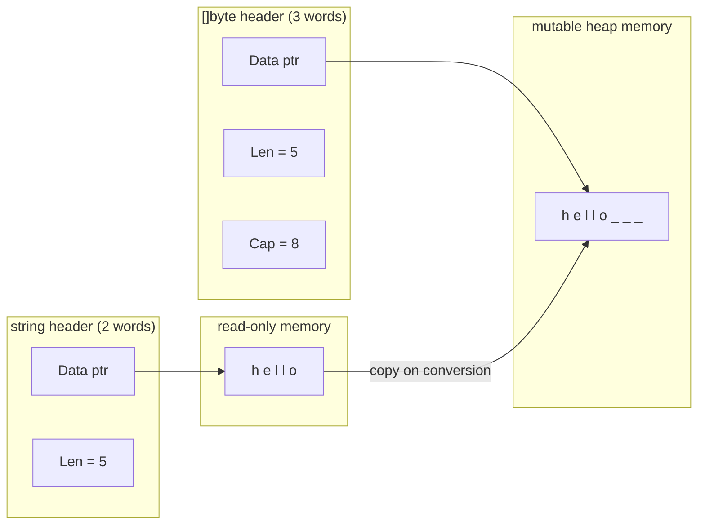

# String Immutability and []byte Conversions

Strings in Go look simple on the surface. You declare one with a double-quoted literal, pass it around, index into it, and print it. But underneath, the immutability contract baked into the type has far-reaching consequences for performance, safety, and how you should structure string-heavy code.

## The String Header

A Go string is not just a pointer to bytes. It is a two-word struct in the runtime:

```go
type stringHeader struct {
    Data unsafe.Pointer // pointer to the first byte
    Len  int            // number of bytes
}
```

This is identical in shape to a slice header, except there is no `Cap` field. The bytes pointed to by `Data` are in **read-only memory** — the operating system marks the segment containing string literals as non-writable. Attempting to modify those bytes causes a segfault at the OS level, but Go prevents you from reaching that point entirely: `s[0] = 'x'` is a compile-time error.



## Why Immutability Matters

The immutability guarantee is not just a language nicety. It unlocks several concrete optimizations.

**Safe sharing between goroutines.** Because no goroutine can modify the bytes a string points to, any number of goroutines can read the same string concurrently without a mutex or any synchronization. If strings were mutable, every read would need to be protected.

**String interning.** The Go compiler stores string literals in the read-only data segment of the binary and deduplicates identical literals at link time. If you write `s1 := "hello"` and `s2 := "hello"` in two different functions, both string headers point to the exact same bytes in memory. There is only one copy of "hello" in the binary.

**Cheap copies.** Assigning a string to another variable copies the two-word header — just 16 bytes on a 64-bit system — not the underlying bytes. Passing strings to functions is similarly cheap.

## string → []byte: The Allocation Cost

Converting a string to a `[]byte` requires allocating a new backing array and copying every byte into it. This is unavoidable: `[]byte` is mutable, but the bytes a string points to are read-only, so the runtime cannot hand you a mutable view of the same memory.

```go
package main

import "fmt"

func main() {
	s := "hello, world"
	b := []byte(s) // allocates new array, copies 12 bytes
	b[0] = 'H'     // safe: b has its own mutable backing array
	fmt.Println(string(b))
	fmt.Println(s) // original string unchanged
}
```
<codapi-snippet sandbox="go" editor="basic"></codapi-snippet>

The cost is O(n) time and one heap allocation proportional to the string length. In a hot path called millions of times, this adds up.

## []byte → string: Also a Copy (Usually)

The reverse conversion — `string(b)` — also allocates and copies by default. The string must own its bytes (because strings are immutable), so the runtime cannot simply point the string header at the `[]byte`'s backing array, which the caller might later mutate.

However, the Go compiler has a handful of well-known escape hatches where it can prove the copy is unnecessary and elides the allocation:

- `string(b)` used directly as a map lookup key: `m[string(b)]`
- `string(b)` in a comparison: `string(b) == "literal"`
- `string(b)` passed to `fmt.Println` and similar (sometimes)

These optimizations are not guaranteed across compiler versions, but they are stable in practice. The rule of thumb: if the result of `string(b)` is immediately consumed and never stored, the compiler is likely to avoid the allocation.

## The O(n²) Concatenation Anti-Pattern

The most common string performance mistake in Go is building a string with `+=` in a loop:

```go
package main

import (
	"fmt"
	"strings"
)

func buildBad(words []string) string {
	result := ""
	for _, w := range words {
		// highlight-next-line
		result += w + " " // allocates a new string every iteration — O(n²) total
	}
	return result
}

func buildGood(words []string) string {
	var sb strings.Builder
	for _, w := range words {
		sb.WriteString(w)
		sb.WriteByte(' ')
	}
	return sb.String() // single allocation at the end
}

func main() {
	words := []string{"the", "quick", "brown", "fox", "jumps"}
	fmt.Println(buildBad(words))
	fmt.Println(buildGood(words))
}
```
<codapi-snippet sandbox="go" editor="basic"></codapi-snippet>

Each `+=` creates a brand new string containing all of the previous content plus the new fragment. After n iterations you have performed 0 + 1 + 2 + ... + n−1 = O(n²) byte copies. With 10,000 words this is 50 million copies; with 100,000 words it is 5 billion.

`strings.Builder` maintains a `[]byte` internally and grows it with the usual doubling strategy. `b.String()` at the end performs exactly one allocation and one copy. The total work is O(n).

:::warning
Repeated `+=` on strings inside a loop is O(n²) in the total number of bytes written. For anything beyond a handful of concatenations, always use `strings.Builder`.
:::

## strings.Builder vs bytes.Buffer

Both `strings.Builder` and `bytes.Buffer` avoid repeated allocations, but they serve slightly different use cases.

`strings.Builder` is the right choice when your goal is to produce a `string`. It exposes `WriteString`, `WriteByte`, `WriteRune`, and `Fmt`-compatible `Write`. It intentionally does not support resetting to an earlier state or reading from the middle.

`bytes.Buffer` is more general: it implements both `io.Reader` and `io.Writer`, supports `Bytes()` to read the accumulated bytes, and can be passed anywhere an `io.Writer` is expected. If you need to pipe your output into another API that consumes an `io.Reader`, use `bytes.Buffer`.

## Demonstrating Immutability and the []byte Workaround

```go
package main

import (
	"fmt"
	"strings"
)

func main() {
	s := "immutable"

	// s[0] = 'I' — compile error: cannot assign to s[0] (neither addressable nor a map index expression)

	// Workaround: convert to []byte, mutate, convert back
	b := []byte(s)
	// highlight-next-line
	b[0] = 'I' // legal: b is a distinct, mutable copy
	mutated := string(b)
	fmt.Println(s)       // immutable
	fmt.Println(mutated) // Immutable

	// strings.Builder for incremental construction
	var sb strings.Builder
	sb.Grow(64) // optional: pre-allocate to avoid intermediate reallocations
	for i := 0; i < 5; i++ {
		fmt.Fprintf(&sb, "item%d ", i)
	}
	fmt.Println(strings.TrimSpace(sb.String()))
}
```
<codapi-snippet sandbox="go" editor="basic"></codapi-snippet>

Note the `sb.Grow(64)` call. If you have a reasonable estimate of the final size, pre-growing the builder avoids the internal doubling reallocations entirely and reduces total allocations to one.

## Practical Guidelines

**Use `[]byte` throughout processing pipelines.** If you are transforming text — parsing, replacing, normalizing — stay in `[]byte` the whole time. Convert to `string` only at the final boundary where a `string` is required (storing in a map, returning from an API, logging). Each conversion in the middle is a wasted allocation.

**Prefer `strings.Builder` over `bytes.Buffer` for building strings.** The compiler can sometimes inline `strings.Builder` operations and the API is narrower and harder to misuse.

**Avoid converting in map lookups when possible.** If you repeatedly look up `string(someBytes)` in a map, consider whether you can change the map's key type to `string` and convert once on insertion, or restructure the data so the key is already a string.

:::tip
Keep your data as `[]byte` throughout your processing pipeline and convert to `string` only at the boundary where a `string` is required. Every mid-pipeline conversion is an O(n) allocation you are paying for without benefit.
:::

## Key Takeaways

- A Go string is a two-word `{ ptr, len }` header pointing to read-only bytes. Modifying string bytes directly is a compile error.
- String literals are deduplicated by the linker and stored in read-only memory. Assigning a string copies the header only (16 bytes), not the bytes.
- Converting `string → []byte` always allocates and copies. Converting `[]byte → string` usually does too, with a few compiler-optimized exceptions (map keys, direct comparisons).
- String concatenation with `+=` in a loop is O(n²). Use `strings.Builder` instead — it is O(n) with one final allocation.
- Stay in `[]byte` throughout processing pipelines. Convert to `string` at boundaries only.
- `strings.Builder.Grow` eliminates intermediate reallocations when the final size is known approximately.
