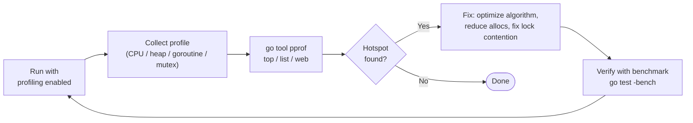

import Tabs from '@theme/Tabs';
import TabItem from '@theme/TabItem';

# pprof Basics: CPU, Heap, Goroutine, and Mutex Profiling

Go ships with one of the best profiling toolchains in any language, available in the standard library with no external dependencies. The `pprof` tool can tell you exactly where your program spends CPU time, what is allocating memory, how many goroutines are running and why, and which mutexes are causing contention. Learning to use it is one of the highest-leverage skills in the Go ecosystem.

## Four Profile Types

Go's profiler produces four main profile types, each answering a different question:

**1. CPU profile.** The runtime samples goroutine stacks at approximately 100 Hz (100 times per second). Each sample records the current call stack of every running goroutine. Accumulating many samples gives you a statistical picture of where CPU time is spent. Functions that appear frequently in samples are your hotspots.

**2. Heap profile.** The runtime samples heap allocations, recording a stack trace for each sampled allocation (by default, one sample per 512 KB allocated). The profile distinguishes between `alloc_space` (total bytes allocated over time, including objects already GC'd) and `inuse_space` (bytes currently live on the heap). Heap profiles show you what is allocating, not just what is alive.

**3. Goroutine profile.** A snapshot of every goroutine in the program, including its full stack trace. This is not a sampled profile — it is a complete enumeration. It is invaluable for detecting goroutine leaks: if your goroutine count keeps growing over time, the goroutine profile shows you where they are stuck.

**4. Mutex profile.** Records goroutines that blocked waiting to acquire a mutex. Enabled at runtime with `runtime.SetMutexProfileFraction(n)` where n is the sampling fraction (1 = record every event). Shows which mutexes cause the most contention.

## Two Ways to Collect Profiles

<Tabs>
<TabItem value="http" label="HTTP endpoint (servers)">

The easiest approach for long-running services. Import the side-effect package and it registers handlers on the default HTTP mux:

```go
package main

import (
	"fmt"
	"log"
	"net/http"
	_ "net/http/pprof" // registers /debug/pprof/ handlers
)

func expensiveHandler(w http.ResponseWriter, r *http.Request) {
	// Simulate work
	total := 0
	for i := 0; i < 1000000; i++ {
		total += i
	}
	fmt.Fprintf(w, "total: %d", total)
}

func main() {
	http.HandleFunc("/", expensiveHandler)
	// pprof endpoints available at:
	//   /debug/pprof/            — index
	//   /debug/pprof/profile     — 30s CPU profile
	//   /debug/pprof/heap        — heap snapshot
	//   /debug/pprof/goroutine   — goroutine dump
	//   /debug/pprof/mutex       — mutex contention
	log.Println("Listening on :6060")
	log.Fatal(http.ListenAndServe(":6060", nil))
}
```

Then collect profiles from the command line:

```bash
# 30-second CPU profile
go tool pprof http://localhost:6060/debug/pprof/profile?seconds=30

# Heap snapshot
go tool pprof http://localhost:6060/debug/pprof/heap

# Goroutine dump
go tool pprof http://localhost:6060/debug/pprof/goroutine

# Open web UI (requires pprof binary)
go tool pprof -http=:8080 http://localhost:6060/debug/pprof/profile?seconds=10
```

</TabItem>
<TabItem value="programmatic" label="Programmatic (batch/offline)">

For batch jobs, CLIs, or when you want to profile a specific code path:

```go
package main

import (
	"fmt"
	"os"
	"runtime"
	"runtime/pprof"
)

func cpuIntensiveWork() {
	// Simulate CPU work: compute sum of squares
	total := 0
	for i := 0; i < 50000000; i++ {
		total += i * i
	}
	fmt.Println("sum:", total)
}

func main() {
	// --- CPU Profile ---
	cpuFile, err := os.Create("cpu.prof")
	if err != nil {
		panic(err)
	}
	defer cpuFile.Close()

	// highlight-next-line
	if err := pprof.StartCPUProfile(cpuFile); err != nil {
		panic(err)
	}

	cpuIntensiveWork()

	// highlight-next-line
	pprof.StopCPUProfile() // flushes and closes the profile

	// --- Heap Profile ---
	heapFile, err := os.Create("heap.prof")
	if err != nil {
		panic(err)
	}
	defer heapFile.Close()

	// Force GC so the heap profile reflects current live objects
	runtime.GC()
	// highlight-next-line
	if err := pprof.WriteHeapProfile(heapFile); err != nil {
		panic(err)
	}

	fmt.Println("Profiles written: cpu.prof, heap.prof")
	fmt.Println("Analyze with: go tool pprof cpu.prof")
}
```
<codapi-snippet sandbox="go" editor="basic"></codapi-snippet>

</TabItem>
<TabItem value="benchmark" label="Benchmark profiling">

The most ergonomic workflow: write a benchmark, run with profile flags:

```bash
# Run benchmarks and collect both CPU and memory profiles
go test -bench=BenchmarkMyFunction -cpuprofile=cpu.prof -memprofile=mem.prof

# Then analyze
go tool pprof cpu.prof
go tool pprof mem.prof
```

Inside the benchmark:

```go
package mypackage

import "testing"

func BenchmarkProcess(b *testing.B) {
	data := generateTestData(10000)
	b.ResetTimer()
	for i := 0; i < b.N; i++ {
		_ = process(data)
	}
}
```

</TabItem>
</Tabs>

## Analyzing Profiles: The pprof Interactive Shell

Once you have a profile file, open it with `go tool pprof`:

```bash
go tool pprof cpu.prof
```

This drops you into an interactive shell. The most useful commands:

**`top`** — lists the top functions by CPU time (or allocation for heap profiles):

```
(pprof) top10
Showing nodes accounting for 2450ms, 94.23% of 2600ms total
      flat  flat%   sum%        cum   cum%
    1230ms 47.31% 47.31%     1230ms 47.31%  runtime.memclrNoHeapPointers
     820ms 31.54% 78.85%      820ms 31.54%  mypackage.process
     400ms 15.38% 94.23%      400ms 15.38%  runtime.memmove
```

- **`flat`**: time spent in the function itself, not in functions it calls.
- **`cum`** (cumulative): time in the function plus all functions it calls. A function with high `cum` but low `flat` is a caller that delegates to expensive children.

**`list FunctionName`** — shows annotated source code with per-line costs:

```
(pprof) list process
Total: 2600ms
ROUTINE ======================== mypackage.process
     820ms      820ms (flat, cum) 31.54% of Total
         .          .     12: func process(data []Record) []Result {
      10ms       10ms     13:     results := make([]Result, 0, len(data))
     810ms      810ms     14:     for _, r := range data {
```

**`web`** or **`png`** — generates a call graph (requires Graphviz). Thicker edges mean more time flows through that call path.

**`-http=:8080`** — opens a web UI with flame graphs, call graphs, and source annotation. This is the most productive interface for complex profiles.

```bash
go tool pprof -http=:8080 cpu.prof
```

:::note
The `-http` flag for the pprof web UI requires the standalone `pprof` binary, not the bundled `go tool pprof`. Install it with `go install github.com/google/pprof@latest`. The web UI provides flame graphs which are far easier to read than text output for deeply nested call stacks.
:::

## Reading Heap Profiles

Heap profiles have two views that answer different questions:

- **`alloc_space` / `alloc_objects`**: total bytes/objects allocated since the program started, including everything already collected by the GC. This tells you what is generating the most allocation pressure.
- **`inuse_space` / `inuse_objects`**: bytes/objects currently live. This tells you what is actually holding memory right now.

To switch between views in the interactive shell:

```bash
go tool pprof -alloc_space heap.prof   # show total allocations
go tool pprof -inuse_space heap.prof   # show current live heap
```

For diagnosing GC pressure, `alloc_space` is usually more useful. For diagnosing memory leaks or unexpected memory growth, `inuse_space` is what you want.

## Detecting Goroutine Leaks

A goroutine leak is a goroutine that was started but never terminates. Common causes: waiting on a channel that will never receive, waiting on a context that is never cancelled, or a blocking network call without a deadline.

The diagnosis workflow:

1. Take a goroutine profile at startup.
2. Run your application through a representative workload.
3. Take another goroutine profile.
4. Compare goroutine counts. If the count grows unboundedly, you have a leak.

```bash
# Take two snapshots, then compare
curl http://localhost:6060/debug/pprof/goroutine?debug=1 > goroutines_t1.txt
# ... wait for some requests to complete ...
curl http://localhost:6060/debug/pprof/goroutine?debug=1 > goroutines_t2.txt
diff goroutines_t1.txt goroutines_t2.txt
```

The goroutine profile with `debug=1` shows the full stack trace of every goroutine, which tells you exactly where each is blocked.

## Mutex Contention Profiling

To profile mutex contention, enable it before your program does work:

```go
package main

import (
	"fmt"
	"os"
	"runtime"
	"runtime/pprof"
	"sync"
)

var (
	mu    sync.Mutex
	count int
)

func contendedWork(n int) {
	for i := 0; i < n; i++ {
		mu.Lock()
		count++
		mu.Unlock()
	}
}

func main() {
	// highlight-next-line
	runtime.SetMutexProfileFraction(1) // record every mutex contention event

	var wg sync.WaitGroup
	for i := 0; i < 8; i++ {
		wg.Add(1)
		go func() {
			defer wg.Done()
			contendedWork(100000)
		}()
	}
	wg.Wait()

	f, err := os.Create("mutex.prof")
	if err != nil {
		panic(err)
	}
	defer f.Close()
	// highlight-next-line
	if err := pprof.Lookup("mutex").WriteTo(f, 0); err != nil {
		panic(err)
	}
	fmt.Println("count:", count)
	fmt.Println("mutex profile written")
}
```
<codapi-snippet sandbox="go" editor="basic"></codapi-snippet>

`SetMutexProfileFraction(1)` records every contention event. For production use, a fraction like `5` or `10` is more appropriate to reduce overhead while still capturing the hottest mutexes.

## The Profiling Workflow



The cycle is: instrument → collect → analyze → fix → verify. Do not optimize without profiling first. Profiling will surprise you — the bottleneck is rarely where intuition says it is.

:::tip
CPU profiling at 100 Hz adds approximately 1–5% overhead in most workloads. It is safe to enable in production on a fraction of your fleet to get real-world profiles rather than synthetic benchmark profiles. Real-world profiles reflect actual traffic patterns and data shapes, which are often very different from benchmarks.
:::

## Key Takeaways

- Go provides four built-in profile types: CPU (where time is spent), heap (what is allocating), goroutine (leak detection), and mutex (lock contention).
- Two collection methods: import `net/http/pprof` for server endpoints, or use `runtime/pprof` directly for programmatic or batch profiling.
- In the `go tool pprof` shell: `top` for overview, `list FunctionName` for line-by-line costs, `-http=:8080` for the full web UI with flame graphs.
- CPU profiles: `flat` is time in the function itself; `cum` is time in the function plus everything it calls.
- Heap profiles: `alloc_space` shows GC pressure (total allocations); `inuse_space` shows current live memory.
- Goroutine leaks: compare goroutine profiles over time. A growing count with stuck stacks indicates leaked goroutines.
- Mutex profiling: enable with `runtime.SetMutexProfileFraction(1)` and read with `pprof.Lookup("mutex").WriteTo`.
- Always profile before optimizing. The bottleneck is rarely where you expect.
